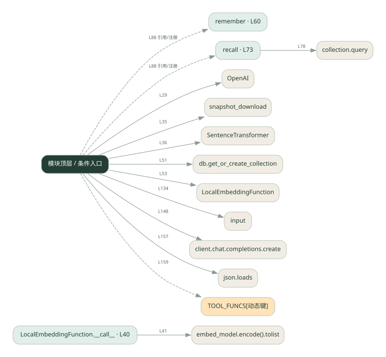
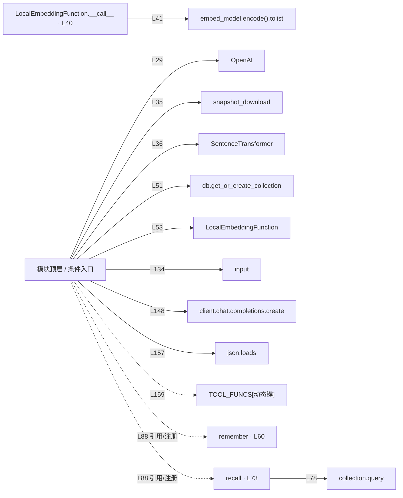

# 001.py · 跨会话记忆

课程：1-4 · 全课程第 4 节。源码快照 SHA-256 前 12 位：`f0bac7cdb862`。

[原文件](../001.py) · [网页阅读](pages/001.py.html) · [放大调用图](graphs/001.py.svg)

## 这份文件要完成什么

把值得保留的信息写入向量库，下次用问题检索回来。

## 为什么需要它

程序重启后，普通 messages 列表会丢失；持久化让过去的信息还能参与回答。

## 当前文件的实际状态

- 仍有下划线占位表达式，源文件行号：49, 67, 68, 79, 80。相应路径在补完前不能正常执行。
- 存在外部服务或模型依赖；执行前需按源文件配置依赖和凭据，可能联网或产生 API 费用。 本次只做静态解析，没有运行练习，也没有替你填写或修改原代码。

## 调用图 / 阅读与数据流程

实线：源码中的直接调用；虚线：函数引用/注册、动态调用或按方法名推断的候选。L 是调用所在源码行号。箭头不表示执行顺序或每次必经；分支、循环、异步调度及框架内部调用需结合源码。灰色是外部/未解析目标，橙色是动态分发；省略 print、len 和常规容器操作以减少干扰。孤立函数可能尚未接入。

Mermaid 图源

## 从哪里开始看

先从 模块入口 出发，沿箭头找到本文件函数，再查看外部调用或动态分发。右侧调用清单保留所有静态调用点，能回到原文件逐行对照。

## 关键函数与依赖

| 函数 / 定义行 | 职责（源码注释供参考） | 函数体中的调用 |
|---|---|---|
| `LocalEmbeddingFunction.__call__` [L40](../001.py#L40) | 以源码函数体为准；下列调用展示其依赖。 | `embed_model.encode().tolist, embed_model.encode` |
| `remember` [L60](../001.py#L60) | 把重要信息写进长期记忆 | `collection.add` |
| `recall` [L73](../001.py#L73) | 从长期记忆检索相关信息 | `collection.query, 动态对象.join` |

## 这样做的优点

只取相关记忆，避免把所有历史都塞进提示词。

## 代价与局限

相似度不等于事实正确；需要处理过期记忆、重复数据和用户隔离。

## 适合什么场景

需要记住用户长期偏好的助手。

## 不适合直接照搬的场景

一次性问答，或没有权限保存个人信息的服务。

## 改一个条件，检验是否理解

记住“我喜欢清淡”，换一种问法询问饮食偏好，观察 recall 是否找到原记录。

如果当前文件有未实现位置，先预测应该怎样变化，补齐后再验证；不要把“能启动”当作“实现正确”。

## 全部静态调用点

这是语法分析清单，包含图中省略的基础操作；不记录参数值。

| 调用方 | 目标表达式 | 行号 | 类型 |
|---|---|---|---|
| <模块入口> | `OpenAI` | 29 | 调用表达式 |
| <模块入口> | `print` | 34 | 调用表达式 |
| <模块入口> | `snapshot_download` | 35 | 调用表达式 |
| <模块入口> | `SentenceTransformer` | 36 | 调用表达式 |
| LocalEmbeddingFunction.__call__ | `embed_model.encode().tolist` | 41 | 调用表达式 |
| LocalEmbeddingFunction.__call__ | `embed_model.encode` | 41 | 调用表达式 |
| <模块入口> | `db.get_or_create_collection` | 51 | 调用表达式 |
| <模块入口> | `LocalEmbeddingFunction` | 53 | 调用表达式 |
| <模块入口> | `print` | 56 | 调用表达式 |
| <模块入口> | `collection.count` | 56 | 调用表达式 |
| remember | `collection.add` | 66 | 调用表达式 |
| recall | `collection.query` | 78 | 调用表达式 |
| recall | `动态对象.join` | 85 | 调用表达式 |
| <模块入口> | `print` | 125 | 调用表达式 |
| <模块入口> | `print` | 126 | 调用表达式 |
| <模块入口> | `print` | 127 | 调用表达式 |
| <模块入口> | `print` | 128 | 调用表达式 |
| <模块入口> | `print` | 129 | 调用表达式 |
| <模块入口> | `print` | 130 | 调用表达式 |
| <模块入口> | `input().strip` | 134 | 调用表达式 |
| <模块入口> | `input` | 134 | 调用表达式 |
| <模块入口> | `print` | 136 | 调用表达式 |
| <模块入口> | `user.lower` | 141 | 调用表达式 |
| <模块入口> | `print` | 142 | 调用表达式 |
| <模块入口> | `messages.append` | 145 | 调用表达式 |
| <模块入口> | `range` | 147 | 调用表达式 |
| <模块入口> | `client.chat.completions.create` | 148 | 调用表达式 |
| <模块入口> | `messages.append` | 154 | 调用表达式 |
| <模块入口> | `json.loads` | 157 | 调用表达式 |
| <模块入口> | `print` | 158 | 调用表达式 |
| <模块入口> | `TOOL_FUNCS[动态键]` | 159 | 调用表达式 |
| <模块入口> | `print` | 160 | 调用表达式 |
| <模块入口> | `messages.append` | 161 | 调用表达式 |
| <模块入口> | `str` | 164 | 调用表达式 |
| <模块入口> | `print` | 167 | 调用表达式 |
| <模块入口> | `messages.append` | 168 | 调用表达式 |
| <模块入口> | `remember` | 88 | 函数引用/注册 |
| <模块入口> | `recall` | 88 | 函数引用/注册 |
