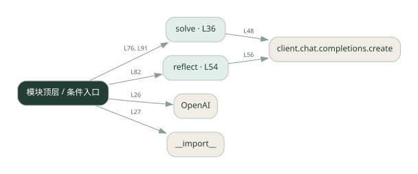
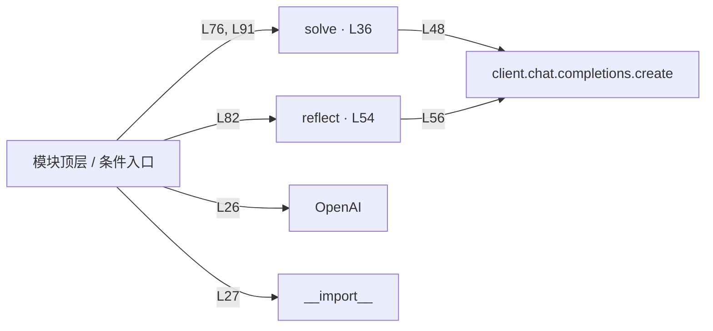

# 007.py · 反思与修订

课程：1-7 · 全课程第 7 节。源码快照 SHA-256 前 12 位：`0e84ce68cc9e`。

[原文件](../007.py) · [网页阅读](pages/007.py.html) · [放大调用图](graphs/007.py.svg)

## 这份文件要完成什么

先回答，再让模型检查答案，最后根据检查意见修订。

## 为什么需要它

第一版可能遗漏约束；独立一轮检查有机会补上。

## 当前文件的实际状态

- 存在外部服务或模型依赖；执行前需按源文件配置依赖和凭据，可能联网或产生 API 费用。 本次只做静态解析，没有运行练习，也没有替你填写或修改原代码。

## 调用图 / 阅读与数据流程

实线：源码中的直接调用；虚线：函数引用/注册、动态调用或按方法名推断的候选。L 是调用所在源码行号。箭头不表示执行顺序或每次必经；分支、循环、异步调度及框架内部调用需结合源码。灰色是外部/未解析目标，橙色是动态分发；省略 print、len 和常规容器操作以减少干扰。孤立函数可能尚未接入。

Mermaid 图源

## 从哪里开始看

先从 模块入口 出发，沿箭头找到本文件函数，再查看外部调用或动态分发。右侧调用清单保留所有静态调用点，能回到原文件逐行对照。

## 关键函数与依赖

| 函数 / 定义行 | 职责（源码注释供参考） | 函数体中的调用 |
|---|---|---|
| `solve` [L36](../007.py#L36) | 让 LLM 解一道题。feedback 是上一轮反思的意见（可选） | `messages.append, client.chat.completions.create` |
| `reflect` [L54](../007.py#L54) | 让 LLM 反思自己的答案，找出错误 | `client.chat.completions.create` |

## 这样做的优点

把检查意见保留下来，便于比较修改前后。

## 代价与局限

同一个模型可能重复自己的错误；多一轮反思不等于验证为真。

## 适合什么场景

可以用明确条件检查的草稿、解释或解题过程。

## 不适合直接照搬的场景

必须由真实数据或确定性测试保证正确的关键判断。

## 改一个条件，检验是否理解

给答案加一个可检查的限制，比较反思是否指出违反之处。

如果当前文件有未实现位置，先预测应该怎样变化，补齐后再验证；不要把“能启动”当作“实现正确”。

## 全部静态调用点

这是语法分析清单，包含图中省略的基础操作；不记录参数值。

| 调用方 | 目标表达式 | 行号 | 类型 |
|---|---|---|---|
| <模块入口> | `OpenAI` | 26 | 调用表达式 |
| <模块入口> | `__import__` | 27 | 调用表达式 |
| solve | `messages.append` | 45 | 调用表达式 |
| solve | `messages.append` | 47 | 调用表达式 |
| solve | `client.chat.completions.create` | 48 | 调用表达式 |
| reflect | `client.chat.completions.create` | 56 | 调用表达式 |
| <模块入口> | `print` | 71 | 调用表达式 |
| <模块入口> | `print` | 72 | 调用表达式 |
| <模块入口> | `print` | 73 | 调用表达式 |
| <模块入口> | `print` | 75 | 调用表达式 |
| <模块入口> | `solve` | 76 | 调用表达式 |
| <模块入口> | `print` | 77 | 调用表达式 |
| <模块入口> | `print` | 79 | 调用表达式 |
| <模块入口> | `print` | 80 | 调用表达式 |
| <模块入口> | `print` | 81 | 调用表达式 |
| <模块入口> | `reflect` | 82 | 调用表达式 |
| <模块入口> | `print` | 83 | 调用表达式 |
| <模块入口> | `print` | 85 | 调用表达式 |
| <模块入口> | `print` | 86 | 调用表达式 |
| <模块入口> | `print` | 87 | 调用表达式 |
| <模块入口> | `solve` | 91 | 调用表达式 |
| <模块入口> | `print` | 92 | 调用表达式 |
