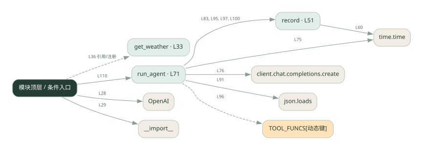
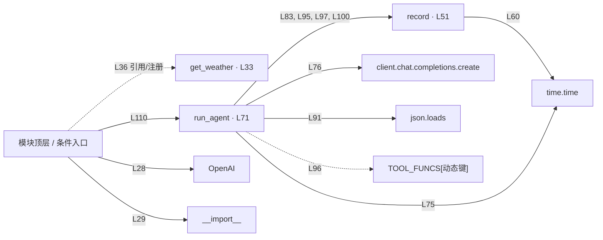

# 009.py · 单 Agent 调用记录

课程：1-9 · 全课程第 9 节。源码快照 SHA-256 前 12 位：`ef867db26321`。

[原文件](../009.py) · [网页阅读](pages/009.py.html) · [放大调用图](graphs/009.py.svg)

## 这份文件要完成什么

把模型和工具执行过程记下来，展示调用与耗时。

## 为什么需要它

只看最终答案无法知道慢在哪、错在哪。

## 当前文件的实际状态

- 模型请求与本地工具是不同边界：这些文件中的天气工具使用示例逻辑，不能将示例天气当成实时查询结果。
- 存在外部服务或模型依赖；执行前需按源文件配置依赖和凭据，可能联网或产生 API 费用。 本次只做静态解析，没有运行练习，也没有替你填写或修改原代码。

## 调用图 / 阅读与数据流程

实线：源码中的直接调用；虚线：函数引用/注册、动态调用或按方法名推断的候选。L 是调用所在源码行号。箭头不表示执行顺序或每次必经；分支、循环、异步调度及框架内部调用需结合源码。灰色是外部/未解析目标，橙色是动态分发；省略 print、len 和常规容器操作以减少干扰。孤立函数可能尚未接入。

Mermaid 图源

## 从哪里开始看

先从 模块入口 出发，沿箭头找到本文件函数，再查看外部调用或动态分发。右侧调用清单保留所有静态调用点，能回到原文件逐行对照。

## 关键函数与依赖

| 函数 / 定义行 | 职责（源码注释供参考） | 函数体中的调用 |
|---|---|---|
| `get_weather` [L33](../009.py#L33) | 以源码函数体为准；下列调用展示其依赖。 | `未发现显式函数调用（可能直接计算、读写状态或尚未实现）` |
| `record` [L51](../009.py#L51) | 记录一条 trace。kind=类型，content=内容，tokens=token数，t0=开始时间戳（算耗时用） | `len, round, time.time, trace.append, print` |
| `run_agent` [L71](../009.py#L71) | 以源码函数体为准；下列调用展示其依赖。 | `range, time.time, client.chat.completions.create, record, messages.append, json.loads, TOOL_FUNCS[动态键], str` |

## 这样做的优点

可以沿记录回看输入、输出和执行步骤。

## 代价与局限

进程内记录不是完整监控系统；真实日志还需脱敏、存储和查询。

## 适合什么场景

调试工具调用链、比较不同实现耗时。

## 不适合直接照搬的场景

需要跨进程追踪和长期审计却只有内存日志的系统。

## 改一个条件，检验是否理解

让某个工具变慢，检查能否从记录中定位这一段。

如果当前文件有未实现位置，先预测应该怎样变化，补齐后再验证；不要把“能启动”当作“实现正确”。

## 全部静态调用点

这是语法分析清单，包含图中省略的基础操作；不记录参数值。

| 调用方 | 目标表达式 | 行号 | 类型 |
|---|---|---|---|
| <模块入口> | `OpenAI` | 28 | 调用表达式 |
| <模块入口> | `__import__` | 29 | 调用表达式 |
| record | `len` | 53 | 调用表达式 |
| record | `round` | 60 | 调用表达式 |
| record | `time.time` | 60 | 调用表达式 |
| record | `trace.append` | 61 | 调用表达式 |
| record | `print` | 67 | 调用表达式 |
| run_agent | `range` | 74 | 调用表达式 |
| run_agent | `time.time` | 75 | 调用表达式 |
| run_agent | `client.chat.completions.create` | 76 | 调用表达式 |
| run_agent | `record` | 83 | 调用表达式 |
| run_agent | `messages.append` | 88 | 调用表达式 |
| run_agent | `json.loads` | 91 | 调用表达式 |
| run_agent | `record` | 95 | 调用表达式 |
| run_agent | `TOOL_FUNCS[动态键]` | 96 | 调用表达式 |
| run_agent | `record` | 97 | 调用表达式 |
| run_agent | `str` | 97 | 调用表达式 |
| run_agent | `messages.append` | 98 | 调用表达式 |
| run_agent | `str` | 98 | 调用表达式 |
| run_agent | `record` | 100 | 调用表达式 |
| run_agent | `messages.append` | 101 | 调用表达式 |
| <模块入口> | `print` | 107 | 调用表达式 |
| <模块入口> | `print` | 108 | 调用表达式 |
| <模块入口> | `print` | 109 | 调用表达式 |
| <模块入口> | `run_agent` | 110 | 调用表达式 |
| <模块入口> | `print` | 112 | 调用表达式 |
| <模块入口> | `print` | 113 | 调用表达式 |
| <模块入口> | `print` | 114 | 调用表达式 |
| <模块入口> | `sum` | 115 | 调用表达式 |
| <模块入口> | `e.get` | 115 | 调用表达式 |
| <模块入口> | `sum` | 116 | 调用表达式 |
| <模块入口> | `e.get` | 116 | 调用表达式 |
| <模块入口> | `sum` | 117 | 调用表达式 |
| <模块入口> | `print` | 118 | 调用表达式 |
| <模块入口> | `len` | 118 | 调用表达式 |
| <模块入口> | `print` | 119 | 调用表达式 |
| <模块入口> | `print` | 120 | 调用表达式 |
| <模块入口> | `print` | 121 | 调用表达式 |
| <模块入口> | `print` | 122 | 调用表达式 |
| <模块入口> | `get_weather` | 36 | 函数引用/注册 |
