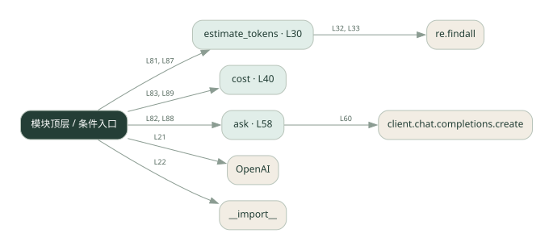
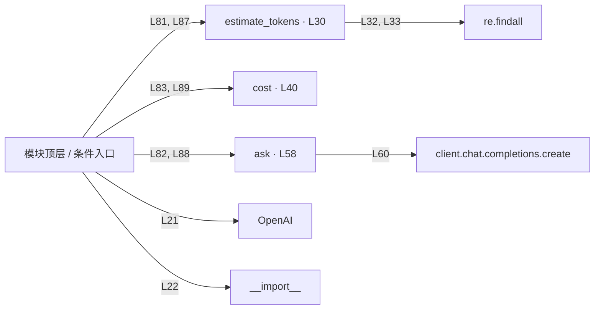

# 012.py · Token 与费用估算

课程：1-12 · 全课程第 12 节。源码快照 SHA-256 前 12 位：`297d2edb4856`。

[原文件](../012.py) · [网页阅读](pages/012.py.html) · [放大调用图](graphs/012.py.svg)

## 这份文件要完成什么

按输入和输出用量分别计算费用，并与估算比较。

## 为什么需要它

只看调用次数无法解释成本：每次输入输出长度都不同。

## 当前文件的实际状态

- 存在外部服务或模型依赖；执行前需按源文件配置依赖和凭据，可能联网或产生 API 费用。 本次只做静态解析，没有运行练习，也没有替你填写或修改原代码。

## 调用图 / 阅读与数据流程

实线：源码中的直接调用；虚线：函数引用/注册、动态调用或按方法名推断的候选。L 是调用所在源码行号。箭头不表示执行顺序或每次必经；分支、循环、异步调度及框架内部调用需结合源码。灰色是外部/未解析目标，橙色是动态分发；省略 print、len 和常规容器操作以减少干扰。孤立函数可能尚未接入。

Mermaid 图源

## 从哪里开始看

先从 模块入口 出发，沿箭头找到本文件函数，再查看外部调用或动态分发。右侧调用清单保留所有静态调用点，能回到原文件逐行对照。

## 关键函数与依赖

| 函数 / 定义行 | 职责（源码注释供参考） | 函数体中的调用 |
|---|---|---|
| `estimate_tokens` [L30](../012.py#L30) | 本地近似估算 token：中文 1 字≈1 token，英文按词估 | `len, re.findall, int` |
| `cost` [L40](../012.py#L40) | 算一次调用的成本（元） | `未发现显式函数调用（可能直接计算、读写状态或尚未实现）` |
| `ask` [L58](../012.py#L58) | 调一次 LLM，返回 (答案, prompt_tokens, completion_tokens) | `client.chat.completions.create` |

## 这样做的优点

费用公式透明，便于比较提示词和回答长度。

## 代价与局限

源码单价是示例配置，不代表当前价格；估算应与供应商实际 usage 对照。

## 适合什么场景

预算教学、不同方案的成本比较。

## 不适合直接照搬的场景

直接用字符估算作为正式账单。

## 改一个条件，检验是否理解

把历史长度加倍，比较输入费用如何变化。

如果当前文件有未实现位置，先预测应该怎样变化，补齐后再验证；不要把“能启动”当作“实现正确”。

## 全部静态调用点

这是语法分析清单，包含图中省略的基础操作；不记录参数值。

| 调用方 | 目标表达式 | 行号 | 类型 |
|---|---|---|---|
| <模块入口> | `OpenAI` | 21 | 调用表达式 |
| <模块入口> | `__import__` | 22 | 调用表达式 |
| estimate_tokens | `len` | 32 | 调用表达式 |
| estimate_tokens | `re.findall` | 32 | 调用表达式 |
| estimate_tokens | `len` | 33 | 调用表达式 |
| estimate_tokens | `re.findall` | 33 | 调用表达式 |
| estimate_tokens | `int` | 37 | 调用表达式 |
| ask | `client.chat.completions.create` | 60 | 调用表达式 |
| <模块入口> | `print` | 77 | 调用表达式 |
| <模块入口> | `print` | 78 | 调用表达式 |
| <模块入口> | `print` | 79 | 调用表达式 |
| <模块入口> | `print` | 81 | 调用表达式 |
| <模块入口> | `estimate_tokens` | 81 | 调用表达式 |
| <模块入口> | `ask` | 82 | 调用表达式 |
| <模块入口> | `cost` | 83 | 调用表达式 |
| <模块入口> | `print` | 84 | 调用表达式 |
| <模块入口> | `print` | 85 | 调用表达式 |
| <模块入口> | `print` | 87 | 调用表达式 |
| <模块入口> | `estimate_tokens` | 87 | 调用表达式 |
| <模块入口> | `ask` | 88 | 调用表达式 |
| <模块入口> | `cost` | 89 | 调用表达式 |
| <模块入口> | `print` | 90 | 调用表达式 |
| <模块入口> | `print` | 91 | 调用表达式 |
| <模块入口> | `print` | 93 | 调用表达式 |
| <模块入口> | `print` | 94 | 调用表达式 |
| <模块入口> | `print` | 95 | 调用表达式 |
| <模块入口> | `print` | 96 | 调用表达式 |
| <模块入口> | `print` | 97 | 调用表达式 |
