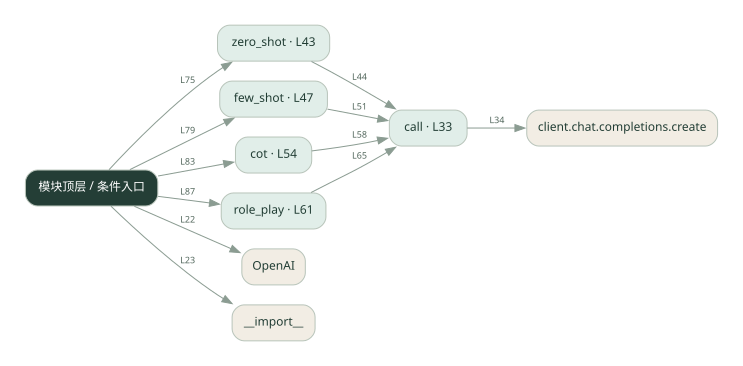
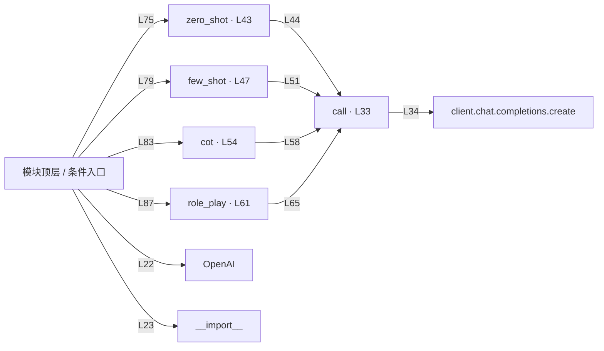

# 013.py · 提示词策略对比

课程：1-13 · 全课程第 13 节。源码快照 SHA-256 前 12 位：`018d5897a3d1`。

[原文件](../013.py) · [网页阅读](pages/013.py.html) · [放大调用图](graphs/013.py.svg)

## 这份文件要完成什么

对同类问题尝试直接提问、示例、分步提示和角色提示。

## 为什么需要它

提示内容改变模型收到的任务约束，需要通过对照看效果。

## 当前文件的实际状态

- 存在外部服务或模型依赖；执行前需按源文件配置依赖和凭据，可能联网或产生 API 费用。 本次只做静态解析，没有运行练习，也没有替你填写或修改原代码。

## 调用图 / 阅读与数据流程

实线：源码中的直接调用；虚线：函数引用/注册、动态调用或按方法名推断的候选。L 是调用所在源码行号。箭头不表示执行顺序或每次必经；分支、循环、异步调度及框架内部调用需结合源码。灰色是外部/未解析目标，橙色是动态分发；省略 print、len 和常规容器操作以减少干扰。孤立函数可能尚未接入。

Mermaid 图源

## 从哪里开始看

先从 模块入口 出发，沿箭头找到本文件函数，再查看外部调用或动态分发。右侧调用清单保留所有静态调用点，能回到原文件逐行对照。

## 关键函数与依赖

| 函数 / 定义行 | 职责（源码注释供参考） | 函数体中的调用 |
|---|---|---|
| `call` [L33](../013.py#L33) | 以源码函数体为准；下列调用展示其依赖。 | `client.chat.completions.create` |
| `zero_shot` [L43](../013.py#L43) | 以源码函数体为准；下列调用展示其依赖。 | `call` |
| `few_shot` [L47](../013.py#L47) | 以源码函数体为准；下列调用展示其依赖。 | `call` |
| `cot` [L54](../013.py#L54) | 以源码函数体为准；下列调用展示其依赖。 | `call` |
| `role_play` [L61](../013.py#L61) | 以源码函数体为准；下列调用展示其依赖。 | `call` |

## 这样做的优点

修改成本低，能快速比较表达方式。

## 代价与局限

单次好结果可能是偶然；更长提示增加成本，也可能限制过头。

## 适合什么场景

有固定评价标准的提示词实验。

## 不适合直接照搬的场景

没有测试集却宣称某种提示永远更好。

## 改一个条件，检验是否理解

用同一组问题比较四种提示，并记录正确率和输出长度。

如果当前文件有未实现位置，先预测应该怎样变化，补齐后再验证；不要把“能启动”当作“实现正确”。

## 全部静态调用点

这是语法分析清单，包含图中省略的基础操作；不记录参数值。

| 调用方 | 目标表达式 | 行号 | 类型 |
|---|---|---|---|
| <模块入口> | `OpenAI` | 22 | 调用表达式 |
| <模块入口> | `__import__` | 23 | 调用表达式 |
| call | `client.chat.completions.create` | 34 | 调用表达式 |
| zero_shot | `call` | 44 | 调用表达式 |
| few_shot | `call` | 51 | 调用表达式 |
| cot | `call` | 58 | 调用表达式 |
| role_play | `call` | 65 | 调用表达式 |
| <模块入口> | `print` | 70 | 调用表达式 |
| <模块入口> | `print` | 71 | 调用表达式 |
| <模块入口> | `print` | 72 | 调用表达式 |
| <模块入口> | `print` | 74 | 调用表达式 |
| <模块入口> | `print` | 75 | 调用表达式 |
| <模块入口> | `zero_shot` | 75 | 调用表达式 |
| <模块入口> | `print` | 77 | 调用表达式 |
| <模块入口> | `print` | 78 | 调用表达式 |
| <模块入口> | `print` | 79 | 调用表达式 |
| <模块入口> | `few_shot` | 79 | 调用表达式 |
| <模块入口> | `print` | 81 | 调用表达式 |
| <模块入口> | `print` | 82 | 调用表达式 |
| <模块入口> | `print` | 83 | 调用表达式 |
| <模块入口> | `cot` | 83 | 调用表达式 |
| <模块入口> | `print` | 85 | 调用表达式 |
| <模块入口> | `print` | 86 | 调用表达式 |
| <模块入口> | `print` | 87 | 调用表达式 |
| <模块入口> | `role_play` | 87 | 调用表达式 |
