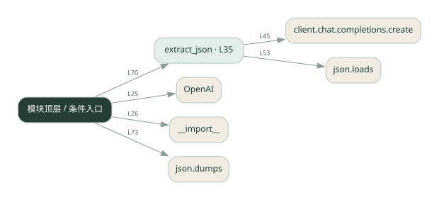
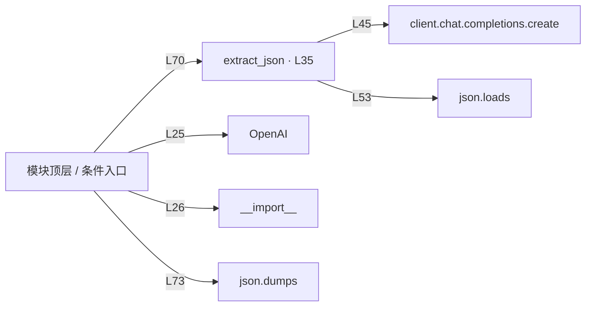

# 014.py · 结构化结果

课程：1-14 · 全课程第 14 节。源码快照 SHA-256 前 12 位：`066f57c8a408`。

[原文件](../014.py) · [网页阅读](pages/014.py.html) · [放大调用图](graphs/014.py.svg)

## 这份文件要完成什么

让模型输出 JSON，解析失败时反馈错误并重试。

## 为什么需要它

程序需要可靠字段，不能只接收一段自由文本。

## 当前文件的实际状态

- 存在外部服务或模型依赖；执行前需按源文件配置依赖和凭据，可能联网或产生 API 费用。 本次只做静态解析，没有运行练习，也没有替你填写或修改原代码。

## 调用图 / 阅读与数据流程

实线：源码中的直接调用；虚线：函数引用/注册、动态调用或按方法名推断的候选。L 是调用所在源码行号。箭头不表示执行顺序或每次必经；分支、循环、异步调度及框架内部调用需结合源码。灰色是外部/未解析目标，橙色是动态分发；省略 print、len 和常规容器操作以减少干扰。孤立函数可能尚未接入。

Mermaid 图源

## 从哪里开始看

先从 模块入口 出发，沿箭头找到本文件函数，再查看外部调用或动态分发。右侧调用清单保留所有静态调用点，能回到原文件逐行对照。

## 关键函数与依赖

| 函数 / 定义行 | 职责（源码注释供参考） | 函数体中的调用 |
|---|---|---|
| `extract_json` [L35](../014.py#L35) | 让 LLM 从文本提取信息，输出 JSON，失败自动修正重试 | `range, client.chat.completions.create, json.loads, print, messages.append` |

## 这样做的优点

结果可以进入后续函数和数据存储。

## 代价与局限

合法 JSON 不代表字段完整或内容正确；仍需类型和业务校验。

## 适合什么场景

信息抽取、表单填充、机器间传值。

## 不适合直接照搬的场景

仅凭能解析就执行敏感操作。

## 改一个条件，检验是否理解

让输入缺少一个字段，检查结果是明确空值还是模型编造。

如果当前文件有未实现位置，先预测应该怎样变化，补齐后再验证；不要把“能启动”当作“实现正确”。

## 全部静态调用点

这是语法分析清单，包含图中省略的基础操作；不记录参数值。

| 调用方 | 目标表达式 | 行号 | 类型 |
|---|---|---|---|
| <模块入口> | `OpenAI` | 25 | 调用表达式 |
| <模块入口> | `__import__` | 26 | 调用表达式 |
| extract_json | `range` | 44 | 调用表达式 |
| extract_json | `client.chat.completions.create` | 45 | 调用表达式 |
| extract_json | `json.loads` | 53 | 调用表达式 |
| extract_json | `print` | 56 | 调用表达式 |
| extract_json | `messages.append` | 60 | 调用表达式 |
| extract_json | `messages.append` | 61 | 调用表达式 |
| <模块入口> | `print` | 66 | 调用表达式 |
| <模块入口> | `print` | 67 | 调用表达式 |
| <模块入口> | `print` | 68 | 调用表达式 |
| <模块入口> | `print` | 69 | 调用表达式 |
| <模块入口> | `extract_json` | 70 | 调用表达式 |
| <模块入口> | `print` | 71 | 调用表达式 |
| <模块入口> | `print` | 72 | 调用表达式 |
| <模块入口> | `print` | 73 | 调用表达式 |
| <模块入口> | `json.dumps` | 73 | 调用表达式 |
