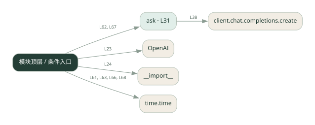
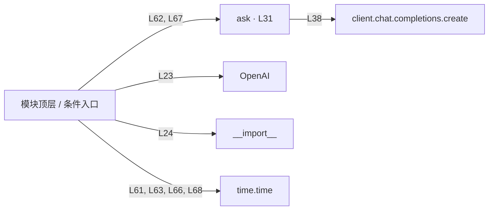

# 015.py · 请求缓存

课程：1-15 · 全课程第 15 节。源码快照 SHA-256 前 12 位：`332e61ac7ae2`。

[原文件](../015.py) · [网页阅读](pages/015.py.html) · [放大调用图](graphs/015.py.svg)

## 这份文件要完成什么

相同请求再次出现时优先返回已保存的响应。

## 为什么需要它

重复询问若每次调用模型，会重复付费和等待。

## 当前文件的实际状态

- 存在外部服务或模型依赖；执行前需按源文件配置依赖和凭据，可能联网或产生 API 费用。 本次只做静态解析，没有运行练习，也没有替你填写或修改原代码。

## 调用图 / 阅读与数据流程

实线：源码中的直接调用；虚线：函数引用/注册、动态调用或按方法名推断的候选。L 是调用所在源码行号。箭头不表示执行顺序或每次必经；分支、循环、异步调度及框架内部调用需结合源码。灰色是外部/未解析目标，橙色是动态分发；省略 print、len 和常规容器操作以减少干扰。孤立函数可能尚未接入。

Mermaid 图源

## 从哪里开始看

先从 模块入口 出发，沿箭头找到本文件函数，再查看外部调用或动态分发。右侧调用清单保留所有静态调用点，能回到原文件逐行对照。

## 关键函数与依赖

| 函数 / 定义行 | 职责（源码注释供参考） | 函数体中的调用 |
|---|---|---|
| `ask` [L31](../015.py#L31) | 带结果缓存的提问：相同问题直接复用 | `client.chat.completions.create` |

## 这样做的优点

命中时速度快、减少调用费用。

## 代价与局限

缓存键需要考虑模型、提示词与用户；内存缓存重启即丢失，过期策略另需设计。

## 适合什么场景

重复率高、答案变化慢的只读问答。

## 不适合直接照搬的场景

实时行情或不能混用不同用户答案的业务。

## 改一个条件，检验是否理解

连续问两次，再改一个字符，观察是否命中及耗时差异。

如果当前文件有未实现位置，先预测应该怎样变化，补齐后再验证；不要把“能启动”当作“实现正确”。

## 全部静态调用点

这是语法分析清单，包含图中省略的基础操作；不记录参数值。

| 调用方 | 目标表达式 | 行号 | 类型 |
|---|---|---|---|
| <模块入口> | `OpenAI` | 23 | 调用表达式 |
| <模块入口> | `__import__` | 24 | 调用表达式 |
| ask | `client.chat.completions.create` | 38 | 调用表达式 |
| <模块入口> | `print` | 56 | 调用表达式 |
| <模块入口> | `print` | 57 | 调用表达式 |
| <模块入口> | `print` | 58 | 调用表达式 |
| <模块入口> | `print` | 60 | 调用表达式 |
| <模块入口> | `time.time` | 61 | 调用表达式 |
| <模块入口> | `print` | 62 | 调用表达式 |
| <模块入口> | `ask` | 62 | 调用表达式 |
| <模块入口> | `print` | 63 | 调用表达式 |
| <模块入口> | `time.time` | 63 | 调用表达式 |
| <模块入口> | `print` | 65 | 调用表达式 |
| <模块入口> | `time.time` | 66 | 调用表达式 |
| <模块入口> | `print` | 67 | 调用表达式 |
| <模块入口> | `ask` | 67 | 调用表达式 |
| <模块入口> | `print` | 68 | 调用表达式 |
| <模块入口> | `time.time` | 68 | 调用表达式 |
