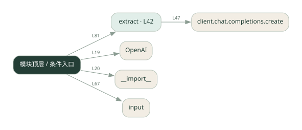
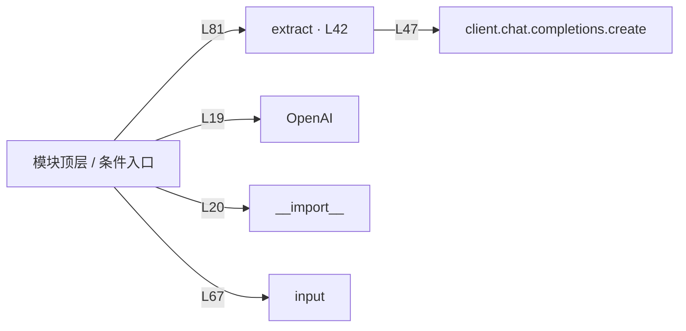

# 017.py · 对话状态机

课程：1-17 · 全课程第 17 节。源码快照 SHA-256 前 12 位：`ca390fd9c1da`。

[原文件](../017.py) · [网页阅读](pages/017.py.html) · [放大调用图](graphs/017.py.svg)

## 这份文件要完成什么

根据当前状态收集信息，并在条件满足后转到下一步。

## 为什么需要它

自由对话容易跳过必要字段；状态把流程约束显式化。

## 当前文件的实际状态

- 存在外部服务或模型依赖；执行前需按源文件配置依赖和凭据，可能联网或产生 API 费用。 本次只做静态解析，没有运行练习，也没有替你填写或修改原代码。

## 调用图 / 阅读与数据流程

实线：源码中的直接调用；虚线：函数引用/注册、动态调用或按方法名推断的候选。L 是调用所在源码行号。箭头不表示执行顺序或每次必经；分支、循环、异步调度及框架内部调用需结合源码。灰色是外部/未解析目标，橙色是动态分发；省略 print、len 和常规容器操作以减少干扰。孤立函数可能尚未接入。

Mermaid 图源

## 从哪里开始看

先从 模块入口 出发，沿箭头找到本文件函数，再查看外部调用或动态分发。右侧调用清单保留所有静态调用点，能回到原文件逐行对照。

## 关键函数与依赖

| 函数 / 定义行 | 职责（源码注释供参考） | 函数体中的调用 |
|---|---|---|
| `extract` [L42](../017.py#L42) | 以源码函数体为准；下列调用展示其依赖。 | `client.chat.completions.create, resp.choices[动态键].message.content.strip` |

## 这样做的优点

每一阶段的必填信息和出口容易检查。

## 代价与局限

状态和分支变多后维护成本上升；模型抽取失败需要回退路径。

## 适合什么场景

预约、下单前的信息收集。

## 不适合直接照搬的场景

完全开放、无法定义阶段的自由聊天。

## 改一个条件，检验是否理解

在收集第二个字段时修改第一个字段，观察状态是否正确更新。

如果当前文件有未实现位置，先预测应该怎样变化，补齐后再验证；不要把“能启动”当作“实现正确”。

## 全部静态调用点

这是语法分析清单，包含图中省略的基础操作；不记录参数值。

| 调用方 | 目标表达式 | 行号 | 类型 |
|---|---|---|---|
| <模块入口> | `OpenAI` | 19 | 调用表达式 |
| <模块入口> | `__import__` | 20 | 调用表达式 |
| extract | `client.chat.completions.create` | 47 | 调用表达式 |
| extract | `resp.choices[动态键].message.content.strip` | 55 | 调用表达式 |
| <模块入口> | `print` | 61 | 调用表达式 |
| <模块入口> | `print` | 62 | 调用表达式 |
| <模块入口> | `print` | 63 | 调用表达式 |
| <模块入口> | `print` | 66 | 调用表达式 |
| <模块入口> | `input().strip` | 67 | 调用表达式 |
| <模块入口> | `input` | 67 | 调用表达式 |
| <模块入口> | `user.lower` | 68 | 调用表达式 |
| <模块入口> | `print` | 69 | 调用表达式 |
| <模块入口> | `print` | 78 | 调用表达式 |
| <模块入口> | `extract` | 81 | 调用表达式 |
| <模块入口> | `print` | 83 | 调用表达式 |
| <模块入口> | `print` | 91 | 调用表达式 |
| <模块入口> | `print` | 92 | 调用表达式 |
| <模块入口> | `order.items` | 93 | 调用表达式 |
| <模块入口> | `print` | 94 | 调用表达式 |
| <模块入口> | `print` | 95 | 调用表达式 |
