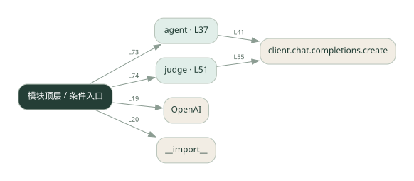
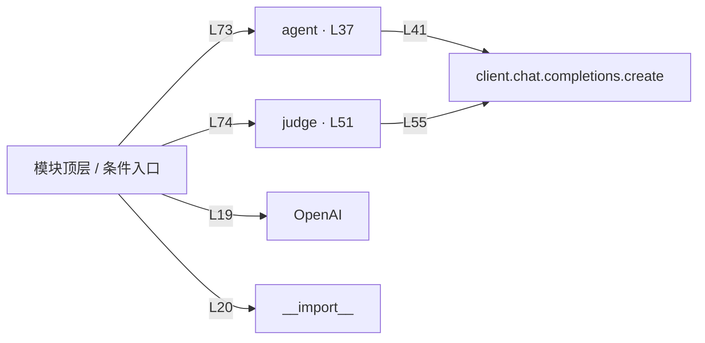

# 019.py · 单 Agent 评测

课程：1-19 · 全课程第 19 节。源码快照 SHA-256 前 12 位：`3bd9ac091789`。

[原文件](../019.py) · [网页阅读](pages/019.py.html) · [放大调用图](graphs/019.py.svg)

## 这份文件要完成什么

用固定问题集运行 Agent，再判定答案是否满足期望。

## 为什么需要它

凭聊天感觉难以判断改动是否真的提升质量。

## 当前文件的实际状态

- 存在外部服务或模型依赖；执行前需按源文件配置依赖和凭据，可能联网或产生 API 费用。 本次只做静态解析，没有运行练习，也没有替你填写或修改原代码。

## 调用图 / 阅读与数据流程

实线：源码中的直接调用；虚线：函数引用/注册、动态调用或按方法名推断的候选。L 是调用所在源码行号。箭头不表示执行顺序或每次必经；分支、循环、异步调度及框架内部调用需结合源码。灰色是外部/未解析目标，橙色是动态分发；省略 print、len 和常规容器操作以减少干扰。孤立函数可能尚未接入。

Mermaid 图源

## 从哪里开始看

先从 模块入口 出发，沿箭头找到本文件函数，再查看外部调用或动态分发。右侧调用清单保留所有静态调用点，能回到原文件逐行对照。

## 关键函数与依赖

| 函数 / 定义行 | 职责（源码注释供参考） | 函数体中的调用 |
|---|---|---|
| `agent` [L37](../019.py#L37) | 以源码函数体为准；下列调用展示其依赖。 | `client.chat.completions.create, resp.choices[动态键].message.content.strip` |
| `judge` [L51](../019.py#L51) | 以源码函数体为准；下列调用展示其依赖。 | `client.chat.completions.create` |

## 这样做的优点

同一测试集可重复比较版本。

## 代价与局限

样本少会偏；模型裁判可能误判，要保留人工核对样本。

## 适合什么场景

提示词或模型改动后的回归比较。

## 不适合直接照搬的场景

少量样例全部通过就声称对所有问题可靠。

## 改一个条件，检验是否理解

加入一个容易误判的同义表达，比较精确匹配和裁判结果。

如果当前文件有未实现位置，先预测应该怎样变化，补齐后再验证；不要把“能启动”当作“实现正确”。

## 全部静态调用点

这是语法分析清单，包含图中省略的基础操作；不记录参数值。

| 调用方 | 目标表达式 | 行号 | 类型 |
|---|---|---|---|
| <模块入口> | `OpenAI` | 19 | 调用表达式 |
| <模块入口> | `__import__` | 20 | 调用表达式 |
| agent | `client.chat.completions.create` | 41 | 调用表达式 |
| agent | `resp.choices[动态键].message.content.strip` | 48 | 调用表达式 |
| judge | `client.chat.completions.create` | 55 | 调用表达式 |
| <模块入口> | `print` | 68 | 调用表达式 |
| <模块入口> | `print` | 69 | 调用表达式 |
| <模块入口> | `print` | 70 | 调用表达式 |
| <模块入口> | `agent` | 73 | 调用表达式 |
| <模块入口> | `judge` | 74 | 调用表达式 |
| <模块入口> | `print` | 78 | 调用表达式 |
| <模块入口> | `print` | 79 | 调用表达式 |
| <模块入口> | `print` | 80 | 调用表达式 |
| <模块入口> | `len` | 82 | 调用表达式 |
| <模块入口> | `print` | 83 | 调用表达式 |
| <模块入口> | `print` | 84 | 调用表达式 |
| <模块入口> | `print` | 85 | 调用表达式 |
