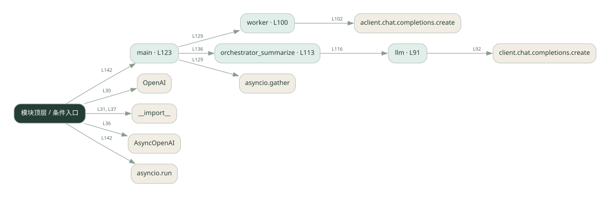
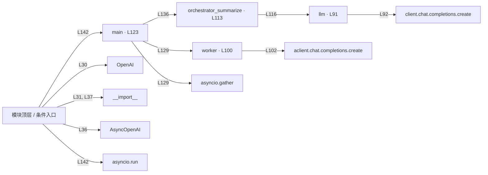

# 020_zhangdi.py · 调度者与执行者

课程：2-1 · 全课程第 21 节。源码快照 SHA-256 前 12 位：`5cdcc46dfa9f`。

[原文件](../020_zhangdi.py) · [网页阅读](pages/020_zhangdi.py.html) · [放大调用图](graphs/020_zhangdi.py.svg)

## 这份文件要完成什么

调度者拆任务，执行者分头处理，最后汇总。

## 为什么需要它

不同子任务有不同目标，把职责分开便于控制。

## 当前文件的实际状态

- 把调度模式用于多维度的岗位/公司比较，使用 AsyncOpenAI 和异步 worker。维度优先级属于这个应用的输入约束，模型分析不等于已核实的现实信息。
- 存在外部服务或模型依赖；执行前需按源文件配置依赖和凭据，可能联网或产生 API 费用。 本次只做静态解析，没有运行练习，也没有替你填写或修改原代码。

## 调用图 / 阅读与数据流程

实线：源码中的直接调用；虚线：函数引用/注册、动态调用或按方法名推断的候选。L 是调用所在源码行号。箭头不表示执行顺序或每次必经；分支、循环、异步调度及框架内部调用需结合源码。灰色是外部/未解析目标，橙色是动态分发；省略 print、len 和常规容器操作以减少干扰。孤立函数可能尚未接入。

Mermaid 图源

## 从哪里开始看

先从 main 及模块入口 出发，沿箭头找到本文件函数，再查看外部调用或动态分发。右侧调用清单保留所有静态调用点，能回到原文件逐行对照。

## 关键函数与依赖

| 函数 / 定义行 | 职责（源码注释供参考） | 函数体中的调用 |
|---|---|---|
| `llm` [L91](../020_zhangdi.py#L91) | 以源码函数体为准；下列调用展示其依赖。 | `client.chat.completions.create, resp.choices[动态键].message.content.strip` |
| `worker` [L100](../020_zhangdi.py#L100) | worker（异步）：按权重规则评估单个企业，输出「定级 + 理由」 | `aclient.chat.completions.create, resp.choices[动态键].message.content.strip` |
| `orchestrator_summarize` [L113](../020_zhangdi.py#L113) | orchestrator：汇总所有 worker 的定级，按权重排序出最终总表 | `动态对象.join, llm` |
| `main` [L123](../020_zhangdi.py#L123) | 以源码函数体为准；下列调用展示其依赖。 | `print, asyncio.gather, worker, enumerate, orchestrator_summarize` |

## 这样做的优点

拆解和汇总各自清楚，便于替换某个执行者。

## 代价与局限

调度者可能成为瓶颈，拆错任务会影响全链路。

## 适合什么场景

能分解为几个专业子任务的报告或分析。

## 不适合直接照搬的场景

简单请求，或子任务之间需要密集交互却没有共享机制。

## 改一个条件，检验是否理解

让一个执行者只返回部分信息，检查汇总是否说明缺失。

如果当前文件有未实现位置，先预测应该怎样变化，补齐后再验证；不要把“能启动”当作“实现正确”。

## 全部静态调用点

这是语法分析清单，包含图中省略的基础操作；不记录参数值。

| 调用方 | 目标表达式 | 行号 | 类型 |
|---|---|---|---|
| <模块入口> | `OpenAI` | 30 | 调用表达式 |
| <模块入口> | `__import__` | 31 | 调用表达式 |
| <模块入口> | `AsyncOpenAI` | 36 | 调用表达式 |
| <模块入口> | `__import__` | 37 | 调用表达式 |
| llm | `client.chat.completions.create` | 92 | 调用表达式 |
| llm | `resp.choices[动态键].message.content.strip` | 97 | 调用表达式 |
| worker | `aclient.chat.completions.create` | 102 | 调用表达式 |
| worker | `resp.choices[动态键].message.content.strip` | 110 | 调用表达式 |
| orchestrator_summarize | `动态对象.join` | 115 | 调用表达式 |
| orchestrator_summarize | `llm` | 116 | 调用表达式 |
| main | `print` | 124 | 调用表达式 |
| main | `print` | 125 | 调用表达式 |
| main | `print` | 126 | 调用表达式 |
| main | `asyncio.gather` | 129 | 调用表达式 |
| main | `worker` | 129 | 调用表达式 |
| main | `print` | 131 | 调用表达式 |
| main | `enumerate` | 132 | 调用表达式 |
| main | `print` | 133 | 调用表达式 |
| main | `orchestrator_summarize` | 136 | 调用表达式 |
| main | `print` | 137 | 调用表达式 |
| main | `print` | 138 | 调用表达式 |
| <模块入口> | `asyncio.run` | 142 | 调用表达式 |
| <模块入口> | `main` | 142 | 调用表达式 |
