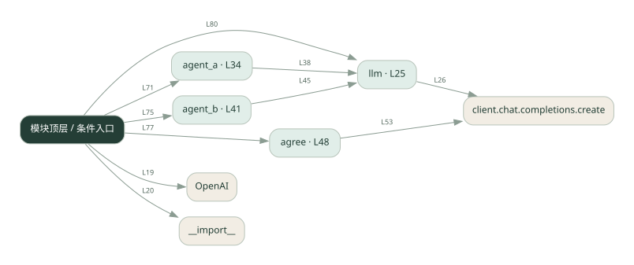
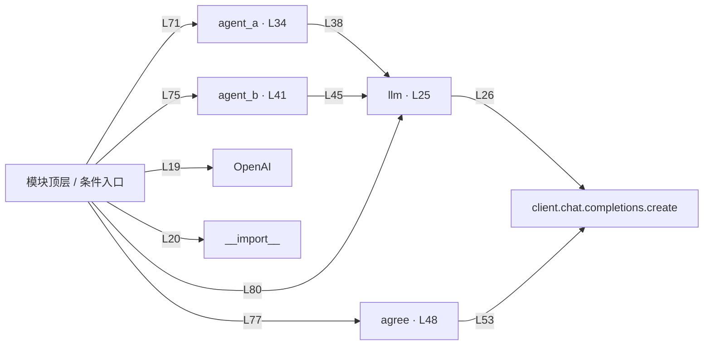

# 022.py · 协作讨论

课程：2-3 · 全课程第 23 节。源码快照 SHA-256 前 12 位：`f17a507bf516`。

[原文件](../022.py) · [网页阅读](pages/022.py.html) · [放大调用图](graphs/022.py.svg)

## 这份文件要完成什么

多个角色轮流交换意见，满足共识条件或轮数上限后停止。

## 为什么需要它

单一视角可能遗漏问题，交叉讨论增加检查角度。

## 当前文件的实际状态

- 存在外部服务或模型依赖；执行前需按源文件配置依赖和凭据，可能联网或产生 API 费用。 本次只做静态解析，没有运行练习，也没有替你填写或修改原代码。

## 调用图 / 阅读与数据流程

实线：源码中的直接调用；虚线：函数引用/注册、动态调用或按方法名推断的候选。L 是调用所在源码行号。箭头不表示执行顺序或每次必经；分支、循环、异步调度及框架内部调用需结合源码。灰色是外部/未解析目标，橙色是动态分发；省略 print、len 和常规容器操作以减少干扰。孤立函数可能尚未接入。

Mermaid 图源

## 从哪里开始看

先从 模块入口 出发，沿箭头找到本文件函数，再查看外部调用或动态分发。右侧调用清单保留所有静态调用点，能回到原文件逐行对照。

## 关键函数与依赖

| 函数 / 定义行 | 职责（源码注释供参考） | 函数体中的调用 |
|---|---|---|
| `llm` [L25](../022.py#L25) | 以源码函数体为准；下列调用展示其依赖。 | `client.chat.completions.create, resp.choices[动态键].message.content.strip` |
| `agent_a` [L34](../022.py#L34) | 以源码函数体为准；下列调用展示其依赖。 | `llm` |
| `agent_b` [L41](../022.py#L41) | 以源码函数体为准；下列调用展示其依赖。 | `llm` |
| `agree` [L48](../022.py#L48) | 以源码函数体为准；下列调用展示其依赖。 | `client.chat.completions.create` |

## 这样做的优点

意见分歧可见，有机会改进初稿。

## 代价与局限

达成共识不代表事实正确；讨论可能重复、成本不断增长。

## 适合什么场景

方案审阅、观点比较。

## 不适合直接照搬的场景

必须有外部证据支撑却只靠模型互相同意的判断。

## 改一个条件，检验是否理解

让两方坚持不同结论，检查轮数上限是否终止讨论。

如果当前文件有未实现位置，先预测应该怎样变化，补齐后再验证；不要把“能启动”当作“实现正确”。

## 全部静态调用点

这是语法分析清单，包含图中省略的基础操作；不记录参数值。

| 调用方 | 目标表达式 | 行号 | 类型 |
|---|---|---|---|
| <模块入口> | `OpenAI` | 19 | 调用表达式 |
| <模块入口> | `__import__` | 20 | 调用表达式 |
| llm | `client.chat.completions.create` | 26 | 调用表达式 |
| llm | `resp.choices[动态键].message.content.strip` | 31 | 调用表达式 |
| agent_a | `llm` | 38 | 调用表达式 |
| agent_b | `llm` | 45 | 调用表达式 |
| agree | `client.chat.completions.create` | 53 | 调用表达式 |
| <模块入口> | `print` | 66 | 调用表达式 |
| <模块入口> | `print` | 67 | 调用表达式 |
| <模块入口> | `print` | 68 | 调用表达式 |
| <模块入口> | `agent_a` | 71 | 调用表达式 |
| <模块入口> | `print` | 72 | 调用表达式 |
| <模块入口> | `range` | 74 | 调用表达式 |
| <模块入口> | `agent_b` | 75 | 调用表达式 |
| <模块入口> | `print` | 76 | 调用表达式 |
| <模块入口> | `agree` | 77 | 调用表达式 |
| <模块入口> | `print` | 78 | 调用表达式 |
| <模块入口> | `llm` | 80 | 调用表达式 |
| <模块入口> | `print` | 84 | 调用表达式 |
| <模块入口> | `print` | 86 | 调用表达式 |
