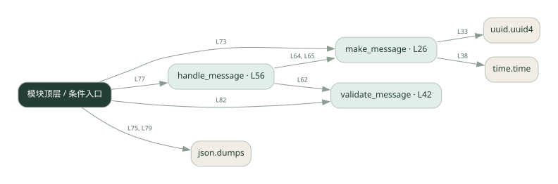
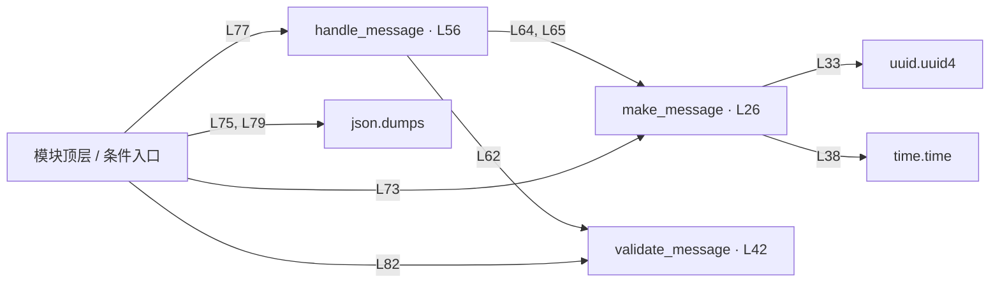

# 024.py · Agent 消息信封

课程：2-5 · 全课程第 25 节。源码快照 SHA-256 前 12 位：`6c5afa197265`。

[原文件](../024.py) · [网页阅读](pages/024.py.html) · [放大调用图](graphs/024.py.svg)

## 这份文件要完成什么

给消息附上发送者、接收者、任务标识等字段并检查格式。

## 为什么需要它

多个角色通信需要知道“谁给谁、属于哪件事”。

## 当前文件的实际状态

- 主要展示本地计算、内存状态或模拟流程；是否写文件/启动子进程请看调用表。 本次只做静态解析，没有运行练习，也没有替你填写或修改原代码。

## 调用图 / 阅读与数据流程

实线：源码中的直接调用；虚线：函数引用/注册、动态调用或按方法名推断的候选。L 是调用所在源码行号。箭头不表示执行顺序或每次必经；分支、循环、异步调度及框架内部调用需结合源码。灰色是外部/未解析目标，橙色是动态分发；省略 print、len 和常规容器操作以减少干扰。孤立函数可能尚未接入。

Mermaid 图源

## 从哪里开始看

先从 模块入口 出发，沿箭头找到本文件函数，再查看外部调用或动态分发。右侧调用清单保留所有静态调用点，能回到原文件逐行对照。

## 关键函数与依赖

| 函数 / 定义行 | 职责（源码注释供参考） | 函数体中的调用 |
|---|---|---|
| `make_message` [L26](../024.py#L26) | 构造一条 A2A 消息 | `uuid.uuid4, time.time` |
| `validate_message` [L42](../024.py#L42) | 以源码函数体为准；下列调用展示其依赖。 | `未发现显式函数调用（可能直接计算、读写状态或尚未实现）` |
| `handle_message` [L56](../024.py#L56) | 以源码函数体为准；下列调用展示其依赖。 | `validate_message, make_message` |

## 这样做的优点

字段明确，方便路由和追踪。

## 代价与局限

自定义 JSON 演示不等于完整 A2A 标准实现；没有自动提供网络传输、认证和重试。

## 适合什么场景

学习消息格式、设计内部消息约定。

## 不适合直接照搬的场景

直接声称能与任意 A2A 服务互通。

## 改一个条件，检验是否理解

删除一个必填字段，观察验证是否拒绝消息。

如果当前文件有未实现位置，先预测应该怎样变化，补齐后再验证；不要把“能启动”当作“实现正确”。

## 全部静态调用点

这是语法分析清单，包含图中省略的基础操作；不记录参数值。

| 调用方 | 目标表达式 | 行号 | 类型 |
|---|---|---|---|
| make_message | `uuid.uuid4` | 33 | 调用表达式 |
| make_message | `time.time` | 38 | 调用表达式 |
| handle_message | `validate_message` | 62 | 调用表达式 |
| handle_message | `make_message` | 64 | 调用表达式 |
| handle_message | `make_message` | 65 | 调用表达式 |
| <模块入口> | `print` | 69 | 调用表达式 |
| <模块入口> | `print` | 70 | 调用表达式 |
| <模块入口> | `print` | 71 | 调用表达式 |
| <模块入口> | `make_message` | 73 | 调用表达式 |
| <模块入口> | `print` | 74 | 调用表达式 |
| <模块入口> | `print` | 75 | 调用表达式 |
| <模块入口> | `json.dumps` | 75 | 调用表达式 |
| <模块入口> | `handle_message` | 77 | 调用表达式 |
| <模块入口> | `print` | 78 | 调用表达式 |
| <模块入口> | `print` | 79 | 调用表达式 |
| <模块入口> | `json.dumps` | 79 | 调用表达式 |
| <模块入口> | `validate_message` | 82 | 调用表达式 |
| <模块入口> | `print` | 83 | 调用表达式 |
