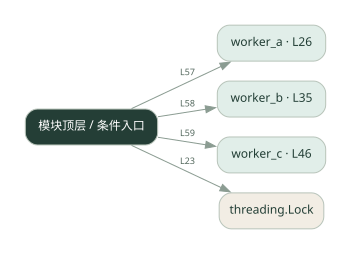
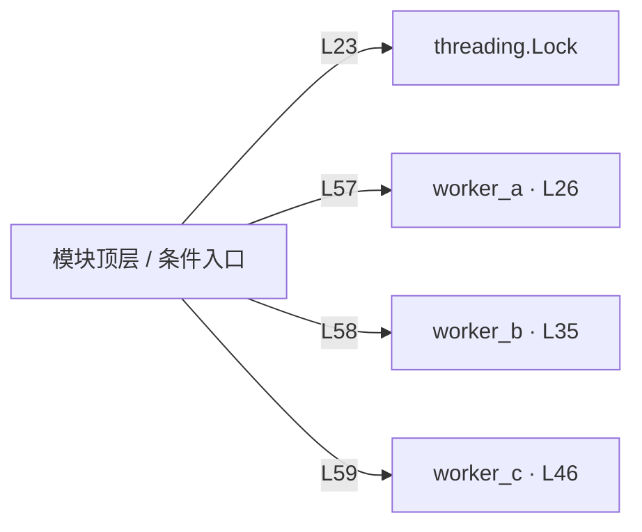

# 025.py · 共享状态

课程：2-6 · 全课程第 26 节。源码快照 SHA-256 前 12 位：`83a2da7fc9bd`。

[原文件](../025.py) · [网页阅读](pages/025.py.html) · [放大调用图](graphs/025.py.svg)

## 这份文件要完成什么

多个 worker 通过共享字典读写中间结果。

## 为什么需要它

后一个角色需要前一个角色的结果，不应重复计算或丢失上下文。

## 当前文件的实际状态

- 主要展示本地计算、内存状态或模拟流程；是否写文件/启动子进程请看调用表。 本次只做静态解析，没有运行练习，也没有替你填写或修改原代码。

## 调用图 / 阅读与数据流程

实线：源码中的直接调用；虚线：函数引用/注册、动态调用或按方法名推断的候选。L 是调用所在源码行号。箭头不表示执行顺序或每次必经；分支、循环、异步调度及框架内部调用需结合源码。灰色是外部/未解析目标，橙色是动态分发；省略 print、len 和常规容器操作以减少干扰。孤立函数可能尚未接入。

Mermaid 图源

## 从哪里开始看

先从 模块入口 出发，沿箭头找到本文件函数，再查看外部调用或动态分发。右侧调用清单保留所有静态调用点，能回到原文件逐行对照。

## 关键函数与依赖

| 函数 / 定义行 | 职责（源码注释供参考） | 函数体中的调用 |
|---|---|---|
| `worker_a` [L26](../025.py#L26) | 以源码函数体为准；下列调用展示其依赖。 | `未发现显式函数调用（可能直接计算、读写状态或尚未实现）` |
| `worker_b` [L35](../025.py#L35) | 以源码函数体为准；下列调用展示其依赖。 | `state.get` |
| `worker_c` [L46](../025.py#L46) | worker C：读所有状态，产出最终答案 | `state.get` |

## 这样做的优点

数据汇聚在一个地方，容易观察变化。

## 代价与局限

锁只能保护读写，不自动保证业务依赖顺序；共享状态会增加耦合。

## 适合什么场景

单进程、明确写入顺序的小型协作。

## 不适合直接照搬的场景

跨机器共享或复杂并发一致性需求。

## 改一个条件，检验是否理解

调换两个 worker 的执行顺序，观察读取是否得到缺失值。

如果当前文件有未实现位置，先预测应该怎样变化，补齐后再验证；不要把“能启动”当作“实现正确”。

## 全部静态调用点

这是语法分析清单，包含图中省略的基础操作；不记录参数值。

| 调用方 | 目标表达式 | 行号 | 类型 |
|---|---|---|---|
| <模块入口> | `threading.Lock` | 23 | 调用表达式 |
| worker_b | `state.get` | 41 | 调用表达式 |
| worker_c | `state.get` | 49 | 调用表达式 |
| <模块入口> | `print` | 53 | 调用表达式 |
| <模块入口> | `print` | 54 | 调用表达式 |
| <模块入口> | `print` | 55 | 调用表达式 |
| <模块入口> | `print` | 57 | 调用表达式 |
| <模块入口> | `worker_a` | 57 | 调用表达式 |
| <模块入口> | `print` | 58 | 调用表达式 |
| <模块入口> | `worker_b` | 58 | 调用表达式 |
| <模块入口> | `print` | 59 | 调用表达式 |
| <模块入口> | `worker_c` | 59 | 调用表达式 |
| <模块入口> | `print` | 60 | 调用表达式 |
