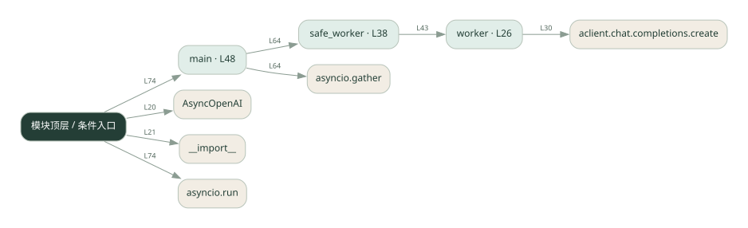
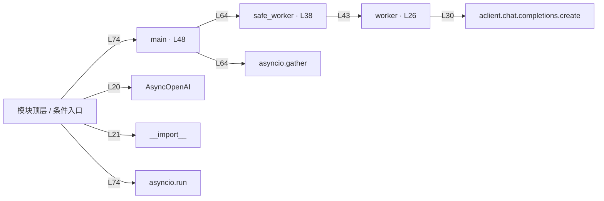

# 028.py · 多 Agent 综合流程

课程：2-10 · 全课程第 30 节。源码快照 SHA-256 前 12 位：`a6033e6f1cf6`。

[原文件](../028.py) · [网页阅读](pages/028.py.html) · [放大调用图](graphs/028.py.svg)

## 这份文件要完成什么

组合并发 worker、失败处理和结果汇总。

## 为什么需要它

分工只有在失败、等待和汇总都被处理后才能形成完整流程。

## 当前文件的实际状态

- 存在外部服务或模型依赖；执行前需按源文件配置依赖和凭据，可能联网或产生 API 费用。 本次只做静态解析，没有运行练习，也没有替你填写或修改原代码。

## 调用图 / 阅读与数据流程

实线：源码中的直接调用；虚线：函数引用/注册、动态调用或按方法名推断的候选。L 是调用所在源码行号。箭头不表示执行顺序或每次必经；分支、循环、异步调度及框架内部调用需结合源码。灰色是外部/未解析目标，橙色是动态分发；省略 print、len 和常规容器操作以减少干扰。孤立函数可能尚未接入。

Mermaid 图源

## 从哪里开始看

先从 main 及模块入口 出发，沿箭头找到本文件函数，再查看外部调用或动态分发。右侧调用清单保留所有静态调用点，能回到原文件逐行对照。

## 关键函数与依赖

| 函数 / 定义行 | 职责（源码注释供参考） | 函数体中的调用 |
|---|---|---|
| `worker` [L26](../028.py#L26) | 以源码函数体为准；下列调用展示其依赖。 | `aclient.chat.completions.create, resp.choices[动态键].message.content.strip` |
| `safe_worker` [L38](../028.py#L38) | 以源码函数体为准；下列调用展示其依赖。 | `worker` |
| `main` [L48](../028.py#L48) | 以源码函数体为准；下列调用展示其依赖。 | `print, asyncio.gather, safe_worker, enumerate` |

## 这样做的优点

一个请求能协调多个执行者，便于比较单 Agent 与多 Agent。

## 代价与局限

部分失败时结果含义复杂；需要区分失败文本和有效答案。

## 适合什么场景

多个独立分析维度的综合报告原型。

## 不适合直接照搬的场景

任何一个子结果错误都会导致不可接受后果的直接自动执行。

## 改一个条件，检验是否理解

让一个 worker 抛错，检查其他任务是否继续，以及汇总是否暴露失败。

如果当前文件有未实现位置，先预测应该怎样变化，补齐后再验证；不要把“能启动”当作“实现正确”。

## 全部静态调用点

这是语法分析清单，包含图中省略的基础操作；不记录参数值。

| 调用方 | 目标表达式 | 行号 | 类型 |
|---|---|---|---|
| <模块入口> | `AsyncOpenAI` | 20 | 调用表达式 |
| <模块入口> | `__import__` | 21 | 调用表达式 |
| worker | `aclient.chat.completions.create` | 30 | 调用表达式 |
| worker | `resp.choices[动态键].message.content.strip` | 34 | 调用表达式 |
| safe_worker | `worker` | 43 | 调用表达式 |
| main | `print` | 56 | 调用表达式 |
| main | `print` | 57 | 调用表达式 |
| main | `print` | 58 | 调用表达式 |
| main | `asyncio.gather` | 64 | 调用表达式 |
| main | `safe_worker` | 64 | 调用表达式 |
| main | `enumerate` | 65 | 调用表达式 |
| main | `print` | 66 | 调用表达式 |
| main | `print` | 68 | 调用表达式 |
| main | `print` | 69 | 调用表达式 |
| main | `print` | 70 | 调用表达式 |
| <模块入口> | `asyncio.run` | 74 | 调用表达式 |
| <模块入口> | `main` | 74 | 调用表达式 |
