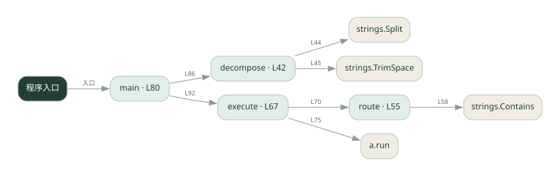
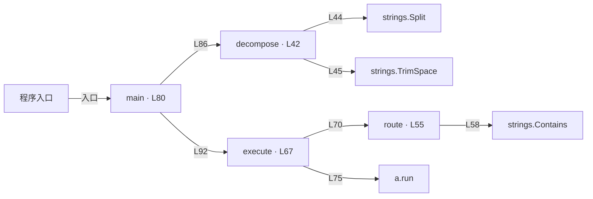

# 029.go · 任务分解与路由

课程：2-11 · 全课程第 31 节。源码快照 SHA-256 前 12 位：`a98f16970f8e`。

[原文件](../029.go) · [网页阅读](pages/029.go.html) · [放大调用图](graphs/029.go.svg)

## 这份文件要完成什么

把文本拆成子任务，按关键词选择匹配的 Agent 执行。

## 为什么需要它

不同任务需要交给不同能力，先做路由才能委派。

## 当前文件的实际状态

- 主要展示本地计算、内存状态或模拟流程；是否写文件/启动子进程请看调用表。 本次只做静态解析，没有运行练习，也没有替你填写或修改原代码。

## 调用图 / 阅读与数据流程

实线：源码中的直接调用；虚线：函数引用/注册、动态调用或按方法名推断的候选。L 是调用所在源码行号。箭头不表示执行顺序或每次必经；分支、循环、异步调度及框架内部调用需结合源码。灰色是外部/未解析目标，橙色是动态分发；省略 print、len 和常规容器操作以减少干扰。孤立函数可能尚未接入。

Mermaid 图源

## 从哪里开始看

先从 main（程序入口） 出发，沿箭头找到本文件函数，再查看外部调用或动态分发。右侧调用清单保留所有静态调用点，能回到原文件逐行对照。

## 关键函数与依赖

| 函数 / 定义行 | 职责（源码注释供参考） | 函数体中的调用 |
|---|---|---|
| `decompose` [L42](../029.go#L42) | decompose：把一整个复杂任务按换行拆成子任务，去掉空行和首尾空白 | `strings.Split, strings.TrimSpace, append` |
| `route` [L55](../029.go#L55) | route：根据子任务内容，匹配最合适的子 agent。 | `strings.Contains` |
| `execute` [L67](../029.go#L67) | execute：委派每个子任务给匹配的 agent 执行，收集结果 | `route, append, fmt.Sprintf, a.run` |
| `main` [L80](../029.go#L80) | 以源码函数体为准；下列调用展示其依赖。 | `decompose, fmt.Printf, len, fmt.Println, execute` |

## 这样做的优点

规则简单可解释，能看到每项任务被谁接走。

## 代价与局限

关键词覆盖有限，同义词和多意图容易选错；演示执行者不等于真实模型。

## 适合什么场景

固定领域的教学路由或小型规则分发。

## 不适合直接照搬的场景

开放领域、表达变化很大的复杂需求。

## 改一个条件，检验是否理解

换掉路由关键词，观察没有执行者认领时返回什么。

如果当前文件有未实现位置，先预测应该怎样变化，补齐后再验证；不要把“能启动”当作“实现正确”。

## 全部静态调用点

这是语法分析清单，包含图中省略的基础操作；不记录参数值。

| 调用方 | 目标表达式 | 行号 | 类型 |
|---|---|---|---|
| decompose | `strings.Split` | 44 | 调用表达式 |
| decompose | `strings.TrimSpace` | 45 | 调用表达式 |
| decompose | `append` | 47 | 调用表达式 |
| route | `strings.Contains` | 58 | 调用表达式 |
| execute | `route` | 70 | 调用表达式 |
| execute | `append` | 72 | 调用表达式 |
| execute | `append` | 75 | 调用表达式 |
| execute | `fmt.Sprintf` | 75 | 调用表达式 |
| execute | `a.run` | 75 | 调用表达式 |
| main | `decompose` | 86 | 调用表达式 |
| main | `fmt.Printf` | 87 | 调用表达式 |
| main | `len` | 87 | 调用表达式 |
| main | `fmt.Printf` | 89 | 调用表达式 |
| main | `fmt.Println` | 91 | 调用表达式 |
| main | `execute` | 92 | 调用表达式 |
| main | `fmt.Println` | 93 | 调用表达式 |
| main | `fmt.Println` | 95 | 调用表达式 |
