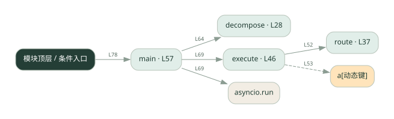
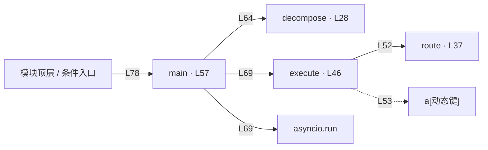

# 029.py · 任务分解与路由

课程：2-11 · 全课程第 31 节。源码快照 SHA-256 前 12 位：`121e86eae86d`。

[原文件](../029.py) · [网页阅读](pages/029.py.html) · [放大调用图](graphs/029.py.svg)

## 这份文件要完成什么

把文本拆成子任务，按关键词选择匹配的 Agent 执行。

## 为什么需要它

不同任务需要交给不同能力，先做路由才能委派。

## 当前文件的实际状态

- decompose 返回 None，main 随后对它调用 len，会失败；route 也返回 None。execute 的 results 未初始化，且把 append 的返回值赋回列表。L53 的工具执行和追加结果还位于 for 循环外，需要放回循环内才能逐项委派。当前还不能完成路由演示。
- 检测到 None 赋值或 pass 的位置：33, 42。这些也可能是正常初始化，需结合下方函数职责与源码判断；不能仅凭没有下划线认定完成。
- 主要展示本地计算、内存状态或模拟流程；是否写文件/启动子进程请看调用表。 本次只做静态解析，没有运行练习，也没有替你填写或修改原代码。

## 调用图 / 阅读与数据流程

实线：源码中的直接调用；虚线：函数引用/注册、动态调用或按方法名推断的候选。L 是调用所在源码行号。箭头不表示执行顺序或每次必经；分支、循环、异步调度及框架内部调用需结合源码。灰色是外部/未解析目标，橙色是动态分发；省略 print、len 和常规容器操作以减少干扰。孤立函数可能尚未接入。

Mermaid 图源

## 从哪里开始看

先从 main 及模块入口 出发，沿箭头找到本文件函数，再查看外部调用或动态分发。右侧调用清单保留所有静态调用点，能回到原文件逐行对照。

## 关键函数与依赖

| 函数 / 定义行 | 职责（源码注释供参考） | 函数体中的调用 |
|---|---|---|
| `decompose` [L28](../029.py#L28) | 把一整个复杂任务拆成子任务列表 | `未发现显式函数调用（可能直接计算、读写状态或尚未实现）` |
| `route` [L37](../029.py#L37) | 根据子任务内容，匹配最合适的子 agent | `未发现显式函数调用（可能直接计算、读写状态或尚未实现）` |
| `execute` [L46](../029.py#L46) | 委派每个子任务给匹配的 agent 执行，收集结果 | `route, results.append, a[动态键]` |
| `main` [L57](../029.py#L57) | 以源码函数体为准；下列调用展示其依赖。 | `decompose, print, len, asyncio.run, execute` |

## 这样做的优点

规则简单可解释，能看到每项任务被谁接走。

## 代价与局限

关键词覆盖有限，同义词和多意图容易选错；演示执行者不等于真实模型。

## 适合什么场景

固定领域的教学路由或小型规则分发。

## 不适合直接照搬的场景

开放领域、表达变化很大的复杂需求。

## 改一个条件，检验是否理解

换掉路由关键词，观察没有执行者认领时返回什么。

如果当前文件有未实现位置，先预测应该怎样变化，补齐后再验证；不要把“能启动”当作“实现正确”。

## 全部静态调用点

这是语法分析清单，包含图中省略的基础操作；不记录参数值。

| 调用方 | 目标表达式 | 行号 | 类型 |
|---|---|---|---|
| execute | `route` | 52 | 调用表达式 |
| execute | `results.append` | 53 | 调用表达式 |
| execute | `a[动态键]` | 53 | 调用表达式 |
| main | `decompose` | 64 | 调用表达式 |
| main | `print` | 65 | 调用表达式 |
| main | `len` | 65 | 调用表达式 |
| main | `print` | 67 | 调用表达式 |
| main | `print` | 68 | 调用表达式 |
| main | `asyncio.run` | 69 | 调用表达式 |
| main | `execute` | 69 | 调用表达式 |
| main | `print` | 70 | 调用表达式 |
| main | `print` | 71 | 调用表达式 |
| <模块入口> | `print` | 75 | 调用表达式 |
| <模块入口> | `print` | 76 | 调用表达式 |
| <模块入口> | `print` | 77 | 调用表达式 |
| <模块入口> | `main` | 78 | 调用表达式 |
