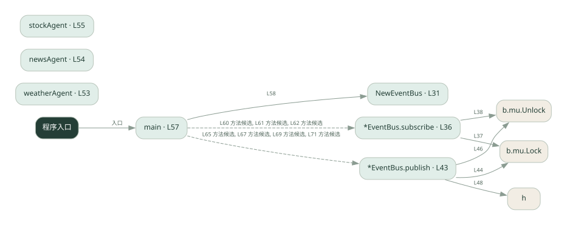
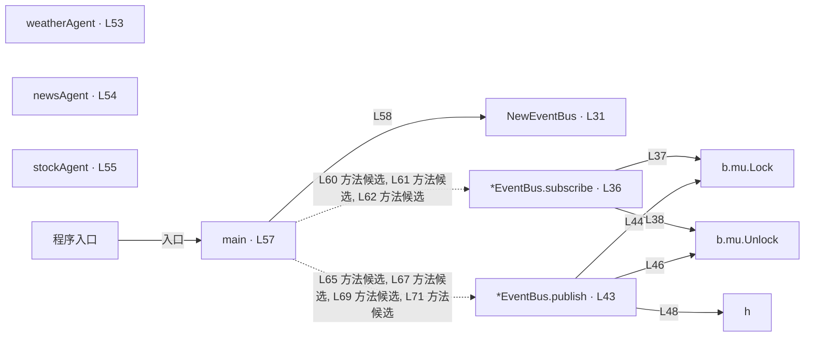

# 030.go · 事件总线

课程：2-12 · 全课程第 32 节。源码快照 SHA-256 前 12 位：`581c34e89c76`。

[原文件](../030.go) · [网页阅读](pages/030.go.html) · [放大调用图](graphs/030.go.svg)

## 这份文件要完成什么

订阅者按主题注册回调，发布时找到该主题的订阅者并投递。

## 为什么需要它

发布者不必知道所有接收者，只需要知道消息主题。

## 当前文件的实际状态

- 主要展示本地计算、内存状态或模拟流程；是否写文件/启动子进程请看调用表。 本次只做静态解析，没有运行练习，也没有替你填写或修改原代码。

## 调用图 / 阅读与数据流程

实线：源码中的直接调用；虚线：函数引用/注册、动态调用或按方法名推断的候选。L 是调用所在源码行号。箭头不表示执行顺序或每次必经；分支、循环、异步调度及框架内部调用需结合源码。灰色是外部/未解析目标，橙色是动态分发；省略 print、len 和常规容器操作以减少干扰。孤立函数可能尚未接入。

Mermaid 图源

## 从哪里开始看

先从 main（程序入口） 出发，沿箭头找到本文件函数，再查看外部调用或动态分发。右侧调用清单保留所有静态调用点，能回到原文件逐行对照。

## 关键函数与依赖

| 函数 / 定义行 | 职责（源码注释供参考） | 函数体中的调用 |
|---|---|---|
| `NewEventBus` [L31](../030.go#L31) | 以源码函数体为准；下列调用展示其依赖。 | `make` |
| `*EventBus.subscribe` [L36](../030.go#L36) | subscribe：把 handler 登记到该 topic 的订阅者列表（topic 首次出现时自动建空切片） | `b.mu.Lock, b.mu.Unlock, append` |
| `*EventBus.publish` [L43](../030.go#L43) | publish：只把消息投递给「订阅了该 topic」的 handler；没人订阅就不投（不串台） | `b.mu.Lock, b.mu.Unlock, h` |
| `weatherAgent` [L53](../030.go#L53) | 三个订阅者：各自只关心自己的 topic | `fmt.Printf` |
| `newsAgent` [L54](../030.go#L54) | 以源码函数体为准；下列调用展示其依赖。 | `fmt.Printf` |
| `stockAgent` [L55](../030.go#L55) | 以源码函数体为准；下列调用展示其依赖。 | `fmt.Printf` |
| `main` [L57](../030.go#L57) | 以源码函数体为准；下列调用展示其依赖。 | `NewEventBus, bus.subscribe, fmt.Println, bus.publish` |

## 这样做的优点

发送端和接收端更容易独立扩展。

## 代价与局限

内存总线没有消息持久化、可靠重投和跨进程能力；同步回调还可能阻塞发布者。

## 适合什么场景

单进程事件通知、理解发布订阅。

## 不适合直接照搬的场景

要求可靠送达的跨服务消息系统。

## 改一个条件，检验是否理解

发布一个无人订阅的主题，再让两个回调订阅同一主题，观察投递次数。

如果当前文件有未实现位置，先预测应该怎样变化，补齐后再验证；不要把“能启动”当作“实现正确”。

## 全部静态调用点

这是语法分析清单，包含图中省略的基础操作；不记录参数值。

| 调用方 | 目标表达式 | 行号 | 类型 |
|---|---|---|---|
| NewEventBus | `make` | 32 | 调用表达式 |
| *EventBus.subscribe | `b.mu.Lock` | 37 | 调用表达式 |
| *EventBus.subscribe | `b.mu.Unlock` | 38 | 调用表达式 |
| *EventBus.subscribe | `append` | 39 | 调用表达式 |
| *EventBus.publish | `b.mu.Lock` | 44 | 调用表达式 |
| *EventBus.publish | `b.mu.Unlock` | 46 | 调用表达式 |
| *EventBus.publish | `h` | 48 | 调用表达式 |
| weatherAgent | `fmt.Printf` | 53 | 调用表达式 |
| newsAgent | `fmt.Printf` | 54 | 调用表达式 |
| stockAgent | `fmt.Printf` | 55 | 调用表达式 |
| main | `NewEventBus` | 58 | 调用表达式 |
| main | `bus.subscribe` | 60 | 调用表达式 |
| main | `bus.subscribe` | 61 | 调用表达式 |
| main | `bus.subscribe` | 62 | 调用表达式 |
| main | `fmt.Println` | 64 | 调用表达式 |
| main | `bus.publish` | 65 | 调用表达式 |
| main | `fmt.Println` | 66 | 调用表达式 |
| main | `bus.publish` | 67 | 调用表达式 |
| main | `fmt.Println` | 68 | 调用表达式 |
| main | `bus.publish` | 69 | 调用表达式 |
| main | `fmt.Println` | 70 | 调用表达式 |
| main | `bus.publish` | 71 | 调用表达式 |
| main | `fmt.Println` | 73 | 调用表达式 |
