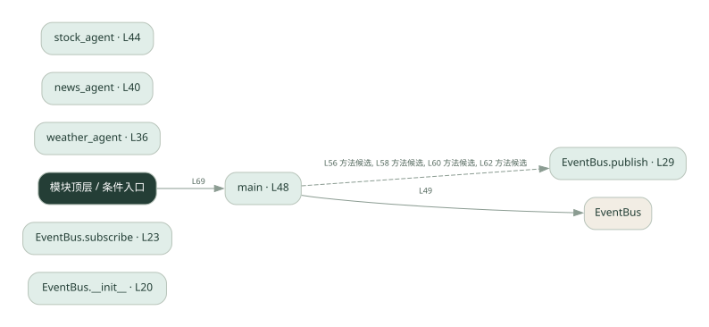
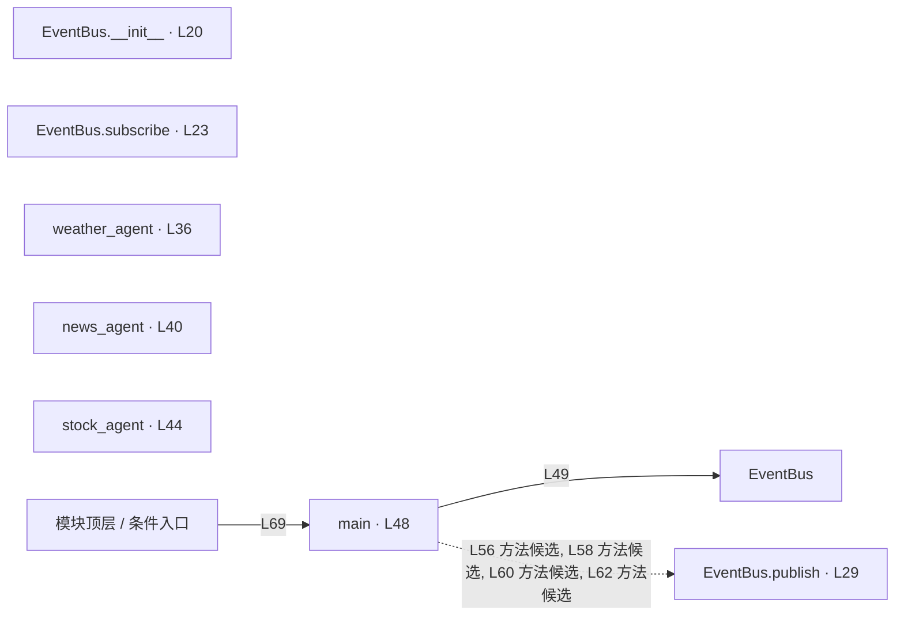

# 030.py · 事件总线

课程：2-12 · 全课程第 32 节。源码快照 SHA-256 前 12 位：`2241fbb8f720`。

[原文件](../030.py) · [网页阅读](pages/030.py.html) · [放大调用图](graphs/030.py.svg)

## 这份文件要完成什么

订阅者按主题注册回调，发布时找到该主题的订阅者并投递。

## 为什么需要它

发布者不必知道所有接收者，只需要知道消息主题。

## 当前文件的实际状态

- subscribe 和 publish 只有 result = None，main 的订阅位置也未实现。因此当前发布消息不会触发三个 agent 回调；图中不会虚构这条调用边。
- 检测到 None 赋值或 pass 的位置：27, 33, 53。这些也可能是正常初始化，需结合下方函数职责与源码判断；不能仅凭没有下划线认定完成。
- 主要展示本地计算、内存状态或模拟流程；是否写文件/启动子进程请看调用表。 本次只做静态解析，没有运行练习，也没有替你填写或修改原代码。

## 调用图 / 阅读与数据流程

实线：源码中的直接调用；虚线：函数引用/注册、动态调用或按方法名推断的候选。L 是调用所在源码行号。箭头不表示执行顺序或每次必经；分支、循环、异步调度及框架内部调用需结合源码。灰色是外部/未解析目标，橙色是动态分发；省略 print、len 和常规容器操作以减少干扰。孤立函数可能尚未接入。

Mermaid 图源

## 从哪里开始看

先从 main 及模块入口 出发，沿箭头找到本文件函数，再查看外部调用或动态分发。右侧调用清单保留所有静态调用点，能回到原文件逐行对照。

## 关键函数与依赖

| 函数 / 定义行 | 职责（源码注释供参考） | 函数体中的调用 |
|---|---|---|
| `EventBus.__init__` [L20](../030.py#L20) | 以源码函数体为准；下列调用展示其依赖。 | `未发现显式函数调用（可能直接计算、读写状态或尚未实现）` |
| `EventBus.subscribe` [L23](../030.py#L23) | 以源码函数体为准；下列调用展示其依赖。 | `未发现显式函数调用（可能直接计算、读写状态或尚未实现）` |
| `EventBus.publish` [L29](../030.py#L29) | 以源码函数体为准；下列调用展示其依赖。 | `未发现显式函数调用（可能直接计算、读写状态或尚未实现）` |
| `weather_agent` [L36](../030.py#L36) | 以源码函数体为准；下列调用展示其依赖。 | `print` |
| `news_agent` [L40](../030.py#L40) | 以源码函数体为准；下列调用展示其依赖。 | `print` |
| `stock_agent` [L44](../030.py#L44) | 以源码函数体为准；下列调用展示其依赖。 | `print` |
| `main` [L48](../030.py#L48) | 以源码函数体为准；下列调用展示其依赖。 | `EventBus, print, bus.publish` |

## 这样做的优点

发送端和接收端更容易独立扩展。

## 代价与局限

内存总线没有消息持久化、可靠重投和跨进程能力；同步回调还可能阻塞发布者。

## 适合什么场景

单进程事件通知、理解发布订阅。

## 不适合直接照搬的场景

要求可靠送达的跨服务消息系统。

## 改一个条件，检验是否理解

发布一个无人订阅的主题，再让两个回调订阅同一主题，观察投递次数。

如果当前文件有未实现位置，先预测应该怎样变化，补齐后再验证；不要把“能启动”当作“实现正确”。

## 全部静态调用点

这是语法分析清单，包含图中省略的基础操作；不记录参数值。

| 调用方 | 目标表达式 | 行号 | 类型 |
|---|---|---|---|
| weather_agent | `print` | 37 | 调用表达式 |
| news_agent | `print` | 41 | 调用表达式 |
| stock_agent | `print` | 45 | 调用表达式 |
| main | `EventBus` | 49 | 调用表达式 |
| main | `print` | 55 | 调用表达式 |
| main | `bus.publish` | 56 | 调用表达式 |
| main | `print` | 57 | 调用表达式 |
| main | `bus.publish` | 58 | 调用表达式 |
| main | `print` | 59 | 调用表达式 |
| main | `bus.publish` | 60 | 调用表达式 |
| main | `print` | 61 | 调用表达式 |
| main | `bus.publish` | 62 | 调用表达式 |
| <模块入口> | `print` | 66 | 调用表达式 |
| <模块入口> | `print` | 67 | 调用表达式 |
| <模块入口> | `print` | 68 | 调用表达式 |
| <模块入口> | `main` | 69 | 调用表达式 |
| <模块入口> | `print` | 70 | 调用表达式 |
