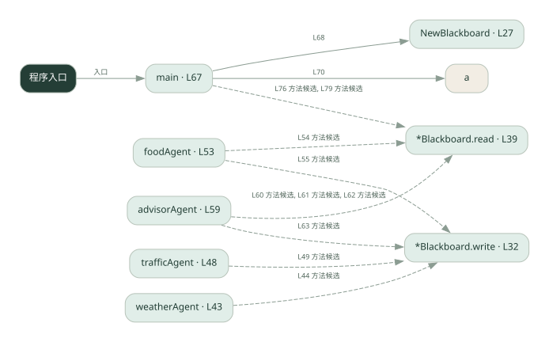
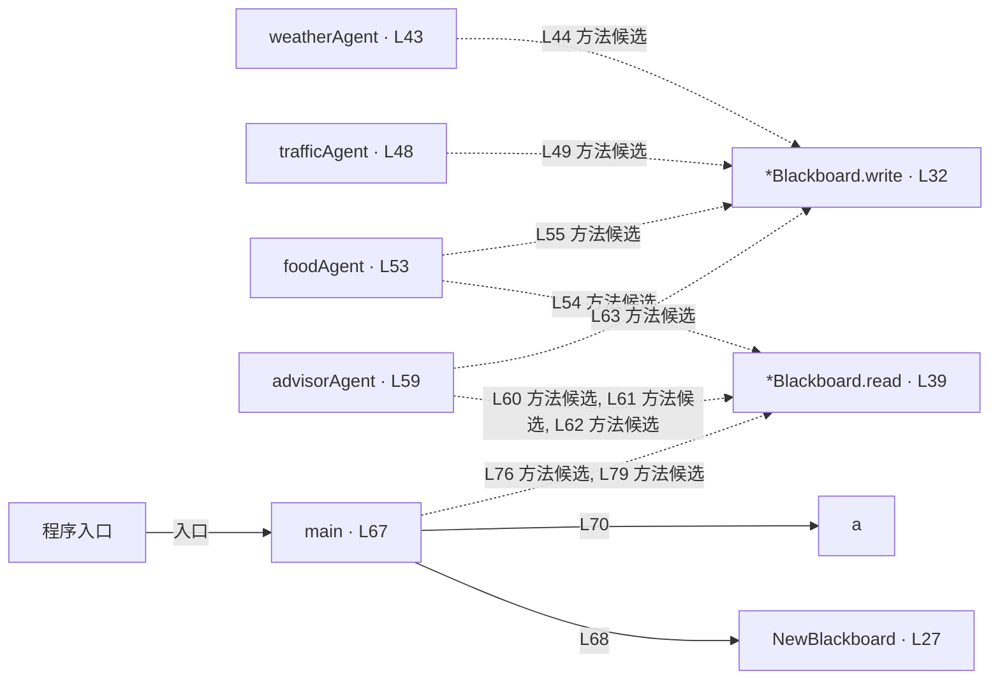

# 031.go · 黑板协作

课程：2-13 · 全课程第 33 节。源码快照 SHA-256 前 12 位：`95d97c4a67a7`。

[原文件](../031.go) · [网页阅读](pages/031.go.html) · [放大调用图](graphs/031.go.svg)

## 这份文件要完成什么

所有角色读写同一块黑板，逐步补齐最终建议所需的信息。

## 为什么需要它

角色不必两两传消息，可以从公共状态发现已有资料。

## 当前文件的实际状态

- 主要展示本地计算、内存状态或模拟流程；是否写文件/启动子进程请看调用表。 本次只做静态解析，没有运行练习，也没有替你填写或修改原代码。

## 调用图 / 阅读与数据流程

实线：源码中的直接调用；虚线：函数引用/注册、动态调用或按方法名推断的候选。L 是调用所在源码行号。箭头不表示执行顺序或每次必经；分支、循环、异步调度及框架内部调用需结合源码。灰色是外部/未解析目标，橙色是动态分发；省略 print、len 和常规容器操作以减少干扰。孤立函数可能尚未接入。

Mermaid 图源

## 从哪里开始看

先从 main（程序入口） 出发，沿箭头找到本文件函数，再查看外部调用或动态分发。右侧调用清单保留所有静态调用点，能回到原文件逐行对照。

## 关键函数与依赖

| 函数 / 定义行 | 职责（源码注释供参考） | 函数体中的调用 |
|---|---|---|
| `NewBlackboard` [L27](../031.go#L27) | 以源码函数体为准；下列调用展示其依赖。 | `make` |
| `*Blackboard.write` [L32](../031.go#L32) | write：把 value 写到黑板（以 key 为键） | `未发现显式函数调用（可能直接计算、读写状态或尚未实现）` |
| `*Blackboard.read` [L39](../031.go#L39) | read：读黑板上的 key。 | `未发现显式函数调用（可能直接计算、读写状态或尚未实现）` |
| `weatherAgent` [L43](../031.go#L43) | 以源码函数体为准；下列调用展示其依赖。 | `bb.write` |
| `trafficAgent` [L48](../031.go#L48) | 以源码函数体为准；下列调用展示其依赖。 | `bb.write` |
| `foodAgent` [L53](../031.go#L53) | 以源码函数体为准；下列调用展示其依赖。 | `bb.read, bb.write` |
| `advisorAgent` [L59](../031.go#L59) | 以源码函数体为准；下列调用展示其依赖。 | `bb.read, bb.write` |
| `main` [L67](../031.go#L67) | 以源码函数体为准；下列调用展示其依赖。 | `NewBlackboard, fmt.Println, a, fmt.Printf, bb.read` |

## 这样做的优点

中间结果集中、方便检查与复用。

## 代价与局限

字段约定和执行顺序隐含依赖；并发写入、过期信息需额外管理。

## 适合什么场景

多个步骤补齐一个结构化结果。

## 不适合直接照搬的场景

严格隔离数据、或无共同状态结构的任务。

## 改一个条件，检验是否理解

先执行依赖天气的推荐者，检查缺失天气时输出是否合理。

如果当前文件有未实现位置，先预测应该怎样变化，补齐后再验证；不要把“能启动”当作“实现正确”。

## 全部静态调用点

这是语法分析清单，包含图中省略的基础操作；不记录参数值。

| 调用方 | 目标表达式 | 行号 | 类型 |
|---|---|---|---|
| NewBlackboard | `make` | 28 | 调用表达式 |
| weatherAgent | `bb.write` | 44 | 调用表达式 |
| trafficAgent | `bb.write` | 49 | 调用表达式 |
| foodAgent | `bb.read` | 54 | 调用表达式 |
| foodAgent | `bb.write` | 55 | 调用表达式 |
| advisorAgent | `bb.read` | 60 | 调用表达式 |
| advisorAgent | `bb.read` | 61 | 调用表达式 |
| advisorAgent | `bb.read` | 62 | 调用表达式 |
| advisorAgent | `bb.write` | 63 | 调用表达式 |
| main | `NewBlackboard` | 68 | 调用表达式 |
| main | `fmt.Println` | 70 | 调用表达式 |
| main | `a` | 70 | 调用表达式 |
| main | `fmt.Println` | 74 | 调用表达式 |
| main | `fmt.Printf` | 76 | 调用表达式 |
| main | `bb.read` | 76 | 调用表达式 |
| main | `fmt.Printf` | 79 | 调用表达式 |
| main | `bb.read` | 79 | 调用表达式 |
| main | `fmt.Println` | 80 | 调用表达式 |
