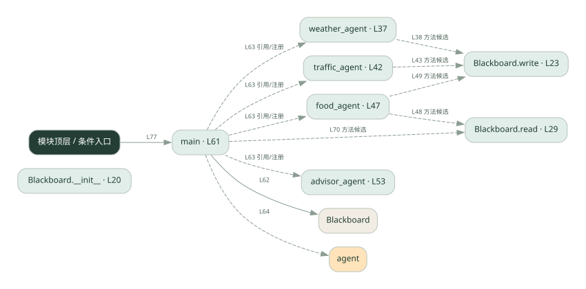
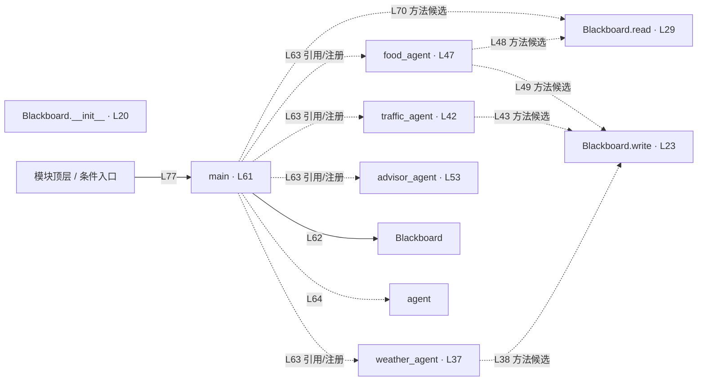

# 031.py · 黑板协作

课程：2-13 · 全课程第 33 节。源码快照 SHA-256 前 12 位：`709633f6bac0`。

[原文件](../031.py) · [网页阅读](pages/031.py.html) · [放大调用图](graphs/031.py.svg)

## 这份文件要完成什么

所有角色读写同一块黑板，逐步补齐最终建议所需的信息。

## 为什么需要它

角色不必两两传消息，可以从公共状态发现已有资料。

## 当前文件的实际状态

- Blackboard.write/read 以及 advisor_agent 的关键逻辑未实现。main 用列表中的 agent 变量间接调用四个角色，但黑板不会被正确填充。
- 检测到 None 赋值或 pass 的位置：27, 33, 57。这些也可能是正常初始化，需结合下方函数职责与源码判断；不能仅凭没有下划线认定完成。
- 主要展示本地计算、内存状态或模拟流程；是否写文件/启动子进程请看调用表。 本次只做静态解析，没有运行练习，也没有替你填写或修改原代码。

## 调用图 / 阅读与数据流程

实线：源码中的直接调用；虚线：函数引用/注册、动态调用或按方法名推断的候选。L 是调用所在源码行号。箭头不表示执行顺序或每次必经；分支、循环、异步调度及框架内部调用需结合源码。灰色是外部/未解析目标，橙色是动态分发；省略 print、len 和常规容器操作以减少干扰。孤立函数可能尚未接入。

Mermaid 图源

## 从哪里开始看

先从 main 及模块入口 出发，沿箭头找到本文件函数，再查看外部调用或动态分发。右侧调用清单保留所有静态调用点，能回到原文件逐行对照。

## 关键函数与依赖

| 函数 / 定义行 | 职责（源码注释供参考） | 函数体中的调用 |
|---|---|---|
| `Blackboard.__init__` [L20](../031.py#L20) | 以源码函数体为准；下列调用展示其依赖。 | `未发现显式函数调用（可能直接计算、读写状态或尚未实现）` |
| `Blackboard.write` [L23](../031.py#L23) | 以源码函数体为准；下列调用展示其依赖。 | `未发现显式函数调用（可能直接计算、读写状态或尚未实现）` |
| `Blackboard.read` [L29](../031.py#L29) | 以源码函数体为准；下列调用展示其依赖。 | `未发现显式函数调用（可能直接计算、读写状态或尚未实现）` |
| `weather_agent` [L37](../031.py#L37) | 以源码函数体为准；下列调用展示其依赖。 | `bb.write` |
| `traffic_agent` [L42](../031.py#L42) | 以源码函数体为准；下列调用展示其依赖。 | `bb.write` |
| `food_agent` [L47](../031.py#L47) | 以源码函数体为准；下列调用展示其依赖。 | `bb.read, bb.write` |
| `advisor_agent` [L53](../031.py#L53) | 以源码函数体为准；下列调用展示其依赖。 | `未发现显式函数调用（可能直接计算、读写状态或尚未实现）` |
| `main` [L61](../031.py#L61) | 以源码函数体为准；下列调用展示其依赖。 | `Blackboard, print, agent, bb.data.items, bb.read` |

## 这样做的优点

中间结果集中、方便检查与复用。

## 代价与局限

字段约定和执行顺序隐含依赖；并发写入、过期信息需额外管理。

## 适合什么场景

多个步骤补齐一个结构化结果。

## 不适合直接照搬的场景

严格隔离数据、或无共同状态结构的任务。

## 改一个条件，检验是否理解

先执行依赖天气的推荐者，检查缺失天气时输出是否合理。

如果当前文件有未实现位置，先预测应该怎样变化，补齐后再验证；不要把“能启动”当作“实现正确”。

## 全部静态调用点

这是语法分析清单，包含图中省略的基础操作；不记录参数值。

| 调用方 | 目标表达式 | 行号 | 类型 |
|---|---|---|---|
| weather_agent | `bb.write` | 38 | 调用表达式 |
| traffic_agent | `bb.write` | 43 | 调用表达式 |
| food_agent | `bb.read` | 48 | 调用表达式 |
| food_agent | `bb.write` | 49 | 调用表达式 |
| main | `Blackboard` | 62 | 调用表达式 |
| main | `print` | 64 | 调用表达式 |
| main | `agent` | 64 | 调用表达式 |
| main | `print` | 66 | 调用表达式 |
| main | `bb.data.items` | 67 | 调用表达式 |
| main | `print` | 68 | 调用表达式 |
| main | `print` | 70 | 调用表达式 |
| main | `bb.read` | 70 | 调用表达式 |
| <模块入口> | `print` | 74 | 调用表达式 |
| <模块入口> | `print` | 75 | 调用表达式 |
| <模块入口> | `print` | 76 | 调用表达式 |
| <模块入口> | `main` | 77 | 调用表达式 |
| <模块入口> | `print` | 78 | 调用表达式 |
| main | `weather_agent` | 63 | 函数引用/注册 |
| main | `traffic_agent` | 63 | 函数引用/注册 |
| main | `food_agent` | 63 | 函数引用/注册 |
| main | `advisor_agent` | 63 | 函数引用/注册 |
