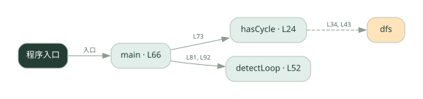
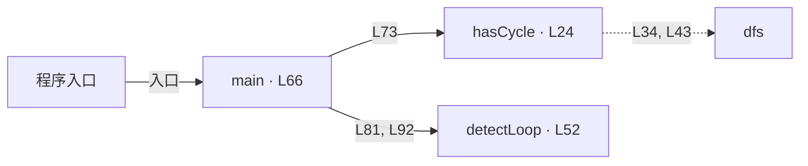

# 032.go · 死锁与重复循环检测

课程：2-14 · 全课程第 34 节。源码快照 SHA-256 前 12 位：`e7fdb9b4c6cb`。

[原文件](../032.go) · [网页阅读](pages/032.go.html) · [放大调用图](graphs/032.go.svg)

## 这份文件要完成什么

在等待关系中找环，并检测状态重复或步数过多。

## 为什么需要它

Agent 可能互相等待，也可能一直重复同样的动作而不结束。

## 当前文件的实际状态

- 主要展示本地计算、内存状态或模拟流程；是否写文件/启动子进程请看调用表。 本次只做静态解析，没有运行练习，也没有替你填写或修改原代码。

## 调用图 / 阅读与数据流程

实线：源码中的直接调用；虚线：函数引用/注册、动态调用或按方法名推断的候选。L 是调用所在源码行号。箭头不表示执行顺序或每次必经；分支、循环、异步调度及框架内部调用需结合源码。灰色是外部/未解析目标，橙色是动态分发；省略 print、len 和常规容器操作以减少干扰。孤立函数可能尚未接入。

Mermaid 图源

## 从哪里开始看

先从 main（程序入口） 出发，沿箭头找到本文件函数，再查看外部调用或动态分发。右侧调用清单保留所有静态调用点，能回到原文件逐行对照。

## 关键函数与依赖

| 函数 / 定义行 | 职责（源码注释供参考） | 函数体中的调用 |
|---|---|---|
| `hasCycle` [L24](../032.go#L24) | hasCycle：等待图找环。waitsFor = {agent: [它正在等待的 agent...]} | `dfs` |
| `detectLoop` [L52](../032.go#L52) | detectLoop：返回 (是否循环, 原因)。 | `len` |
| `main` [L66](../032.go#L66) | 以源码函数体为准；下列调用展示其依赖。 | `fmt.Println, hasCycle, detectLoop, fmt.Printf, make, append, fmt.Sprintf` |

## 这样做的优点

把“卡住”变成可检测条件，便于终止和诊断。

## 代价与局限

重复状态不总是错误；图检测成立依赖等待关系建模是否准确。

## 适合什么场景

工作流调试、给迭代过程增加停止条件。

## 不适合直接照搬的场景

把检测到等待图环直接等同所有运行时死锁而不检查锁语义。

## 改一个条件，检验是否理解

构造 A 等 B、B 等 A，再构造正常链条，比较检测结果。

如果当前文件有未实现位置，先预测应该怎样变化，补齐后再验证；不要把“能启动”当作“实现正确”。

## 全部静态调用点

这是语法分析清单，包含图中省略的基础操作；不记录参数值。

| 调用方 | 目标表达式 | 行号 | 类型 |
|---|---|---|---|
| hasCycle | `dfs` | 34 | 调用表达式 |
| hasCycle | `dfs` | 43 | 调用表达式 |
| detectLoop | `len` | 60 | 调用表达式 |
| main | `fmt.Println` | 67 | 调用表达式 |
| main | `hasCycle` | 73 | 调用表达式 |
| main | `fmt.Println` | 74 | 调用表达式 |
| main | `fmt.Println` | 76 | 调用表达式 |
| main | `fmt.Println` | 79 | 调用表达式 |
| main | `detectLoop` | 81 | 调用表达式 |
| main | `fmt.Printf` | 82 | 调用表达式 |
| main | `fmt.Printf` | 84 | 调用表达式 |
| main | `fmt.Println` | 87 | 调用表达式 |
| main | `make` | 88 | 调用表达式 |
| main | `append` | 90 | 调用表达式 |
| main | `fmt.Sprintf` | 90 | 调用表达式 |
| main | `detectLoop` | 92 | 调用表达式 |
| main | `fmt.Printf` | 93 | 调用表达式 |
| main | `fmt.Printf` | 95 | 调用表达式 |
