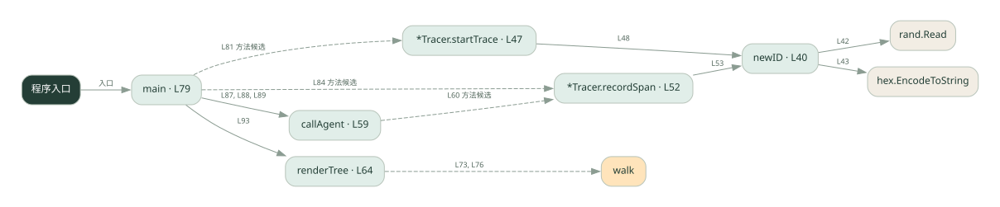
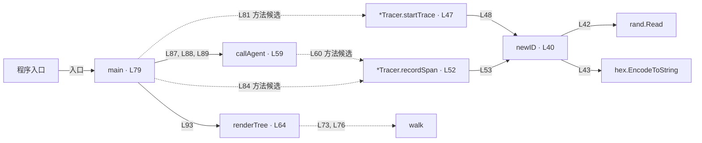

# 033.go · 跨角色调用链

课程：2-15 · 全课程第 35 节。源码快照 SHA-256 前 12 位：`fbb0e29bd2af`。

[原文件](../033.go) · [网页阅读](pages/033.go.html) · [放大调用图](graphs/033.go.svg)

## 这份文件要完成什么

给一次请求和每段调用生成标识，再按父子关系还原树。

## 为什么需要它

多个执行者的日志混在一起时，需要知道哪些记录属于同一请求。

## 当前文件的实际状态

- 主要展示本地计算、内存状态或模拟流程；是否写文件/启动子进程请看调用表。 本次只做静态解析，没有运行练习，也没有替你填写或修改原代码。

## 调用图 / 阅读与数据流程

实线：源码中的直接调用；虚线：函数引用/注册、动态调用或按方法名推断的候选。L 是调用所在源码行号。箭头不表示执行顺序或每次必经；分支、循环、异步调度及框架内部调用需结合源码。灰色是外部/未解析目标，橙色是动态分发；省略 print、len 和常规容器操作以减少干扰。孤立函数可能尚未接入。

Mermaid 图源

## 从哪里开始看

先从 main（程序入口） 出发，沿箭头找到本文件函数，再查看外部调用或动态分发。右侧调用清单保留所有静态调用点，能回到原文件逐行对照。

## 关键函数与依赖

| 函数 / 定义行 | 职责（源码注释供参考） | 函数体中的调用 |
|---|---|---|
| `newID` [L40](../033.go#L40) | newID：生成 8 位十六进制短 id（4 随机字节 → hex） | `make, rand.Read, hex.EncodeToString` |
| `*Tracer.startTrace` [L47](../033.go#L47) | startTrace：一次请求一个 trace_id，作为整条链路的标识 | `newID` |
| `*Tracer.recordSpan` [L52](../033.go#L52) | recordSpan：记一个 span（trace_id, 名字, 父 span），返回它的 span_id | `newID, append` |
| `callAgent` [L59](../033.go#L59) | callAgent：模拟「跨 agent 调用」——把 tracing 上下文（trace_id + 父 span）传给下一个 agent | `t.recordSpan` |
| `renderTree` [L64](../033.go#L64) | renderTree：按 parent 把 span 拼成树形文本 | `append, fmt.Printf, walk` |
| `main` [L79](../033.go#L79) | 以源码函数体为准；下列调用展示其依赖。 | `tracer.startTrace, tracer.recordSpan, callAgent, fmt.Printf, len, renderTree, fmt.Println` |

## 这样做的优点

能看清调用归属和上下游关系。

## 代价与局限

本地树形演示不包含跨服务上下文传播、采样与集中存储。

## 适合什么场景

理解 trace/span 和调试多步调用。

## 不适合直接照搬的场景

直接替代完整分布式可观测平台。

## 改一个条件，检验是否理解

让同一角色被两个父节点调用，检查是否能按 parent 区分。

如果当前文件有未实现位置，先预测应该怎样变化，补齐后再验证；不要把“能启动”当作“实现正确”。

## 全部静态调用点

这是语法分析清单，包含图中省略的基础操作；不记录参数值。

| 调用方 | 目标表达式 | 行号 | 类型 |
|---|---|---|---|
| newID | `make` | 41 | 调用表达式 |
| newID | `rand.Read` | 42 | 调用表达式 |
| newID | `hex.EncodeToString` | 43 | 调用表达式 |
| *Tracer.startTrace | `newID` | 48 | 调用表达式 |
| *Tracer.recordSpan | `newID` | 53 | 调用表达式 |
| *Tracer.recordSpan | `append` | 54 | 调用表达式 |
| callAgent | `t.recordSpan` | 60 | 调用表达式 |
| renderTree | `append` | 67 | 调用表达式 |
| renderTree | `fmt.Printf` | 72 | 调用表达式 |
| renderTree | `walk` | 73 | 调用表达式 |
| renderTree | `walk` | 76 | 调用表达式 |
| main | `tracer.startTrace` | 81 | 调用表达式 |
| main | `tracer.recordSpan` | 84 | 调用表达式 |
| main | `callAgent` | 87 | 调用表达式 |
| main | `callAgent` | 88 | 调用表达式 |
| main | `callAgent` | 89 | 调用表达式 |
| main | `fmt.Printf` | 91 | 调用表达式 |
| main | `fmt.Printf` | 92 | 调用表达式 |
| main | `len` | 92 | 调用表达式 |
| main | `renderTree` | 93 | 调用表达式 |
| main | `fmt.Println` | 94 | 调用表达式 |
