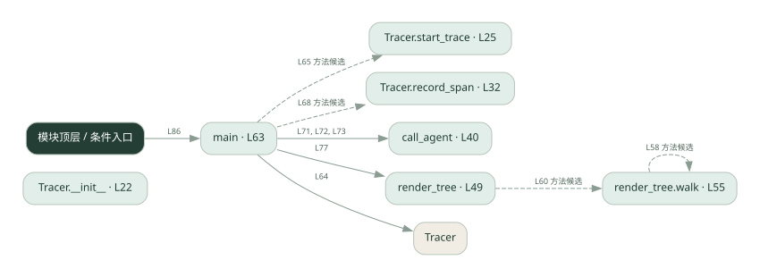
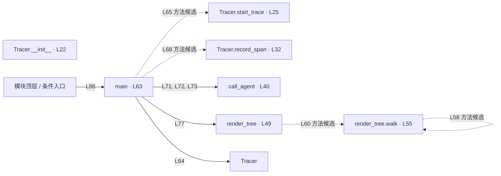

# 033.py · 跨角色调用链

课程：2-15 · 全课程第 35 节。源码快照 SHA-256 前 12 位：`e3f9aa2b9e52`。

[原文件](../033.py) · [网页阅读](pages/033.py.html) · [放大调用图](graphs/033.py.svg)

## 这份文件要完成什么

给一次请求和每段调用生成标识，再按父子关系还原树。

## 为什么需要它

多个执行者的日志混在一起时，需要知道哪些记录属于同一请求。

## 当前文件的实际状态

- start_trace、record_span 和 call_agent 返回 None，没有生成标识或追加 span；render_tree 能遍历树，但目前没有有效记录供它展示。
- 检测到 None 赋值或 pass 的位置：29, 36, 45。这些也可能是正常初始化，需结合下方函数职责与源码判断；不能仅凭没有下划线认定完成。
- 主要展示本地计算、内存状态或模拟流程；是否写文件/启动子进程请看调用表。 本次只做静态解析，没有运行练习，也没有替你填写或修改原代码。

## 调用图 / 阅读与数据流程

实线：源码中的直接调用；虚线：函数引用/注册、动态调用或按方法名推断的候选。L 是调用所在源码行号。箭头不表示执行顺序或每次必经；分支、循环、异步调度及框架内部调用需结合源码。灰色是外部/未解析目标，橙色是动态分发；省略 print、len 和常规容器操作以减少干扰。孤立函数可能尚未接入。

Mermaid 图源

## 从哪里开始看

先从 main 及模块入口 出发，沿箭头找到本文件函数，再查看外部调用或动态分发。右侧调用清单保留所有静态调用点，能回到原文件逐行对照。

## 关键函数与依赖

| 函数 / 定义行 | 职责（源码注释供参考） | 函数体中的调用 |
|---|---|---|
| `Tracer.__init__` [L22](../033.py#L22) | 以源码函数体为准；下列调用展示其依赖。 | `未发现显式函数调用（可能直接计算、读写状态或尚未实现）` |
| `Tracer.start_trace` [L25](../033.py#L25) | 以源码函数体为准；下列调用展示其依赖。 | `未发现显式函数调用（可能直接计算、读写状态或尚未实现）` |
| `Tracer.record_span` [L32](../033.py#L32) | 以源码函数体为准；下列调用展示其依赖。 | `未发现显式函数调用（可能直接计算、读写状态或尚未实现）` |
| `call_agent` [L40](../033.py#L40) | 模拟「跨 agent 调用」：把 tracing 上下文（trace_id + 父 span）传给下一个 agent | `未发现显式函数调用（可能直接计算、读写状态或尚未实现）` |
| `render_tree` [L49](../033.py#L49) | 按 parent_id 把 span 拼成树形文本 | `children.setdefault().append, children.setdefault, walk` |
| `render_tree.walk` [L55](../033.py#L55) | 以源码函数体为准；下列调用展示其依赖。 | `children.get, print, walk` |
| `main` [L63](../033.py#L63) | 以源码函数体为准；下列调用展示其依赖。 | `Tracer, tracer.start_trace, tracer.record_span, call_agent, print, len, render_tree` |

## 这样做的优点

能看清调用归属和上下游关系。

## 代价与局限

本地树形演示不包含跨服务上下文传播、采样与集中存储。

## 适合什么场景

理解 trace/span 和调试多步调用。

## 不适合直接照搬的场景

直接替代完整分布式可观测平台。

## 改一个条件，检验是否理解

让同一角色被两个父节点调用，检查是否能按 parent 区分。

如果当前文件有未实现位置，先预测应该怎样变化，补齐后再验证；不要把“能启动”当作“实现正确”。

## 全部静态调用点

这是语法分析清单，包含图中省略的基础操作；不记录参数值。

| 调用方 | 目标表达式 | 行号 | 类型 |
|---|---|---|---|
| render_tree | `children.setdefault().append` | 53 | 调用表达式 |
| render_tree | `children.setdefault` | 53 | 调用表达式 |
| render_tree.walk | `children.get` | 56 | 调用表达式 |
| render_tree.walk | `print` | 57 | 调用表达式 |
| render_tree.walk | `walk` | 58 | 调用表达式 |
| render_tree | `walk` | 60 | 调用表达式 |
| main | `Tracer` | 64 | 调用表达式 |
| main | `tracer.start_trace` | 65 | 调用表达式 |
| main | `tracer.record_span` | 68 | 调用表达式 |
| main | `call_agent` | 71 | 调用表达式 |
| main | `call_agent` | 72 | 调用表达式 |
| main | `call_agent` | 73 | 调用表达式 |
| main | `print` | 75 | 调用表达式 |
| main | `print` | 76 | 调用表达式 |
| main | `len` | 76 | 调用表达式 |
| main | `render_tree` | 77 | 调用表达式 |
| main | `print` | 78 | 调用表达式 |
| <模块入口> | `print` | 83 | 调用表达式 |
| <模块入口> | `print` | 84 | 调用表达式 |
| <模块入口> | `print` | 85 | 调用表达式 |
| <模块入口> | `main` | 86 | 调用表达式 |
