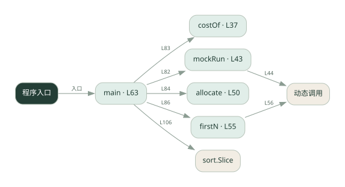
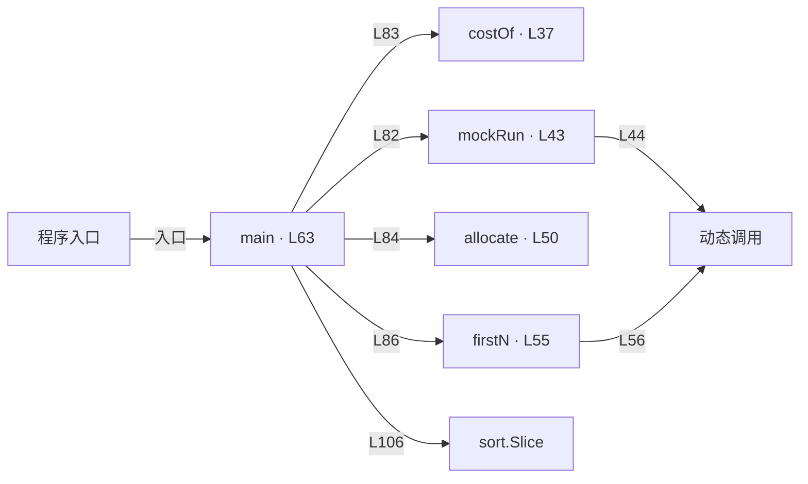

# 034.go · 预算分摊

课程：2-16 · 全课程第 36 节。源码快照 SHA-256 前 12 位：`16893a616bc6`。

[原文件](../034.go) · [网页阅读](pages/034.go.html) · [放大调用图](graphs/034.go.svg)

## 这份文件要完成什么

按每个 Agent 的输入输出用量累计费用，并与预算比较。

## 为什么需要它

总费用高时需要知道花在谁身上，以及何时该停止。

## 当前文件的实际状态

- 主要展示本地计算、内存状态或模拟流程；是否写文件/启动子进程请看调用表。 本次只做静态解析，没有运行练习，也没有替你填写或修改原代码。

## 调用图 / 阅读与数据流程

实线：源码中的直接调用；虚线：函数引用/注册、动态调用或按方法名推断的候选。L 是调用所在源码行号。箭头不表示执行顺序或每次必经；分支、循环、异步调度及框架内部调用需结合源码。灰色是外部/未解析目标，橙色是动态分发；省略 print、len 和常规容器操作以减少干扰。孤立函数可能尚未接入。

Mermaid 图源

## 从哪里开始看

先从 main（程序入口） 出发，沿箭头找到本文件函数，再查看外部调用或动态分发。右侧调用清单保留所有静态调用点，能回到原文件逐行对照。

## 关键函数与依赖

| 函数 / 定义行 | 职责（源码注释供参考） | 函数体中的调用 |
|---|---|---|
| `costOf` [L37](../034.go#L37) | costOf：算一次调用的成本（元）。输入、输出单价不同，要分开乘，再除以 1_000_000。 | `float64` |
| `mockRun` [L43](../034.go#L43) | mockRun：模拟一个 agent 执行任务，返回 (prompt_tokens, completion_tokens)。 | `len, 动态调用` |
| `allocate` [L50](../034.go#L50) | allocate：成本分摊，把本次 cost 累加到 agent_name 名下 | `未发现显式函数调用（可能直接计算、读写状态或尚未实现）` |
| `firstN` [L55](../034.go#L55) | firstN：取字符串前 n 个字符（按 rune，对应 Python 的 s[:n]） | `动态调用, len, string` |
| `main` [L63](../034.go#L63) | 以源码函数体为准；下列调用展示其依赖。 | `fmt.Println, fmt.Printf, mockRun, costOf, allocate, firstN, append, sort.Slice` |

## 这样做的优点

费用可归因，便于调整调用策略。

## 代价与局限

示例 token 与单价不代表实际账单；调用后记账可能超过预算。

## 适合什么场景

预算教学、离线成本模型。

## 不适合直接照搬的场景

要求严格绝不超额却没有调用前预留和并发控制的系统。

## 改一个条件，检验是否理解

设置小于一次调用成本的预算，观察何时停止、是否已超额。

如果当前文件有未实现位置，先预测应该怎样变化，补齐后再验证；不要把“能启动”当作“实现正确”。

## 全部静态调用点

这是语法分析清单，包含图中省略的基础操作；不记录参数值。

| 调用方 | 目标表达式 | 行号 | 类型 |
|---|---|---|---|
| costOf | `float64` | 38 | 调用表达式 |
| costOf | `float64` | 38 | 调用表达式 |
| mockRun | `len` | 44 | 调用表达式 |
| mockRun | `动态调用` | 44 | 调用表达式 |
| firstN | `动态调用` | 56 | 调用表达式 |
| firstN | `len` | 57 | 调用表达式 |
| firstN | `string` | 60 | 调用表达式 |
| main | `fmt.Println` | 77 | 调用表达式 |
| main | `fmt.Printf` | 78 | 调用表达式 |
| main | `fmt.Println` | 79 | 调用表达式 |
| main | `mockRun` | 82 | 调用表达式 |
| main | `costOf` | 83 | 调用表达式 |
| main | `allocate` | 84 | 调用表达式 |
| main | `fmt.Printf` | 86 | 调用表达式 |
| main | `firstN` | 86 | 调用表达式 |
| main | `fmt.Println` | 90 | 调用表达式 |
| main | `fmt.Println` | 96 | 调用表达式 |
| main | `fmt.Println` | 97 | 调用表达式 |
| main | `append` | 104 | 调用表达式 |
| main | `sort.Slice` | 106 | 调用表达式 |
| main | `fmt.Printf` | 108 | 调用表达式 |
| main | `fmt.Printf` | 110 | 调用表达式 |
| main | `fmt.Printf` | 112 | 调用表达式 |
| main | `fmt.Println` | 114 | 调用表达式 |
| main | `fmt.Println` | 116 | 调用表达式 |
