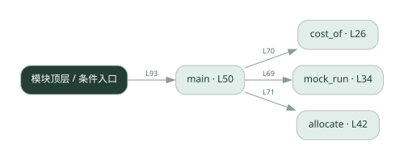
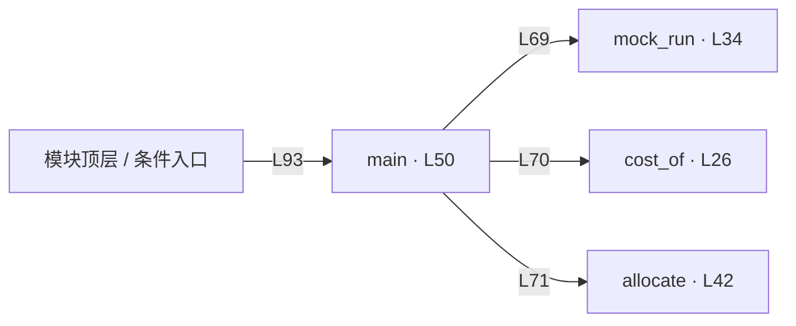

# 034.py · 预算分摊

课程：2-16 · 全课程第 36 节。源码快照 SHA-256 前 12 位：`f079a5e1ccfd`。

[原文件](../034.py) · [网页阅读](pages/034.py.html) · [放大调用图](graphs/034.py.svg)

## 这份文件要完成什么

按每个 Agent 的输入输出用量累计费用，并与预算比较。

## 为什么需要它

总费用高时需要知道花在谁身上，以及何时该停止。

## 当前文件的实际状态

- cost_of 固定返回 0，allocate 只有 pass，main 没有实现预算中止判断。因此当前输出零费用，不能说明预算控制已完成。
- 检测到 None 赋值或 pass 的位置：47。这些也可能是正常初始化，需结合下方函数职责与源码判断；不能仅凭没有下划线认定完成。
- 主要展示本地计算、内存状态或模拟流程；是否写文件/启动子进程请看调用表。 本次只做静态解析，没有运行练习，也没有替你填写或修改原代码。

## 调用图 / 阅读与数据流程

实线：源码中的直接调用；虚线：函数引用/注册、动态调用或按方法名推断的候选。L 是调用所在源码行号。箭头不表示执行顺序或每次必经；分支、循环、异步调度及框架内部调用需结合源码。灰色是外部/未解析目标，橙色是动态分发；省略 print、len 和常规容器操作以减少干扰。孤立函数可能尚未接入。

Mermaid 图源

## 从哪里开始看

先从 main 及模块入口 出发，沿箭头找到本文件函数，再查看外部调用或动态分发。右侧调用清单保留所有静态调用点，能回到原文件逐行对照。

## 关键函数与依赖

| 函数 / 定义行 | 职责（源码注释供参考） | 函数体中的调用 |
|---|---|---|
| `cost_of` [L26](../034.py#L26) | 算一次调用的成本（元）。输入、输出单价不同，要分开乘，再除以 1_000_000。 | `未发现显式函数调用（可能直接计算、读写状态或尚未实现）` |
| `mock_run` [L34](../034.py#L34) | 模拟一个 agent 执行任务，返回 (agent 名, prompt_tokens, completion_tokens)。 | `len` |
| `allocate` [L42](../034.py#L42) | 成本分摊：把本次 cost 累加到 agent_name 名下。 | `未发现显式函数调用（可能直接计算、读写状态或尚未实现）` |
| `main` [L50](../034.py#L50) | 以源码函数体为准；下列调用展示其依赖。 | `print, mock_run, cost_of, allocate, sorted, ledger.items` |

## 这样做的优点

费用可归因，便于调整调用策略。

## 代价与局限

示例 token 与单价不代表实际账单；调用后记账可能超过预算。

## 适合什么场景

预算教学、离线成本模型。

## 不适合直接照搬的场景

要求严格绝不超额却没有调用前预留和并发控制的系统。

## 改一个条件，检验是否理解

设置小于一次调用成本的预算，观察何时停止、是否已超额。

如果当前文件有未实现位置，先预测应该怎样变化，补齐后再验证；不要把“能启动”当作“实现正确”。

## 全部静态调用点

这是语法分析清单，包含图中省略的基础操作；不记录参数值。

| 调用方 | 目标表达式 | 行号 | 类型 |
|---|---|---|---|
| mock_run | `len` | 37 | 调用表达式 |
| mock_run | `len` | 38 | 调用表达式 |
| main | `print` | 64 | 调用表达式 |
| main | `print` | 65 | 调用表达式 |
| main | `print` | 66 | 调用表达式 |
| main | `mock_run` | 69 | 调用表达式 |
| main | `cost_of` | 70 | 调用表达式 |
| main | `allocate` | 71 | 调用表达式 |
| main | `print` | 73 | 调用表达式 |
| main | `print` | 80 | 调用表达式 |
| main | `print` | 81 | 调用表达式 |
| main | `sorted` | 82 | 调用表达式 |
| main | `ledger.items` | 82 | 调用表达式 |
| main | `print` | 83 | 调用表达式 |
| main | `print` | 84 | 调用表达式 |
| main | `print` | 86 | 调用表达式 |
| main | `print` | 88 | 调用表达式 |
| main | `print` | 89 | 调用表达式 |
| <模块入口> | `main` | 93 | 调用表达式 |
