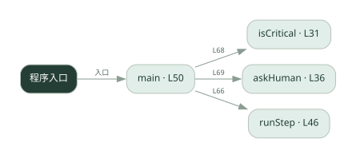
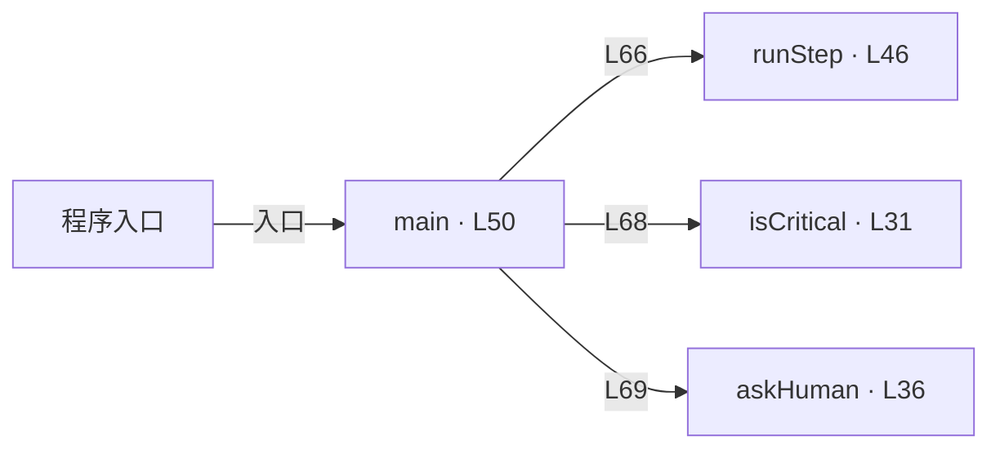

# 035.go · 人工确认节点

课程：2-17 · 全课程第 37 节。源码快照 SHA-256 前 12 位：`3cf3d3baea90`。

[原文件](../035.go) · [网页阅读](pages/035.go.html) · [放大调用图](graphs/035.go.svg)

## 这份文件要完成什么

识别关键步骤，在真正执行前取得人工批准，拒绝时停止或跳过。

## 为什么需要它

发信、改库等动作需要由人承担最终决策，不能只靠模型决定。

## 当前文件的实际状态

- 回复来自 humanReplies 预设队列，队列用完默认批准；并非真实人工输入。main 在审批判断前已经调用 runStep，拒绝只能阻止后续步骤。runStep 目前只返回文字；接真实动作前必须调整顺序。
- 主要展示本地计算、内存状态或模拟流程；是否写文件/启动子进程请看调用表。 本次只做静态解析，没有运行练习，也没有替你填写或修改原代码。

## 调用图 / 阅读与数据流程

实线：源码中的直接调用；虚线：函数引用/注册、动态调用或按方法名推断的候选。L 是调用所在源码行号。箭头不表示执行顺序或每次必经；分支、循环、异步调度及框架内部调用需结合源码。灰色是外部/未解析目标，橙色是动态分发；省略 print、len 和常规容器操作以减少干扰。孤立函数可能尚未接入。

Mermaid 图源

## 从哪里开始看

先从 main（程序入口） 出发，沿箭头找到本文件函数，再查看外部调用或动态分发。右侧调用清单保留所有静态调用点，能回到原文件逐行对照。

## 关键函数与依赖

| 函数 / 定义行 | 职责（源码注释供参考） | 函数体中的调用 |
|---|---|---|
| `isCritical` [L31](../035.go#L31) | isCritical：判断这个步骤是不是「必须等人确认」的关键节点 | `未发现显式函数调用（可能直接计算、读写状态或尚未实现）` |
| `askHuman` [L36](../035.go#L36) | askHuman：从队列弹出一个回答；队列弹空了就默认批准（approve） | `len` |
| `runStep` [L46](../035.go#L46) | runStep：模拟执行一个普通步骤（离线，不真调工具） | `fmt.Sprintf` |
| `main` [L50](../035.go#L50) | 以源码函数体为准；下列调用展示其依赖。 | `fmt.Println, fmt.Printf, runStep, isCritical, askHuman, fmt.Sprintf` |

## 这样做的优点

关键决策可以插入可见的人工关口。

## 代价与局限

模拟回复不等于真实审批；审批若放在执行后就无法阻止动作。

## 适合什么场景

学习关键节点识别、模拟审批与中止流程。

## 不适合直接照搬的场景

照搬模拟批准代码直接执行外部副作用。

## 改一个条件，检验是否理解

给关键步骤返回 reject，确认 runStep 是否仍被调用。

如果当前文件有未实现位置，先预测应该怎样变化，补齐后再验证；不要把“能启动”当作“实现正确”。

## 全部静态调用点

这是语法分析清单，包含图中省略的基础操作；不记录参数值。

| 调用方 | 目标表达式 | 行号 | 类型 |
|---|---|---|---|
| askHuman | `len` | 37 | 调用表达式 |
| runStep | `fmt.Sprintf` | 47 | 调用表达式 |
| main | `fmt.Println` | 61 | 调用表达式 |
| main | `fmt.Println` | 62 | 调用表达式 |
| main | `fmt.Println` | 63 | 调用表达式 |
| main | `fmt.Printf` | 66 | 调用表达式 |
| main | `runStep` | 66 | 调用表达式 |
| main | `isCritical` | 68 | 调用表达式 |
| main | `askHuman` | 69 | 调用表达式 |
| main | `fmt.Sprintf` | 69 | 调用表达式 |
| main | `fmt.Printf` | 70 | 调用表达式 |
| main | `fmt.Println` | 73 | 调用表达式 |
| main | `fmt.Println` | 79 | 调用表达式 |
| main | `fmt.Println` | 80 | 调用表达式 |
| main | `fmt.Println` | 81 | 调用表达式 |
