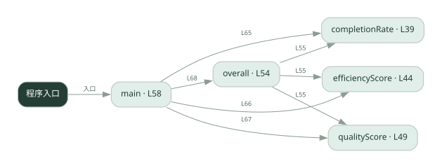
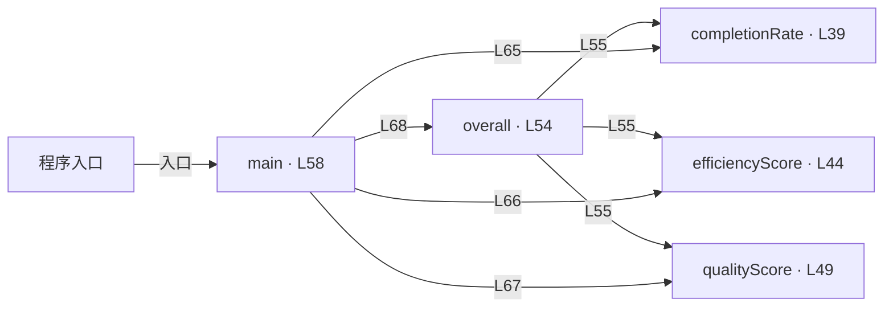

# 036.go · 多 Agent 协作评测

课程：2-18 · 全课程第 38 节。源码快照 SHA-256 前 12 位：`db279ccad274`。

[原文件](../036.go) · [网页阅读](pages/036.go.html) · [放大调用图](graphs/036.go.svg)

## 这份文件要完成什么

计算完成率、协作轮数对应的效率分和产出质量，再加权比较。

## 为什么需要它

仅看最终答案无法体现协作成本和任务遗漏。

## 当前文件的实际状态

- 主要展示本地计算、内存状态或模拟流程；是否写文件/启动子进程请看调用表。 本次只做静态解析，没有运行练习，也没有替你填写或修改原代码。

## 调用图 / 阅读与数据流程

实线：源码中的直接调用；虚线：函数引用/注册、动态调用或按方法名推断的候选。L 是调用所在源码行号。箭头不表示执行顺序或每次必经；分支、循环、异步调度及框架内部调用需结合源码。灰色是外部/未解析目标，橙色是动态分发；省略 print、len 和常规容器操作以减少干扰。孤立函数可能尚未接入。

Mermaid 图源

## 从哪里开始看

先从 main（程序入口） 出发，沿箭头找到本文件函数，再查看外部调用或动态分发。右侧调用清单保留所有静态调用点，能回到原文件逐行对照。

## 关键函数与依赖

| 函数 / 定义行 | 职责（源码注释供参考） | 函数体中的调用 |
|---|---|---|
| `completionRate` [L39](../036.go#L39) | completionRate：任务完成率 = 完成的子任务数 / 总子任务数（0~1） | `float64` |
| `efficiencyScore` [L44](../036.go#L44) | efficiencyScore：效率分 = 1 / 共识轮数（轮数越少越高效，轮数 1 得满分 1.0） | `float64` |
| `qualityScore` [L49](../036.go#L49) | qualityScore：产出质量分，直接读 run 的 quality | `未发现显式函数调用（可能直接计算、读写状态或尚未实现）` |
| `overall` [L54](../036.go#L54) | overall：综合协作质量 = 完成率 0.4 + 效率 0.3 + 质量 0.3 加权求和 | `completionRate, efficiencyScore, qualityScore` |
| `main` [L58](../036.go#L58) | 以源码函数体为准；下列调用展示其依赖。 | `fmt.Println, completionRate, efficiencyScore, qualityScore, overall, fmt.Printf, float64, len` |

## 这样做的优点

可以把多个评价维度放在一起比较。

## 代价与局限

权重是人为选择；少轮数不必然高质量，样例质量分也不是自动验证。

## 适合什么场景

架构对照实验、固定任务集的趋势比较。

## 不适合直接照搬的场景

把单个综合分当作所有场景的绝对优劣。

## 改一个条件，检验是否理解

交换效率和质量的权重，观察排名是否变化。

如果当前文件有未实现位置，先预测应该怎样变化，补齐后再验证；不要把“能启动”当作“实现正确”。

## 全部静态调用点

这是语法分析清单，包含图中省略的基础操作；不记录参数值。

| 调用方 | 目标表达式 | 行号 | 类型 |
|---|---|---|---|
| completionRate | `float64` | 40 | 调用表达式 |
| completionRate | `float64` | 40 | 调用表达式 |
| efficiencyScore | `float64` | 45 | 调用表达式 |
| overall | `completionRate` | 55 | 调用表达式 |
| overall | `efficiencyScore` | 55 | 调用表达式 |
| overall | `qualityScore` | 55 | 调用表达式 |
| main | `fmt.Println` | 59 | 调用表达式 |
| main | `fmt.Println` | 60 | 调用表达式 |
| main | `fmt.Println` | 61 | 调用表达式 |
| main | `completionRate` | 65 | 调用表达式 |
| main | `efficiencyScore` | 66 | 调用表达式 |
| main | `qualityScore` | 67 | 调用表达式 |
| main | `overall` | 68 | 调用表达式 |
| main | `fmt.Printf` | 70 | 调用表达式 |
| main | `fmt.Printf` | 71 | 调用表达式 |
| main | `float64` | 74 | 调用表达式 |
| main | `len` | 74 | 调用表达式 |
| main | `fmt.Println` | 75 | 调用表达式 |
| main | `fmt.Printf` | 76 | 调用表达式 |
| main | `fmt.Println` | 77 | 调用表达式 |
| main | `fmt.Println` | 78 | 调用表达式 |
