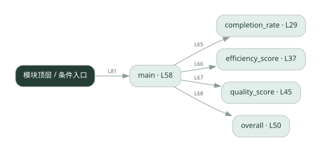

# 036.py · 多 Agent 协作评测

课程：2-18 · 全课程第 38 节。源码快照 SHA-256 前 12 位：`3917d3294711`。

[原文件](../036.py) · [网页阅读](pages/036.py.html) · [放大调用图](graphs/036.py.svg)

## 这份文件要完成什么

计算完成率、协作轮数对应的效率分和产出质量，再加权比较。

## 为什么需要它

仅看最终答案无法体现协作成本和任务遗漏。

## 当前文件的实际状态

- completion_rate、efficiency_score、overall 都固定返回 0；quality_score 只读样例字段。当前总分尚未真正实现。
- 主要展示本地计算、内存状态或模拟流程；是否写文件/启动子进程请看调用表。 本次只做静态解析，没有运行练习，也没有替你填写或修改原代码。

## 调用图 / 阅读与数据流程

实线：源码中的直接调用；虚线：函数引用/注册、动态调用或按方法名推断的候选。L 是调用所在源码行号。箭头不表示执行顺序或每次必经；分支、循环、异步调度及框架内部调用需结合源码。灰色是外部/未解析目标，橙色是动态分发；省略 print、len 和常规容器操作以减少干扰。孤立函数可能尚未接入。



<details><summary>Mermaid 图源</summary>

```mermaid
flowchart LR
  n0["completion_rate · L29"]
  n1["efficiency_score · L37"]
  n2["quality_score · L45"]
  n3["overall · L50"]
  n4["main · L58"]
  n5["模块顶层 / 条件入口"]
  n4 -->|"L65"| n0
  n4 -->|"L66"| n1
  n4 -->|"L67"| n2
  n4 -->|"L68"| n3
  n5 -->|"L81"| n4
```

</details>

## 从哪里开始看

先从 main 及模块入口 出发，沿箭头找到本文件函数，再查看外部调用或动态分发。右侧调用清单保留所有静态调用点，能回到原文件逐行对照。

## 关键函数与依赖

| 函数 / 定义行 | 职责（源码注释供参考） | 函数体中的调用 |
|---|---|---|
| `completion_rate` [L29](../036.py#L29) | 任务完成率：完成的子任务数 / 总子任务数（0~1）。 | `未发现显式函数调用（可能直接计算、读写状态或尚未实现）` |
| `efficiency_score` [L37](../036.py#L37) | 效率分：达成共识用的轮数越少，协作越高效。用 1/轮数，轮数 1 得满分 1.0。 | `未发现显式函数调用（可能直接计算、读写状态或尚未实现）` |
| `quality_score` [L45](../036.py#L45) | 产出质量分：直接读 run 的 quality（真实系统由 LLM-as-Judge 给出）。 | `未发现显式函数调用（可能直接计算、读写状态或尚未实现）` |
| `overall` [L50](../036.py#L50) | 综合协作质量：完成率、效率、质量三维度加权求和。 | `未发现显式函数调用（可能直接计算、读写状态或尚未实现）` |
| `main` [L58](../036.py#L58) | 以源码函数体为准；下列调用展示其依赖。 | `print, enumerate, completion_rate, efficiency_score, quality_score, overall, totals.append, sum, len` |

## 这样做的优点

可以把多个评价维度放在一起比较。

## 代价与局限

权重是人为选择；少轮数不必然高质量，样例质量分也不是自动验证。

## 适合什么场景

架构对照实验、固定任务集的趋势比较。

## 不适合直接照搬的场景

把单个综合分当作所有场景的绝对优劣。

## 改一个条件，检验是否理解

交换效率和质量的权重，观察排名是否变化。

如果当前文件有未实现位置，先预测应该怎样变化，补齐后再验证；不要把“能启动”当作“实现正确”。

## 全部静态调用点

这是语法分析清单，包含图中省略的基础操作；不记录参数值。

| 调用方 | 目标表达式 | 行号 | 类型 |
|---|---|---|---|
| main | `print` | 59 | 调用表达式 |
| main | `print` | 60 | 调用表达式 |
| main | `print` | 61 | 调用表达式 |
| main | `enumerate` | 64 | 调用表达式 |
| main | `completion_rate` | 65 | 调用表达式 |
| main | `efficiency_score` | 66 | 调用表达式 |
| main | `quality_score` | 67 | 调用表达式 |
| main | `overall` | 68 | 调用表达式 |
| main | `totals.append` | 69 | 调用表达式 |
| main | `print` | 70 | 调用表达式 |
| main | `print` | 71 | 调用表达式 |
| main | `sum` | 73 | 调用表达式 |
| main | `len` | 73 | 调用表达式 |
| main | `print` | 74 | 调用表达式 |
| main | `print` | 75 | 调用表达式 |
| main | `print` | 76 | 调用表达式 |
| main | `print` | 77 | 调用表达式 |
| <模块入口> | `main` | 81 | 调用表达式 |
