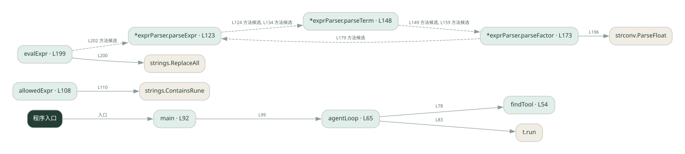
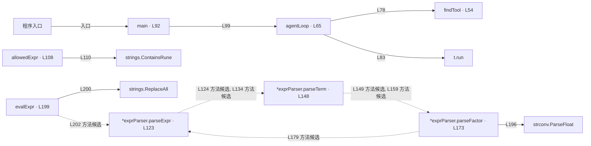

# 038.go · 框架工具调用 Agent

课程：3-1 · 全课程第 41 节。源码快照 SHA-256 前 12 位：`eed6e8153bd1`。

[原文件](../038.go) · [网页阅读](pages/038.go.html) · [放大调用图](graphs/038.go.svg)

## 这份文件要完成什么

把天气与计算工具交给 Agent，模型选择工具，框架或循环执行并回传结果。

## 为什么需要它

手写循环要处理工具描述、参数和消息回填，框架可以统一这些环节。

## 当前文件的实际状态

- 用自定义工具表和 agentLoop 演示工具分发，没有调用 LangChain，也没有真实大模型请求。表达式由本文件的递归下降解析器处理。
- 主要展示本地计算、内存状态或模拟流程；是否写文件/启动子进程请看调用表。 本次只做静态解析，没有运行练习，也没有替你填写或修改原代码。

## 调用图 / 阅读与数据流程

实线：源码中的直接调用；虚线：函数引用/注册、动态调用或按方法名推断的候选。L 是调用所在源码行号。箭头不表示执行顺序或每次必经；分支、循环、异步调度及框架内部调用需结合源码。灰色是外部/未解析目标，橙色是动态分发；省略 print、len 和常规容器操作以减少干扰。孤立函数可能尚未接入。

Mermaid 图源

## 从哪里开始看

先从 main（程序入口） 出发，沿箭头找到本文件函数，再查看外部调用或动态分发。右侧调用清单保留所有静态调用点，能回到原文件逐行对照。

## 关键函数与依赖

| 函数 / 定义行 | 职责（源码注释供参考） | 函数体中的调用 |
|---|---|---|
| `findTool` [L54](../038.go#L54) | findTool：按名字找工具（对应 Python 里框架自动绑定的「按名分发」） | `未发现显式函数调用（可能直接计算、读写状态或尚未实现）` |
| `agentLoop` [L65](../038.go#L65) | agentLoop：极简 ReAct 循环 —— 模拟 LLM 的决策：先调工具，再给最终答案 | `findTool, append, fmt.Sprintf, t.run, fmt.Printf` |
| `main` [L92](../038.go#L92) | 以源码函数体为准；下列调用展示其依赖。 | `fmt.Println, fmt.Printf, agentLoop` |
| `allowedExpr` [L108](../038.go#L108) | allowedExpr：只允许数字和 + - * / ( ) . 空格 | `strings.ContainsRune` |
| `*exprParser.parseExpr` [L123](../038.go#L123) | parseExpr：加减（最低优先级） | `p.parseTerm, len` |
| `*exprParser.parseTerm` [L148](../038.go#L148) | parseTerm：乘除（中优先级） | `p.parseFactor, len` |
| `*exprParser.parseFactor` [L173](../038.go#L173) | parseFactor：数字或括号表达式（最高优先级） | `len, fmt.Errorf, p.parseExpr, strconv.ParseFloat` |
| `evalExpr` [L199](../038.go#L199) | 以源码函数体为准；下列调用展示其依赖。 | `strings.ReplaceAll, p.parseExpr, len, fmt.Errorf` |

## 这样做的优点

更容易增减工具和复用调用协议。

## 代价与局限

框架增加版本依赖和调试层次；工具本身的正确性仍需自己负责。

## 适合什么场景

工具数量逐渐增加的助手原型。

## 不适合直接照搬的场景

极简规则流程，或必须精确控制每一个调用细节且不愿引入框架的项目。

## 改一个条件，检验是否理解

给出同时需要天气和算术的问题，检查工具结果是否都进入最终回答。

如果当前文件有未实现位置，先预测应该怎样变化，补齐后再验证；不要把“能启动”当作“实现正确”。

## 全部静态调用点

这是语法分析清单，包含图中省略的基础操作；不记录参数值。

| 调用方 | 目标表达式 | 行号 | 类型 |
|---|---|---|---|
| agentLoop | `findTool` | 78 | 调用表达式 |
| agentLoop | `append` | 80 | 调用表达式 |
| agentLoop | `fmt.Sprintf` | 80 | 调用表达式 |
| agentLoop | `t.run` | 83 | 调用表达式 |
| agentLoop | `append` | 84 | 调用表达式 |
| agentLoop | `fmt.Printf` | 85 | 调用表达式 |
| agentLoop | `fmt.Sprintf` | 89 | 调用表达式 |
| main | `fmt.Println` | 93 | 调用表达式 |
| main | `fmt.Println` | 94 | 调用表达式 |
| main | `fmt.Println` | 95 | 调用表达式 |
| main | `fmt.Printf` | 97 | 调用表达式 |
| main | `agentLoop` | 99 | 调用表达式 |
| main | `fmt.Printf` | 100 | 调用表达式 |
| main | `fmt.Println` | 101 | 调用表达式 |
| main | `fmt.Println` | 102 | 调用表达式 |
| allowedExpr | `strings.ContainsRune` | 110 | 调用表达式 |
| *exprParser.parseExpr | `p.parseTerm` | 124 | 调用表达式 |
| *exprParser.parseExpr | `len` | 128 | 调用表达式 |
| *exprParser.parseExpr | `p.parseTerm` | 134 | 调用表达式 |
| *exprParser.parseTerm | `p.parseFactor` | 149 | 调用表达式 |
| *exprParser.parseTerm | `len` | 153 | 调用表达式 |
| *exprParser.parseTerm | `p.parseFactor` | 159 | 调用表达式 |
| *exprParser.parseFactor | `len` | 174 | 调用表达式 |
| *exprParser.parseFactor | `fmt.Errorf` | 175 | 调用表达式 |
| *exprParser.parseFactor | `p.parseExpr` | 179 | 调用表达式 |
| *exprParser.parseFactor | `len` | 183 | 调用表达式 |
| *exprParser.parseFactor | `fmt.Errorf` | 184 | 调用表达式 |
| *exprParser.parseFactor | `len` | 190 | 调用表达式 |
| *exprParser.parseFactor | `fmt.Errorf` | 194 | 调用表达式 |
| *exprParser.parseFactor | `strconv.ParseFloat` | 196 | 调用表达式 |
| evalExpr | `strings.ReplaceAll` | 200 | 调用表达式 |
| evalExpr | `p.parseExpr` | 202 | 调用表达式 |
| evalExpr | `len` | 206 | 调用表达式 |
| evalExpr | `fmt.Errorf` | 207 | 调用表达式 |
