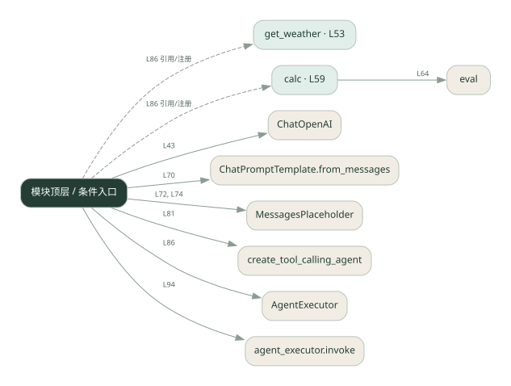
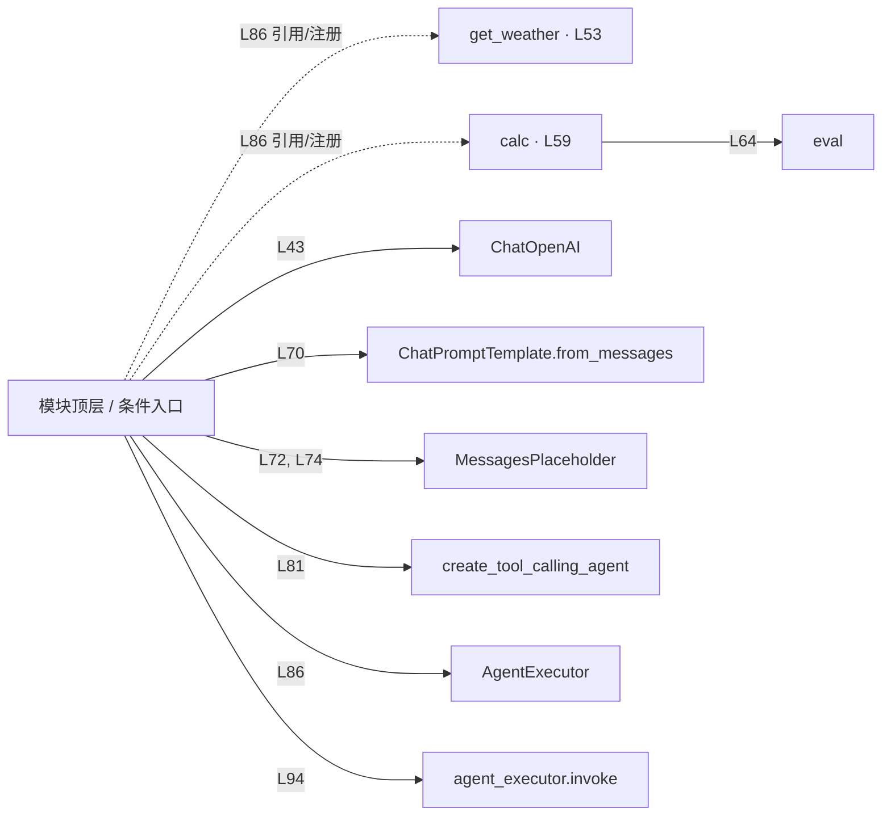

# 038.py · 框架工具调用 Agent

课程：3-1 · 全课程第 41 节。源码快照 SHA-256 前 12 位：`09b3aa1c0b47`。

[原文件](../038.py) · [网页阅读](pages/038.py.html) · [放大调用图](graphs/038.py.svg)

## 这份文件要完成什么

把天气与计算工具交给 Agent，模型选择工具，框架或循环执行并回传结果。

## 为什么需要它

手写循环要处理工具描述、参数和消息回填，框架可以统一这些环节。

## 当前文件的实际状态

- 此文件使用 create_tool_calling_agent / AgentExecutor 的接口写法。天气工具是本地示例；框架组装处仍有填空。按源码理解接口职责，实际安装版本是否支持需另行核对。
- 仍有下划线占位表达式，源文件行号：82, 83, 84。相应路径在补完前不能正常执行。
- 源码存在 eval 调用。请先看表达式限制条件；调用图只能说明它被使用，不能证明输入已被安全限制。
- 存在外部服务或模型依赖；执行前需按源文件配置依赖和凭据，可能联网或产生 API 费用。 本次只做静态解析，没有运行练习，也没有替你填写或修改原代码。

## 调用图 / 阅读与数据流程

实线：源码中的直接调用；虚线：函数引用/注册、动态调用或按方法名推断的候选。L 是调用所在源码行号。箭头不表示执行顺序或每次必经；分支、循环、异步调度及框架内部调用需结合源码。灰色是外部/未解析目标，橙色是动态分发；省略 print、len 和常规容器操作以减少干扰。孤立函数可能尚未接入。

Mermaid 图源

## 从哪里开始看

先从 模块入口 出发，沿箭头找到本文件函数，再查看外部调用或动态分发。右侧调用清单保留所有静态调用点，能回到原文件逐行对照。

## 关键函数与依赖

| 函数 / 定义行 | 职责（源码注释供参考） | 函数体中的调用 |
|---|---|---|
| `get_weather` [L53](../038.py#L53) | 查询某个城市的天气。 | `未发现显式函数调用（可能直接计算、读写状态或尚未实现）` |
| `calc` [L59](../038.py#L59) | 计算数学表达式，如 3*(5+2)。 | `set, any, str, eval` |

## 这样做的优点

更容易增减工具和复用调用协议。

## 代价与局限

框架增加版本依赖和调试层次；工具本身的正确性仍需自己负责。

## 适合什么场景

工具数量逐渐增加的助手原型。

## 不适合直接照搬的场景

极简规则流程，或必须精确控制每一个调用细节且不愿引入框架的项目。

## 改一个条件，检验是否理解

给出同时需要天气和算术的问题，检查工具结果是否都进入最终回答。

如果当前文件有未实现位置，先预测应该怎样变化，补齐后再验证；不要把“能启动”当作“实现正确”。

## 全部静态调用点

这是语法分析清单，包含图中省略的基础操作；不记录参数值。

| 调用方 | 目标表达式 | 行号 | 类型 |
|---|---|---|---|
| <模块入口> | `ChatOpenAI` | 43 | 调用表达式 |
| calc | `set` | 61 | 调用表达式 |
| calc | `any` | 62 | 调用表达式 |
| calc | `str` | 64 | 调用表达式 |
| calc | `eval` | 64 | 调用表达式 |
| <模块入口> | `ChatPromptTemplate.from_messages` | 70 | 调用表达式 |
| <模块入口> | `MessagesPlaceholder` | 72 | 调用表达式 |
| <模块入口> | `MessagesPlaceholder` | 74 | 调用表达式 |
| <模块入口> | `create_tool_calling_agent` | 81 | 调用表达式 |
| <模块入口> | `AgentExecutor` | 86 | 调用表达式 |
| <模块入口> | `print` | 90 | 调用表达式 |
| <模块入口> | `print` | 91 | 调用表达式 |
| <模块入口> | `print` | 92 | 调用表达式 |
| <模块入口> | `agent_executor.invoke` | 94 | 调用表达式 |
| <模块入口> | `print` | 98 | 调用表达式 |
| <模块入口> | `get_weather` | 86 | 函数引用/注册 |
| <模块入口> | `calc` | 86 | 函数引用/注册 |
