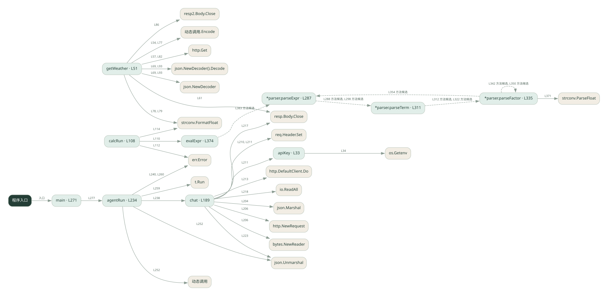
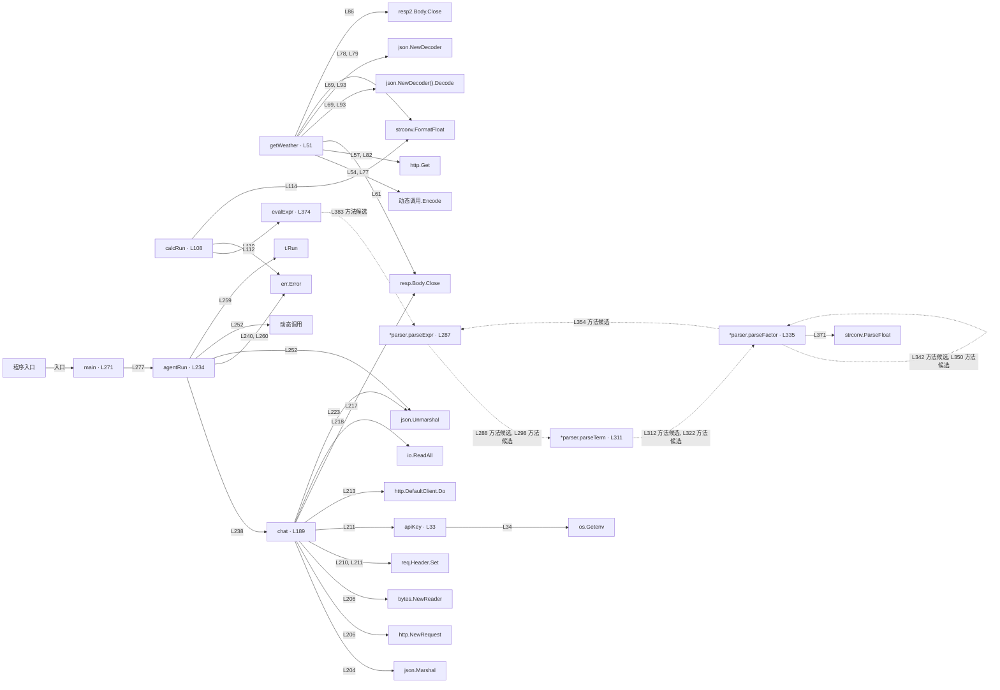

# 038_real.go · 框架工具调用 Agent

课程：3-1 · 全课程第 41 节。源码快照 SHA-256 前 12 位：`efc313327b6c`。

[原文件](../038_real.go) · [网页阅读](pages/038_real.go.html) · [放大调用图](graphs/038_real.go.svg)

## 这份文件要完成什么

把天气与计算工具交给 Agent，模型选择工具，框架或循环执行并回传结果。

## 为什么需要它

手写循环要处理工具描述、参数和消息回填，框架可以统一这些环节。

## 当前文件的实际状态

- 直接用 HTTP 与模型通信，再由 agentRun 分发工具；没有 LangChain 依赖。getWeather 连接真实天气服务，calcRun 使用本地算术解析器。
- 存在外部服务或模型依赖；执行前需按源文件配置依赖和凭据，可能联网或产生 API 费用。 本次只做静态解析，没有运行练习，也没有替你填写或修改原代码。

## 调用图 / 阅读与数据流程

实线：源码中的直接调用；虚线：函数引用/注册、动态调用或按方法名推断的候选。L 是调用所在源码行号。箭头不表示执行顺序或每次必经；分支、循环、异步调度及框架内部调用需结合源码。灰色是外部/未解析目标，橙色是动态分发；省略 print、len 和常规容器操作以减少干扰。孤立函数可能尚未接入。

Mermaid 图源

## 从哪里开始看

先从 main（程序入口） 出发，沿箭头找到本文件函数，再查看外部调用或动态分发。右侧调用清单保留所有静态调用点，能回到原文件逐行对照。

## 关键函数与依赖

| 函数 / 定义行 | 职责（源码注释供参考） | 函数体中的调用 |
|---|---|---|
| `apiKey` [L33](../038_real.go#L33) | 从环境变量读 key，读不到就用占位符 | `os.Getenv` |
| `getWeather` [L51](../038_real.go#L51) | 天气工具：真调 Open-Meteo（免费、无需 key） | `动态调用.Encode, http.Get, resp.Body.Close, json.NewDecoder().Decode, json.NewDecoder, len, fmt.Sprintf, strconv.FormatFloat, resp2.Body.Close` |
| `calcRun` [L108](../038_real.go#L108) | 计算工具：Go 里没有 eval，用递归下降求值（这里允许 + - * / ( ) 和数字） | `evalExpr, err.Error, strconv.FormatFloat` |
| `chat` [L189](../038_real.go#L189) | chat：真调 DeepSeek 的 /chat/completions，把工具 schema 一起发过去 | `make, len, append, json.Marshal, http.NewRequest, bytes.NewReader, req.Header.Set, apiKey, http.DefaultClient.Do, resp.Body.Close, io.ReadAll, fmt.Errorf, string, json.Unmarshal` |
| `agentRun` [L234](../038_real.go#L234) | 以源码函数体为准；下列调用展示其依赖。 | `chat, err.Error, len, append, json.Unmarshal, 动态调用, t.Run, fmt.Printf` |
| `main` [L271](../038_real.go#L271) | 以源码函数体为准；下列调用展示其依赖。 | `fmt.Println, fmt.Printf, agentRun` |
| `*parser.parseExpr` [L287](../038_real.go#L287) | 以源码函数体为准；下列调用展示其依赖。 | `p.parseTerm, len` |
| `*parser.parseTerm` [L311](../038_real.go#L311) | 以源码函数体为准；下列调用展示其依赖。 | `p.parseFactor, len` |
| `*parser.parseFactor` [L335](../038_real.go#L335) | 以源码函数体为准；下列调用展示其依赖。 | `len, fmt.Errorf, p.parseFactor, p.parseExpr, strconv.ParseFloat` |
| `evalExpr` [L374](../038_real.go#L374) | 以源码函数体为准；下列调用展示其依赖。 | `make, len, append, string, p.parseExpr, fmt.Errorf` |

## 这样做的优点

更容易增减工具和复用调用协议。

## 代价与局限

框架增加版本依赖和调试层次；工具本身的正确性仍需自己负责。

## 适合什么场景

工具数量逐渐增加的助手原型。

## 不适合直接照搬的场景

极简规则流程，或必须精确控制每一个调用细节且不愿引入框架的项目。

## 改一个条件，检验是否理解

给出同时需要天气和算术的问题，检查工具结果是否都进入最终回答。

如果当前文件有未实现位置，先预测应该怎样变化，补齐后再验证；不要把“能启动”当作“实现正确”。

## 全部静态调用点

这是语法分析清单，包含图中省略的基础操作；不记录参数值。

| 调用方 | 目标表达式 | 行号 | 类型 |
|---|---|---|---|
| apiKey | `os.Getenv` | 34 | 调用表达式 |
| getWeather | `动态调用.Encode` | 54 | 调用表达式 |
| getWeather | `http.Get` | 57 | 调用表达式 |
| getWeather | `resp.Body.Close` | 61 | 调用表达式 |
| getWeather | `json.NewDecoder().Decode` | 69 | 调用表达式 |
| getWeather | `json.NewDecoder` | 69 | 调用表达式 |
| getWeather | `len` | 72 | 调用表达式 |
| getWeather | `fmt.Sprintf` | 73 | 调用表达式 |
| getWeather | `动态调用.Encode` | 77 | 调用表达式 |
| getWeather | `strconv.FormatFloat` | 78 | 调用表达式 |
| getWeather | `strconv.FormatFloat` | 79 | 调用表达式 |
| getWeather | `http.Get` | 82 | 调用表达式 |
| getWeather | `resp2.Body.Close` | 86 | 调用表达式 |
| getWeather | `json.NewDecoder().Decode` | 93 | 调用表达式 |
| getWeather | `json.NewDecoder` | 93 | 调用表达式 |
| getWeather | `fmt.Sprintf` | 102 | 调用表达式 |
| getWeather | `fmt.Sprintf` | 104 | 调用表达式 |
| calcRun | `evalExpr` | 110 | 调用表达式 |
| calcRun | `err.Error` | 112 | 调用表达式 |
| calcRun | `strconv.FormatFloat` | 114 | 调用表达式 |
| chat | `make` | 190 | 调用表达式 |
| chat | `len` | 190 | 调用表达式 |
| chat | `append` | 192 | 调用表达式 |
| chat | `json.Marshal` | 204 | 调用表达式 |
| chat | `http.NewRequest` | 206 | 调用表达式 |
| chat | `bytes.NewReader` | 206 | 调用表达式 |
| chat | `req.Header.Set` | 210 | 调用表达式 |
| chat | `req.Header.Set` | 211 | 调用表达式 |
| chat | `apiKey` | 211 | 调用表达式 |
| chat | `http.DefaultClient.Do` | 213 | 调用表达式 |
| chat | `resp.Body.Close` | 217 | 调用表达式 |
| chat | `io.ReadAll` | 218 | 调用表达式 |
| chat | `fmt.Errorf` | 220 | 调用表达式 |
| chat | `string` | 220 | 调用表达式 |
| chat | `json.Unmarshal` | 223 | 调用表达式 |
| chat | `len` | 226 | 调用表达式 |
| chat | `fmt.Errorf` | 227 | 调用表达式 |
| agentRun | `chat` | 238 | 调用表达式 |
| agentRun | `err.Error` | 240 | 调用表达式 |
| agentRun | `len` | 244 | 调用表达式 |
| agentRun | `append` | 249 | 调用表达式 |
| agentRun | `json.Unmarshal` | 252 | 调用表达式 |
| agentRun | `动态调用` | 252 | 调用表达式 |
| agentRun | `t.Run` | 259 | 调用表达式 |
| agentRun | `err.Error` | 260 | 调用表达式 |
| agentRun | `fmt.Printf` | 264 | 调用表达式 |
| agentRun | `append` | 265 | 调用表达式 |
| main | `fmt.Println` | 272 | 调用表达式 |
| main | `fmt.Println` | 273 | 调用表达式 |
| main | `fmt.Println` | 274 | 调用表达式 |
| main | `fmt.Printf` | 276 | 调用表达式 |
| main | `fmt.Printf` | 277 | 调用表达式 |
| main | `agentRun` | 277 | 调用表达式 |
| *parser.parseExpr | `p.parseTerm` | 288 | 调用表达式 |
| *parser.parseExpr | `len` | 292 | 调用表达式 |
| *parser.parseExpr | `p.parseTerm` | 298 | 调用表达式 |
| *parser.parseTerm | `p.parseFactor` | 312 | 调用表达式 |
| *parser.parseTerm | `len` | 316 | 调用表达式 |
| *parser.parseTerm | `p.parseFactor` | 322 | 调用表达式 |
| *parser.parseFactor | `len` | 336 | 调用表达式 |
| *parser.parseFactor | `fmt.Errorf` | 337 | 调用表达式 |
| *parser.parseFactor | `p.parseFactor` | 342 | 调用表达式 |
| *parser.parseFactor | `p.parseFactor` | 350 | 调用表达式 |
| *parser.parseFactor | `p.parseExpr` | 354 | 调用表达式 |
| *parser.parseFactor | `len` | 358 | 调用表达式 |
| *parser.parseFactor | `fmt.Errorf` | 359 | 调用表达式 |
| *parser.parseFactor | `len` | 365 | 调用表达式 |
| *parser.parseFactor | `fmt.Errorf` | 369 | 调用表达式 |
| *parser.parseFactor | `strconv.ParseFloat` | 371 | 调用表达式 |
| evalExpr | `make` | 376 | 调用表达式 |
| evalExpr | `len` | 376 | 调用表达式 |
| evalExpr | `len` | 377 | 调用表达式 |
| evalExpr | `append` | 379 | 调用表达式 |
| evalExpr | `string` | 382 | 调用表达式 |
| evalExpr | `p.parseExpr` | 383 | 调用表达式 |
| evalExpr | `len` | 387 | 调用表达式 |
| evalExpr | `fmt.Errorf` | 388 | 调用表达式 |
