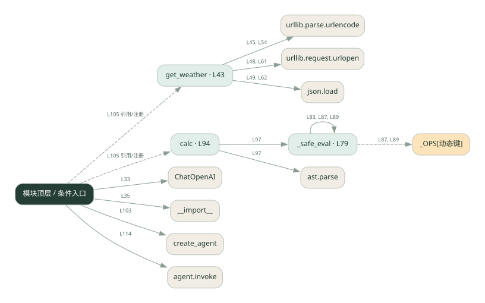
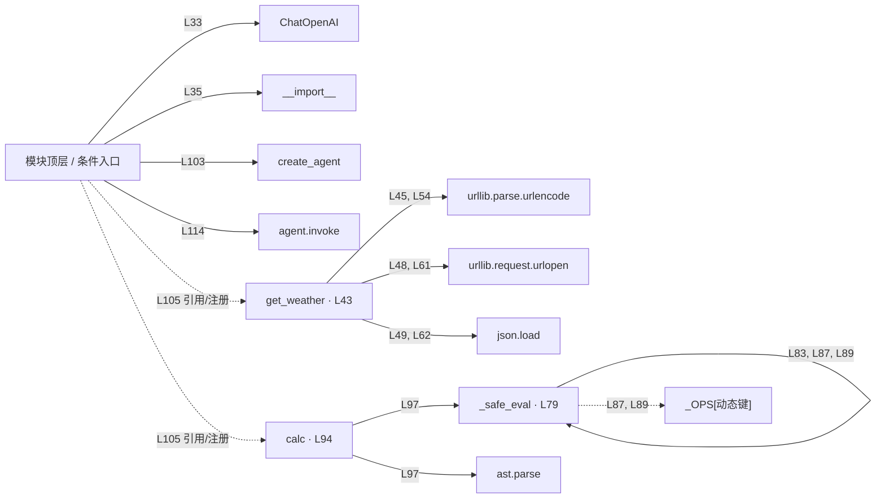

# 038_real.py · 框架工具调用 Agent

课程：3-1 · 全课程第 41 节。源码快照 SHA-256 前 12 位：`2ab03924af0b`。

[原文件](../038_real.py) · [网页阅读](pages/038_real.py.html) · [放大调用图](graphs/038_real.py.svg)

## 这份文件要完成什么

把天气与计算工具交给 Agent，模型选择工具，框架或循环执行并回传结果。

## 为什么需要它

手写循环要处理工具描述、参数和消息回填，框架可以统一这些环节。

## 当前文件的实际状态

- 使用 ChatOpenAI 和 create_agent 连接真实模型；get_weather 先查城市坐标，匹配成功后再查天气，共两次 Open-Meteo HTTP 请求；无匹配城市时提前返回。calc 用 AST 白名单计算，不执行任意 Python 语句。框架根据模型回复动态调用注册工具，静态图中的注册边不代表每次都会调用。
- 存在外部服务或模型依赖；执行前需按源文件配置依赖和凭据，可能联网或产生 API 费用。 本次只做静态解析，没有运行练习，也没有替你填写或修改原代码。

## 调用图 / 阅读与数据流程

实线：源码中的直接调用；虚线：函数引用/注册、动态调用或按方法名推断的候选。L 是调用所在源码行号。箭头不表示执行顺序或每次必经；分支、循环、异步调度及框架内部调用需结合源码。灰色是外部/未解析目标，橙色是动态分发；省略 print、len 和常规容器操作以减少干扰。孤立函数可能尚未接入。

Mermaid 图源

## 从哪里开始看

先从 模块入口 出发，沿箭头找到本文件函数，再查看外部调用或动态分发。右侧调用清单保留所有静态调用点，能回到原文件逐行对照。

## 关键函数与依赖

| 函数 / 定义行 | 职责（源码注释供参考） | 函数体中的调用 |
|---|---|---|
| `get_weather` [L43](../038_real.py#L43) | 查询某个城市的实时天气。参数 city 是中文城市名，如「北京」。 | `urllib.parse.urlencode, urllib.request.urlopen, json.load, geo.get, codes.get` |
| `_safe_eval` [L79](../038_real.py#L79) | 以源码函数体为准；下列调用展示其依赖。 | `type, ValueError, isinstance, _safe_eval, _OPS[动态键]` |
| `calc` [L94](../038_real.py#L94) | 计算数学表达式，如 3*(5+2)。支持 + - * / 和括号。 | `str, _safe_eval, ast.parse` |

## 这样做的优点

更容易增减工具和复用调用协议。

## 代价与局限

框架增加版本依赖和调试层次；工具本身的正确性仍需自己负责。

## 适合什么场景

工具数量逐渐增加的助手原型。

## 不适合直接照搬的场景

极简规则流程，或必须精确控制每一个调用细节且不愿引入框架的项目。

## 改一个条件，检验是否理解

给出同时需要天气和算术的问题，检查工具结果是否都进入最终回答。

如果当前文件有未实现位置，先预测应该怎样变化，补齐后再验证；不要把“能启动”当作“实现正确”。

## 全部静态调用点

这是语法分析清单，包含图中省略的基础操作；不记录参数值。

| 调用方 | 目标表达式 | 行号 | 类型 |
|---|---|---|---|
| <模块入口> | `ChatOpenAI` | 33 | 调用表达式 |
| <模块入口> | `__import__` | 35 | 调用表达式 |
| get_weather | `urllib.parse.urlencode` | 45 | 调用表达式 |
| get_weather | `urllib.request.urlopen` | 48 | 调用表达式 |
| get_weather | `json.load` | 49 | 调用表达式 |
| get_weather | `geo.get` | 50 | 调用表达式 |
| get_weather | `urllib.parse.urlencode` | 54 | 调用表达式 |
| get_weather | `urllib.request.urlopen` | 61 | 调用表达式 |
| get_weather | `json.load` | 62 | 调用表达式 |
| get_weather | `codes.get` | 67 | 调用表达式 |
| _safe_eval | `type` | 80 | 调用表达式 |
| _safe_eval | `ValueError` | 81 | 调用表达式 |
| _safe_eval | `type` | 81 | 调用表达式 |
| _safe_eval | `isinstance` | 82 | 调用表达式 |
| _safe_eval | `_safe_eval` | 83 | 调用表达式 |
| _safe_eval | `isinstance` | 84 | 调用表达式 |
| _safe_eval | `isinstance` | 84 | 调用表达式 |
| _safe_eval | `isinstance` | 86 | 调用表达式 |
| _safe_eval | `_OPS[动态键]` | 87 | 调用表达式 |
| _safe_eval | `type` | 87 | 调用表达式 |
| _safe_eval | `_safe_eval` | 87 | 调用表达式 |
| _safe_eval | `_safe_eval` | 87 | 调用表达式 |
| _safe_eval | `isinstance` | 88 | 调用表达式 |
| _safe_eval | `_OPS[动态键]` | 89 | 调用表达式 |
| _safe_eval | `type` | 89 | 调用表达式 |
| _safe_eval | `_safe_eval` | 89 | 调用表达式 |
| _safe_eval | `ValueError` | 90 | 调用表达式 |
| calc | `str` | 97 | 调用表达式 |
| calc | `_safe_eval` | 97 | 调用表达式 |
| calc | `ast.parse` | 97 | 调用表达式 |
| <模块入口> | `create_agent` | 103 | 调用表达式 |
| <模块入口> | `print` | 111 | 调用表达式 |
| <模块入口> | `print` | 112 | 调用表达式 |
| <模块入口> | `print` | 113 | 调用表达式 |
| <模块入口> | `agent.invoke` | 114 | 调用表达式 |
| <模块入口> | `print` | 120 | 调用表达式 |
| <模块入口> | `get_weather` | 105 | 函数引用/注册 |
| <模块入口> | `calc` | 105 | 函数引用/注册 |
