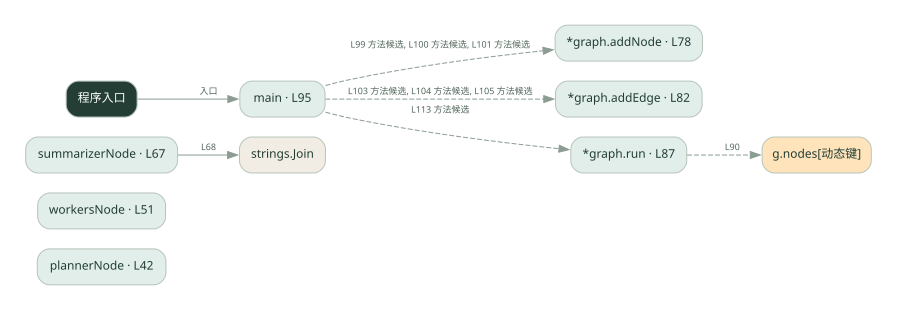
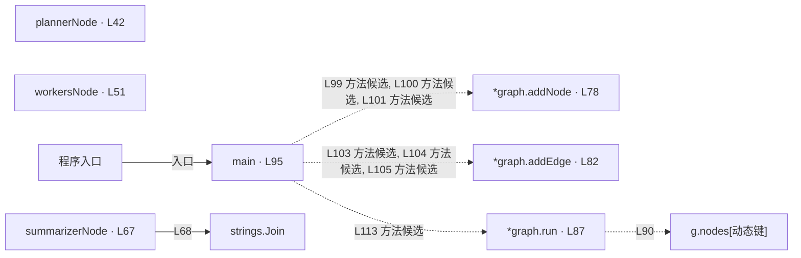

# 039.go · 图式工作流

课程：3-2 · 全课程第 42 节。源码快照 SHA-256 前 12 位：`94aad0a4e335`。

[原文件](../039.go) · [网页阅读](pages/039.go.html) · [放大调用图](graphs/039.go.svg)

## 这份文件要完成什么

用节点表示计划、执行与汇总，用边规定下一步。

## 为什么需要它

流程复杂后，显式图比散落的条件判断更容易检查。

## 当前文件的实际状态

- 这是自定义 graph 类型，不是 LangGraph SDK。计划与 worker 结果采用演示逻辑，按边顺序运行。
- 主要展示本地计算、内存状态或模拟流程；是否写文件/启动子进程请看调用表。 本次只做静态解析，没有运行练习，也没有替你填写或修改原代码。

## 调用图 / 阅读与数据流程

实线：源码中的直接调用；虚线：函数引用/注册、动态调用或按方法名推断的候选。L 是调用所在源码行号。箭头不表示执行顺序或每次必经；分支、循环、异步调度及框架内部调用需结合源码。灰色是外部/未解析目标，橙色是动态分发；省略 print、len 和常规容器操作以减少干扰。孤立函数可能尚未接入。

Mermaid 图源

## 从哪里开始看

先从 main（程序入口） 出发，沿箭头找到本文件函数，再查看外部调用或动态分发。右侧调用清单保留所有静态调用点，能回到原文件逐行对照。

## 关键函数与依赖

| 函数 / 定义行 | 职责（源码注释供参考） | 函数体中的调用 |
|---|---|---|
| `plannerNode` [L42](../039.go#L42) | plannerNode：节点 1 —— 拆任务（真系统里调 LLM 拆，这里对演示任务硬编码） | `未发现显式函数调用（可能直接计算、读写状态或尚未实现）` |
| `workersNode` [L51](../039.go#L51) | workersNode：节点 2 —— 逐个执行子任务（真系统里调 LLM，这里硬编码） | `append` |
| `summarizerNode` [L67](../039.go#L67) | summarizerNode：节点 3 —— 汇总（把各子任务结果整合成一段） | `strings.Join` |
| `*graph.addNode` [L78](../039.go#L78) | 以源码函数体为准；下列调用展示其依赖。 | `未发现显式函数调用（可能直接计算、读写状态或尚未实现）` |
| `*graph.addEdge` [L82](../039.go#L82) | 以源码函数体为准；下列调用展示其依赖。 | `未发现显式函数调用（可能直接计算、读写状态或尚未实现）` |
| `*graph.run` [L87](../039.go#L87) | run：按边遍历执行（START 只是标记，真正从 g.start 开始） | `g.nodes[动态键]` |
| `main` [L95](../039.go#L95) | 以源码函数体为准；下列调用展示其依赖。 | `g.addNode, g.addEdge, fmt.Println, g.run, fmt.Printf, len` |

## 这样做的优点

阶段与连接关系清晰，节点可以单独替换。

## 代价与局限

图本身不会自动并行；状态字段和边的错误仍会传播。

## 适合什么场景

阶段固定、需要观察状态变化的任务。

## 不适合直接照搬的场景

简单直线脚本且没有图管理需求。

## 改一个条件，检验是否理解

去掉通向汇总节点的一条边，思考图在哪里终止。

如果当前文件有未实现位置，先预测应该怎样变化，补齐后再验证；不要把“能启动”当作“实现正确”。

## 全部静态调用点

这是语法分析清单，包含图中省略的基础操作；不记录参数值。

| 调用方 | 目标表达式 | 行号 | 类型 |
|---|---|---|---|
| workersNode | `append` | 59 | 调用表达式 |
| workersNode | `append` | 61 | 调用表达式 |
| summarizerNode | `strings.Join` | 68 | 调用表达式 |
| *graph.run | `g.nodes[动态键]` | 90 | 调用表达式 |
| main | `g.addNode` | 99 | 调用表达式 |
| main | `g.addNode` | 100 | 调用表达式 |
| main | `g.addNode` | 101 | 调用表达式 |
| main | `g.addEdge` | 103 | 调用表达式 |
| main | `g.addEdge` | 104 | 调用表达式 |
| main | `g.addEdge` | 105 | 调用表达式 |
| main | `fmt.Println` | 109 | 调用表达式 |
| main | `fmt.Println` | 110 | 调用表达式 |
| main | `fmt.Println` | 111 | 调用表达式 |
| main | `g.run` | 113 | 调用表达式 |
| main | `fmt.Printf` | 115 | 调用表达式 |
| main | `len` | 115 | 调用表达式 |
| main | `fmt.Printf` | 117 | 调用表达式 |
| main | `fmt.Printf` | 119 | 调用表达式 |
| main | `fmt.Println` | 120 | 调用表达式 |
