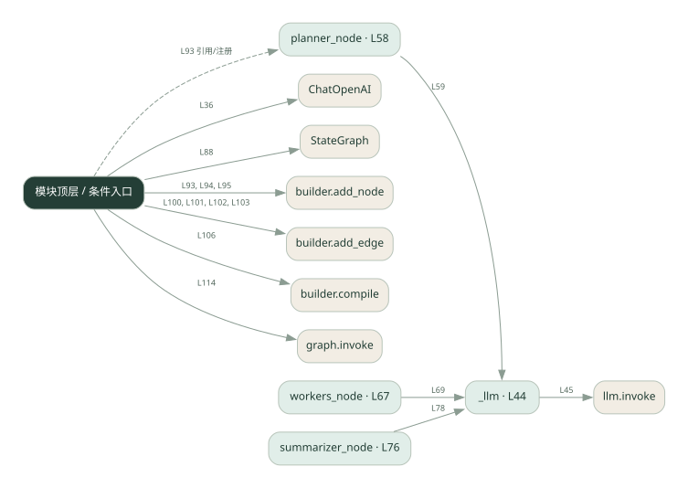
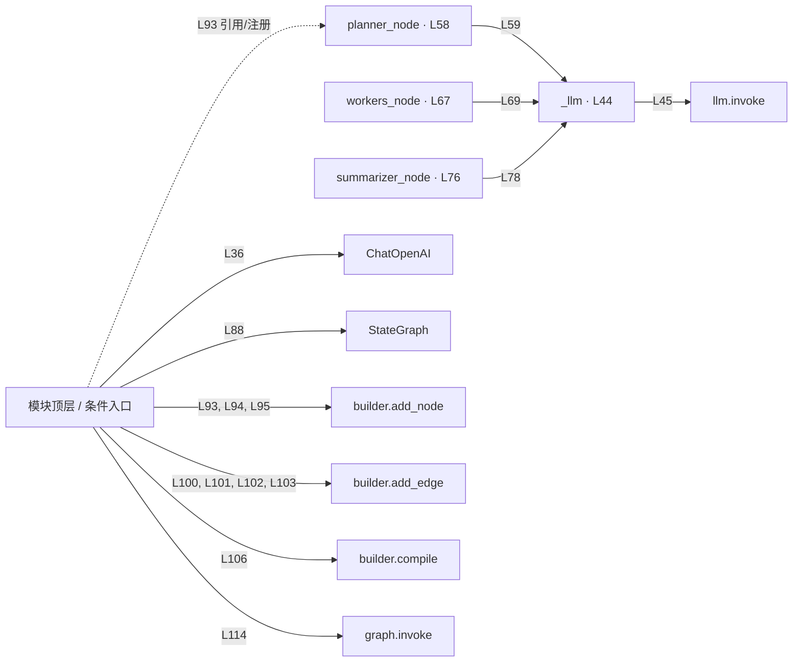

# 039.py · 图式工作流

课程：3-2 · 全课程第 42 节。源码快照 SHA-256 前 12 位：`54eb034f10b4`。

[原文件](../039.py) · [网页阅读](pages/039.py.html) · [放大调用图](graphs/039.py.svg)

## 这份文件要完成什么

用节点表示计划、执行与汇总，用边规定下一步。

## 为什么需要它

流程复杂后，显式图比散落的条件判断更容易检查。

## 当前文件的实际状态

- 使用真实 LangGraph/ChatOpenAI 接口，但图组装仍有填空。workers_node 内按列表逐项调用模型，画成多个节点不会自动变成并行。
- 仍有下划线占位表达式，源文件行号：88, 94, 95, 102。相应路径在补完前不能正常执行。
- 存在外部服务或模型依赖；执行前需按源文件配置依赖和凭据，可能联网或产生 API 费用。 本次只做静态解析，没有运行练习，也没有替你填写或修改原代码。

## 调用图 / 阅读与数据流程

实线：源码中的直接调用；虚线：函数引用/注册、动态调用或按方法名推断的候选。L 是调用所在源码行号。箭头不表示执行顺序或每次必经；分支、循环、异步调度及框架内部调用需结合源码。灰色是外部/未解析目标，橙色是动态分发；省略 print、len 和常规容器操作以减少干扰。孤立函数可能尚未接入。

Mermaid 图源

## 从哪里开始看

先从 模块入口 出发，沿箭头找到本文件函数，再查看外部调用或动态分发。右侧调用清单保留所有静态调用点，能回到原文件逐行对照。

## 关键函数与依赖

| 函数 / 定义行 | 职责（源码注释供参考） | 函数体中的调用 |
|---|---|---|
| `_llm` [L44](../039.py#L44) | 以源码函数体为准；下列调用展示其依赖。 | `llm.invoke, resp.content.strip` |
| `planner_node` [L58](../039.py#L58) | 以源码函数体为准；下列调用展示其依赖。 | `_llm, s.strip().strip, s.strip, plan.split` |
| `workers_node` [L67](../039.py#L67) | 以源码函数体为准；下列调用展示其依赖。 | `_llm` |
| `summarizer_node` [L76](../039.py#L76) | 以源码函数体为准；下列调用展示其依赖。 | `动态对象.join, _llm` |

## 这样做的优点

阶段与连接关系清晰，节点可以单独替换。

## 代价与局限

图本身不会自动并行；状态字段和边的错误仍会传播。

## 适合什么场景

阶段固定、需要观察状态变化的任务。

## 不适合直接照搬的场景

简单直线脚本且没有图管理需求。

## 改一个条件，检验是否理解

去掉通向汇总节点的一条边，思考图在哪里终止。

如果当前文件有未实现位置，先预测应该怎样变化，补齐后再验证；不要把“能启动”当作“实现正确”。

## 全部静态调用点

这是语法分析清单，包含图中省略的基础操作；不记录参数值。

| 调用方 | 目标表达式 | 行号 | 类型 |
|---|---|---|---|
| <模块入口> | `ChatOpenAI` | 36 | 调用表达式 |
| _llm | `llm.invoke` | 45 | 调用表达式 |
| _llm | `resp.content.strip` | 46 | 调用表达式 |
| planner_node | `_llm` | 59 | 调用表达式 |
| planner_node | `s.strip().strip` | 63 | 调用表达式 |
| planner_node | `s.strip` | 63 | 调用表达式 |
| planner_node | `plan.split` | 63 | 调用表达式 |
| planner_node | `s.strip` | 63 | 调用表达式 |
| workers_node | `_llm` | 69 | 调用表达式 |
| summarizer_node | `动态对象.join` | 77 | 调用表达式 |
| summarizer_node | `_llm` | 78 | 调用表达式 |
| <模块入口> | `StateGraph` | 88 | 调用表达式 |
| <模块入口> | `builder.add_node` | 93 | 调用表达式 |
| <模块入口> | `builder.add_node` | 94 | 调用表达式 |
| <模块入口> | `builder.add_node` | 95 | 调用表达式 |
| <模块入口> | `builder.add_edge` | 100 | 调用表达式 |
| <模块入口> | `builder.add_edge` | 101 | 调用表达式 |
| <模块入口> | `builder.add_edge` | 102 | 调用表达式 |
| <模块入口> | `builder.add_edge` | 103 | 调用表达式 |
| <模块入口> | `builder.compile` | 106 | 调用表达式 |
| <模块入口> | `print` | 111 | 调用表达式 |
| <模块入口> | `print` | 112 | 调用表达式 |
| <模块入口> | `print` | 113 | 调用表达式 |
| <模块入口> | `graph.invoke` | 114 | 调用表达式 |
| <模块入口> | `print` | 115 | 调用表达式 |
| <模块入口> | `planner_node` | 93 | 函数引用/注册 |
