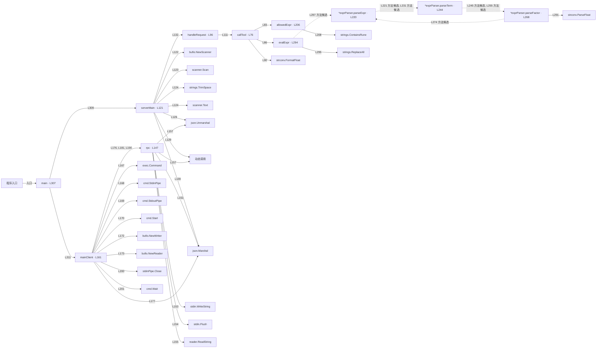

# 040.go · MCP 工具通信入门

课程：3-3 · 全课程第 43 节。源码快照 SHA-256 前 12 位：`f1b8cd4e8e0d`。

[原文件](../040.go) · [网页阅读](pages/040.go.html) · [放大调用图](graphs/040.go.svg)

## 这份文件要完成什么

客户端启动子进程，用标准输入输出传 JSON-RPC 请求，服务端列出并执行工具。

## 为什么需要它

工具可以运行在独立进程，双方需要约定请求和响应格式。

## 当前文件的实际状态

- 客户端启动当前程序的服务端模式，通过管道传 JSON-RPC；不是在同一函数里假装网络调用。它仍然是最小协议示例。
- 主要展示本地计算、内存状态或模拟流程；是否写文件/启动子进程请看调用表。 本次只做静态解析，没有运行练习，也没有替你填写或修改原代码。

## 调用图 / 阅读与数据流程

实线：源码中的直接调用；虚线：函数引用/注册、动态调用或按方法名推断的候选。L 是调用所在源码行号。箭头不表示执行顺序或每次必经；分支、循环、异步调度及框架内部调用需结合源码。灰色是外部/未解析目标，橙色是动态分发；省略 print、len 和常规容器操作以减少干扰。孤立函数可能尚未接入。

Mermaid 图源

## 从哪里开始看

先从 main（程序入口） 出发，沿箭头找到本文件函数，再查看外部调用或动态分发。右侧调用清单保留所有静态调用点，能回到原文件逐行对照。

## 关键函数与依赖

| 函数 / 定义行 | 职责（源码注释供参考） | 函数体中的调用 |
|---|---|---|
| `callTool` [L76](../040.go#L76) | callTool：真正执行工具（这是 server 的核心逻辑） | `fmt.Sprintf, allowedExpr, evalExpr, strconv.FormatFloat` |
| `handleRequest` [L96](../040.go#L96) | handleRequest：按 method 分发，返回 result（这就是 MCP 的「协议处理」） | `callTool, fmt.Sprintf` |
| `serverMain` [L121](../040.go#L121) | serverMain：server 主循环，从 stdin 逐行读 JSON 请求，往 stdout 逐行写 JSON 响应 | `bufio.NewScanner, scanner.Scan, strings.TrimSpace, scanner.Text, json.Unmarshal, 动态调用, handleRequest, json.Marshal, fmt.Println, string` |
| `rpc` [L147](../040.go#L147) | rpc：发一个 JSON-RPC 请求，收一个响应 | `json.Marshal, stdin.WriteString, string, stdin.Flush, reader.ReadString, json.Unmarshal, 动态调用` |
| `mainClient` [L161](../040.go#L161) | 以源码函数体为准；下列调用展示其依赖。 | `fmt.Println, exec.Command, cmd.StdinPipe, cmd.StdoutPipe, cmd.Start, bufio.NewWriter, bufio.NewReader, rpc, json.Marshal, fmt.Printf, string, stdinPipe.Close, cmd.Wait` |
| `allowedExpr` [L206](../040.go#L206) | 以源码函数体为准；下列调用展示其依赖。 | `strings.ContainsRune` |
| `*exprParser.parseExpr` [L220](../040.go#L220) | 以源码函数体为准；下列调用展示其依赖。 | `p.parseTerm, len` |
| `*exprParser.parseTerm` [L244](../040.go#L244) | 以源码函数体为准；下列调用展示其依赖。 | `p.parseFactor, len` |
| `*exprParser.parseFactor` [L268](../040.go#L268) | 以源码函数体为准；下列调用展示其依赖。 | `len, fmt.Errorf, p.parseExpr, strconv.ParseFloat` |
| `evalExpr` [L294](../040.go#L294) | 以源码函数体为准；下列调用展示其依赖。 | `strings.ReplaceAll, p.parseExpr, len, fmt.Errorf` |
| `main` [L307](../040.go#L307) | 以源码函数体为准；下列调用展示其依赖。 | `len, serverMain, mainClient` |

## 这样做的优点

模型侧和工具实现可以分离，协议内容可直接观察。

## 代价与局限

这是协议子集教学实现；不能据此认定完整兼容、可靠并发或具备安全隔离。

## 适合什么场景

理解 stdio 与工具发现、工具调用的关系。

## 不适合直接照搬的场景

直接作为面向不可信客户端的公共工具服务。

## 改一个条件，检验是否理解

请求一个不存在的工具，观察响应 id 与错误内容是否能对应请求。

如果当前文件有未实现位置，先预测应该怎样变化，补齐后再验证；不要把“能启动”当作“实现正确”。

## 全部静态调用点

这是语法分析清单，包含图中省略的基础操作；不记录参数值。

| 调用方 | 目标表达式 | 行号 | 类型 |
|---|---|---|---|
| callTool | `fmt.Sprintf` | 80 | 调用表达式 |
| callTool | `allowedExpr` | 83 | 调用表达式 |
| callTool | `evalExpr` | 86 | 调用表达式 |
| callTool | `strconv.FormatFloat` | 90 | 调用表达式 |
| callTool | `fmt.Sprintf` | 92 | 调用表达式 |
| handleRequest | `callTool` | 111 | 调用表达式 |
| handleRequest | `fmt.Sprintf` | 117 | 调用表达式 |
| serverMain | `bufio.NewScanner` | 122 | 调用表达式 |
| serverMain | `scanner.Scan` | 123 | 调用表达式 |
| serverMain | `strings.TrimSpace` | 124 | 调用表达式 |
| serverMain | `scanner.Text` | 124 | 调用表达式 |
| serverMain | `json.Unmarshal` | 129 | 调用表达式 |
| serverMain | `动态调用` | 129 | 调用表达式 |
| serverMain | `handleRequest` | 132 | 调用表达式 |
| serverMain | `json.Marshal` | 139 | 调用表达式 |
| serverMain | `fmt.Println` | 140 | 调用表达式 |
| serverMain | `string` | 140 | 调用表达式 |
| rpc | `json.Marshal` | 152 | 调用表达式 |
| rpc | `stdin.WriteString` | 153 | 调用表达式 |
| rpc | `string` | 153 | 调用表达式 |
| rpc | `stdin.Flush` | 154 | 调用表达式 |
| rpc | `reader.ReadString` | 155 | 调用表达式 |
| rpc | `json.Unmarshal` | 157 | 调用表达式 |
| rpc | `动态调用` | 157 | 调用表达式 |
| mainClient | `fmt.Println` | 162 | 调用表达式 |
| mainClient | `fmt.Println` | 163 | 调用表达式 |
| mainClient | `fmt.Println` | 164 | 调用表达式 |
| mainClient | `exec.Command` | 167 | 调用表达式 |
| mainClient | `cmd.StdinPipe` | 168 | 调用表达式 |
| mainClient | `cmd.StdoutPipe` | 169 | 调用表达式 |
| mainClient | `cmd.Start` | 170 | 调用表达式 |
| mainClient | `bufio.NewWriter` | 172 | 调用表达式 |
| mainClient | `bufio.NewReader` | 173 | 调用表达式 |
| mainClient | `rpc` | 176 | 调用表达式 |
| mainClient | `json.Marshal` | 177 | 调用表达式 |
| mainClient | `fmt.Printf` | 178 | 调用表达式 |
| mainClient | `string` | 178 | 调用表达式 |
| mainClient | `rpc` | 181 | 调用表达式 |
| mainClient | `fmt.Println` | 182 | 调用表达式 |
| mainClient | `fmt.Printf` | 186 | 调用表达式 |
| mainClient | `rpc` | 190 | 调用表达式 |
| mainClient | `fmt.Println` | 198 | 调用表达式 |
| mainClient | `stdinPipe.Close` | 200 | 调用表达式 |
| mainClient | `cmd.Wait` | 201 | 调用表达式 |
| allowedExpr | `strings.ContainsRune` | 208 | 调用表达式 |
| *exprParser.parseExpr | `p.parseTerm` | 221 | 调用表达式 |
| *exprParser.parseExpr | `len` | 225 | 调用表达式 |
| *exprParser.parseExpr | `p.parseTerm` | 231 | 调用表达式 |
| *exprParser.parseTerm | `p.parseFactor` | 245 | 调用表达式 |
| *exprParser.parseTerm | `len` | 249 | 调用表达式 |
| *exprParser.parseTerm | `p.parseFactor` | 255 | 调用表达式 |
| *exprParser.parseFactor | `len` | 269 | 调用表达式 |
| *exprParser.parseFactor | `fmt.Errorf` | 270 | 调用表达式 |
| *exprParser.parseFactor | `p.parseExpr` | 274 | 调用表达式 |
| *exprParser.parseFactor | `len` | 278 | 调用表达式 |
| *exprParser.parseFactor | `fmt.Errorf` | 279 | 调用表达式 |
| *exprParser.parseFactor | `len` | 285 | 调用表达式 |
| *exprParser.parseFactor | `fmt.Errorf` | 289 | 调用表达式 |
| *exprParser.parseFactor | `strconv.ParseFloat` | 291 | 调用表达式 |
| evalExpr | `strings.ReplaceAll` | 295 | 调用表达式 |
| evalExpr | `p.parseExpr` | 297 | 调用表达式 |
| evalExpr | `len` | 301 | 调用表达式 |
| evalExpr | `fmt.Errorf` | 302 | 调用表达式 |
| main | `len` | 308 | 调用表达式 |
| main | `serverMain` | 309 | 调用表达式 |
| main | `mainClient` | 311 | 调用表达式 |
