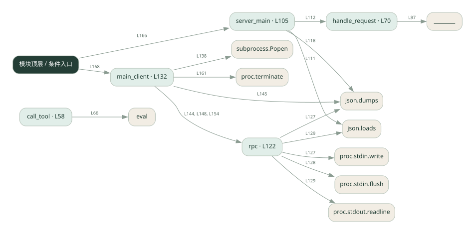
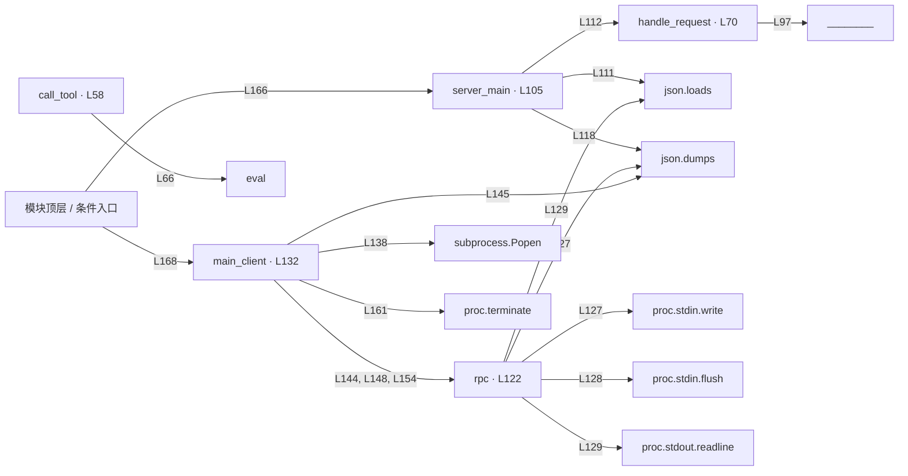

# 040.py · MCP 工具通信入门

课程：3-3 · 全课程第 43 节。源码快照 SHA-256 前 12 位：`25d618851cf0`。

[原文件](../040.py) · [网页阅读](pages/040.py.html) · [放大调用图](graphs/040.py.svg)

## 这份文件要完成什么

客户端启动子进程，用标准输入输出传 JSON-RPC 请求，服务端列出并执行工具。

## 为什么需要它

工具可以运行在独立进程，双方需要约定请求和响应格式。

## 当前文件的实际状态

- 同一个脚本分客户端与 --server 两种入口，通过子进程标准输入输出通信。请求分发仍有填空；协议教学代码不能直接认定为完整 MCP 服务。
- 仍有下划线占位表达式，源文件行号：87, 97, 99, 158。相应路径在补完前不能正常执行。
- 源码存在 eval 调用。请先看表达式限制条件；调用图只能说明它被使用，不能证明输入已被安全限制。
- 主要展示本地计算、内存状态或模拟流程；是否写文件/启动子进程请看调用表。 本次只做静态解析，没有运行练习，也没有替你填写或修改原代码。

## 调用图 / 阅读与数据流程

实线：源码中的直接调用；虚线：函数引用/注册、动态调用或按方法名推断的候选。L 是调用所在源码行号。箭头不表示执行顺序或每次必经；分支、循环、异步调度及框架内部调用需结合源码。灰色是外部/未解析目标，橙色是动态分发；省略 print、len 和常规容器操作以减少干扰。孤立函数可能尚未接入。

Mermaid 图源

## 从哪里开始看

先从 模块入口 出发，沿箭头找到本文件函数，再查看外部调用或动态分发。右侧调用清单保留所有静态调用点，能回到原文件逐行对照。

## 关键函数与依赖

| 函数 / 定义行 | 职责（源码注释供参考） | 函数体中的调用 |
|---|---|---|
| `call_tool` [L58](../040.py#L58) | 真正执行工具（这是 server 的核心逻辑） | `set, any, str, eval` |
| `handle_request` [L70](../040.py#L70) | 按 method 分发，返回 result（这就是 MCP 的「协议处理」） | `req.get, ________.items, ________` |
| `server_main` [L105](../040.py#L105) | server 主循环：从 stdin 逐行读 JSON 请求，往 stdout 逐行写 JSON 响应 | `line.strip, json.loads, handle_request, req.get, print, json.dumps` |
| `rpc` [L122](../040.py#L122) | 发一个 JSON-RPC 请求，收一个响应 | `proc.stdin.write, json.dumps, proc.stdin.flush, json.loads, proc.stdout.readline` |
| `main_client` [L132](../040.py#L132) | 以源码函数体为准；下列调用展示其依赖。 | `print, subprocess.Popen, rpc, json.dumps, proc.terminate` |

## 这样做的优点

模型侧和工具实现可以分离，协议内容可直接观察。

## 代价与局限

这是协议子集教学实现；不能据此认定完整兼容、可靠并发或具备安全隔离。

## 适合什么场景

理解 stdio 与工具发现、工具调用的关系。

## 不适合直接照搬的场景

直接作为面向不可信客户端的公共工具服务。

## 改一个条件，检验是否理解

请求一个不存在的工具，观察响应 id 与错误内容是否能对应请求。

如果当前文件有未实现位置，先预测应该怎样变化，补齐后再验证；不要把“能启动”当作“实现正确”。

## 全部静态调用点

这是语法分析清单，包含图中省略的基础操作；不记录参数值。

| 调用方 | 目标表达式 | 行号 | 类型 |
|---|---|---|---|
| call_tool | `set` | 63 | 调用表达式 |
| call_tool | `any` | 64 | 调用表达式 |
| call_tool | `str` | 66 | 调用表达式 |
| call_tool | `eval` | 66 | 调用表达式 |
| handle_request | `req.get` | 72 | 调用表达式 |
| handle_request | `________.items` | 87 | 调用表达式 |
| handle_request | `________` | 97 | 调用表达式 |
| server_main | `line.strip` | 108 | 调用表达式 |
| server_main | `json.loads` | 111 | 调用表达式 |
| server_main | `handle_request` | 112 | 调用表达式 |
| server_main | `req.get` | 113 | 调用表达式 |
| server_main | `print` | 118 | 调用表达式 |
| server_main | `json.dumps` | 118 | 调用表达式 |
| rpc | `proc.stdin.write` | 127 | 调用表达式 |
| rpc | `json.dumps` | 127 | 调用表达式 |
| rpc | `proc.stdin.flush` | 128 | 调用表达式 |
| rpc | `json.loads` | 129 | 调用表达式 |
| rpc | `proc.stdout.readline` | 129 | 调用表达式 |
| main_client | `print` | 133 | 调用表达式 |
| main_client | `print` | 134 | 调用表达式 |
| main_client | `print` | 135 | 调用表达式 |
| main_client | `subprocess.Popen` | 138 | 调用表达式 |
| main_client | `rpc` | 144 | 调用表达式 |
| main_client | `print` | 145 | 调用表达式 |
| main_client | `json.dumps` | 145 | 调用表达式 |
| main_client | `rpc` | 148 | 调用表达式 |
| main_client | `print` | 149 | 调用表达式 |
| main_client | `print` | 151 | 调用表达式 |
| main_client | `rpc` | 154 | 调用表达式 |
| main_client | `print` | 159 | 调用表达式 |
| main_client | `proc.terminate` | 161 | 调用表达式 |
| <模块入口> | `server_main` | 166 | 调用表达式 |
| <模块入口> | `main_client` | 168 | 调用表达式 |
