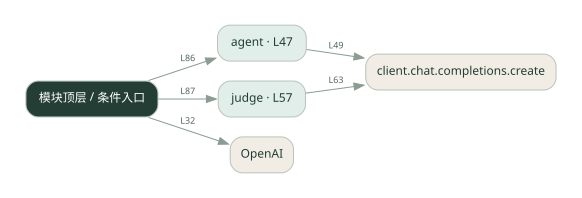
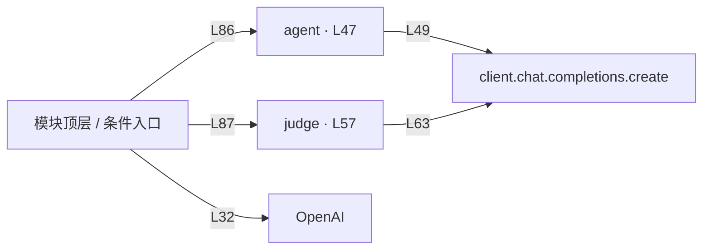

# 041.py · 评测运行器

课程：3-4 · 全课程第 44 节。源码快照 SHA-256 前 12 位：`dff9562f69c8`。

[原文件](../041.py) · [网页阅读](pages/041.py.html) · [放大调用图](graphs/041.py.svg)

## 这份文件要完成什么

遍历固定题集，调用被测 Agent 和裁判，统计正确率等结果。

## 为什么需要它

修改 Agent 后需要同口径检查回归。

## 当前文件的实际状态

- 仍有下划线占位表达式，源文件行号：62, 76, 99。相应路径在补完前不能正常执行。
- 存在外部服务或模型依赖；执行前需按源文件配置依赖和凭据，可能联网或产生 API 费用。 本次只做静态解析，没有运行练习，也没有替你填写或修改原代码。

## 调用图 / 阅读与数据流程

实线：源码中的直接调用；虚线：函数引用/注册、动态调用或按方法名推断的候选。L 是调用所在源码行号。箭头不表示执行顺序或每次必经；分支、循环、异步调度及框架内部调用需结合源码。灰色是外部/未解析目标，橙色是动态分发；省略 print、len 和常规容器操作以减少干扰。孤立函数可能尚未接入。

Mermaid 图源

## 从哪里开始看

先从 模块入口 出发，沿箭头找到本文件函数，再查看外部调用或动态分发。右侧调用清单保留所有静态调用点，能回到原文件逐行对照。

## 关键函数与依赖

| 函数 / 定义行 | 职责（源码注释供参考） | 函数体中的调用 |
|---|---|---|
| `agent` [L47](../041.py#L47) | 被测的 agent：直接问 LLM | `client.chat.completions.create, resp.choices[动态键].message.content.strip` |
| `judge` [L57](../041.py#L57) | LLM-as-Judge：判断答案是否正确，返回 True/False | `client.chat.completions.create` |

## 这样做的优点

输入、期望和得分集中，便于比较版本。

## 代价与局限

小题集不能代表真实分布；裁判错误会直接影响分数。

## 适合什么场景

评测流程入门、少量回归样例。

## 不适合直接照搬的场景

凭几题分数做高风险选型或效果承诺。

## 改一个条件，检验是否理解

增加一道模型容易答非所问的题，查看裁判是否只认关键词。

如果当前文件有未实现位置，先预测应该怎样变化，补齐后再验证；不要把“能启动”当作“实现正确”。

## 全部静态调用点

这是语法分析清单，包含图中省略的基础操作；不记录参数值。

| 调用方 | 目标表达式 | 行号 | 类型 |
|---|---|---|---|
| <模块入口> | `OpenAI` | 32 | 调用表达式 |
| agent | `client.chat.completions.create` | 49 | 调用表达式 |
| agent | `resp.choices[动态键].message.content.strip` | 54 | 调用表达式 |
| judge | `client.chat.completions.create` | 63 | 调用表达式 |
| <模块入口> | `print` | 81 | 调用表达式 |
| <模块入口> | `print` | 82 | 调用表达式 |
| <模块入口> | `print` | 83 | 调用表达式 |
| <模块入口> | `agent` | 86 | 调用表达式 |
| <模块入口> | `judge` | 87 | 调用表达式 |
| <模块入口> | `print` | 91 | 调用表达式 |
| <模块入口> | `print` | 92 | 调用表达式 |
| <模块入口> | `print` | 93 | 调用表达式 |
| <模块入口> | `len` | 95 | 调用表达式 |
| <模块入口> | `print` | 100 | 调用表达式 |
| <模块入口> | `print` | 101 | 调用表达式 |
| <模块入口> | `print` | 102 | 调用表达式 |
