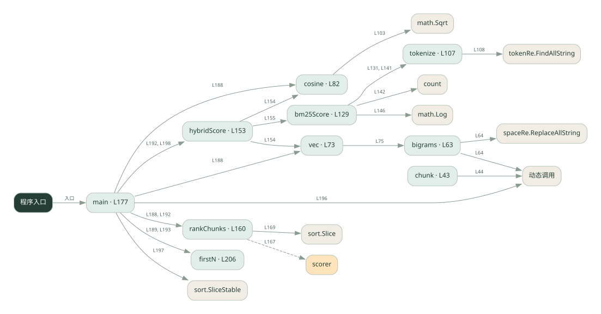
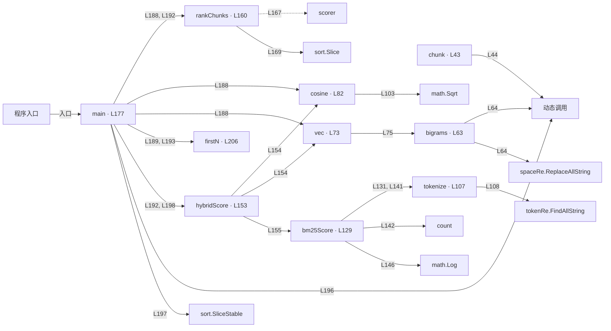

# 042.go · 切块、混合检索与重排

课程：3-5 · 全课程第 45 节。源码快照 SHA-256 前 12 位：`d3209987561e`。

[原文件](../042.go) · [网页阅读](pages/042.go.html) · [放大调用图](graphs/042.go.svg)

## 这份文件要完成什么

把文档切块，用字符向量与词项分数召回，再对候选排序。

## 为什么需要它

整篇检索粒度粗；只用一种匹配信号可能漏掉相关片段。

## 当前文件的实际状态

- 向量来自字符二元组，稀疏分数是简化公式，排序是本地计算；没有下载 embedding 模型，也没有调用真实重排模型。
- 主要展示本地计算、内存状态或模拟流程；是否写文件/启动子进程请看调用表。 本次只做静态解析，没有运行练习，也没有替你填写或修改原代码。

## 调用图 / 阅读与数据流程

实线：源码中的直接调用；虚线：函数引用/注册、动态调用或按方法名推断的候选。L 是调用所在源码行号。箭头不表示执行顺序或每次必经；分支、循环、异步调度及框架内部调用需结合源码。灰色是外部/未解析目标，橙色是动态分发；省略 print、len 和常规容器操作以减少干扰。孤立函数可能尚未接入。

Mermaid 图源

## 从哪里开始看

先从 main（程序入口） 出发，沿箭头找到本文件函数，再查看外部调用或动态分发。右侧调用清单保留所有静态调用点，能回到原文件逐行对照。

## 关键函数与依赖

| 函数 / 定义行 | 职责（源码注释供参考） | 函数体中的调用 |
|---|---|---|
| `chunk` [L43](../042.go#L43) | chunk：按固定窗口切块，块与块之间保留重叠（步长 = 窗口 - 重叠） | `动态调用, len, append, string` |
| `bigrams` [L63](../042.go#L63) | bigrams：字符 bigram（去空白后，相邻两字符一组） | `动态调用, spaceRe.ReplaceAllString, len, append, string` |
| `vec` [L73](../042.go#L73) | vec：文本 → bigram 词频向量 | `bigrams` |
| `cosine` [L82](../042.go#L82) | cosine：余弦相似度 = 点积 / (／a／ * ／b／) | `len, float64, math.Sqrt` |
| `tokenize` [L107](../042.go#L107) | tokenize：中文单字 / 英文单词（简化分词） | `tokenRe.FindAllString` |
| `bm25Score` [L129](../042.go#L129) | bm25Score：简化 BM25（词频 + 逆文档频率） | `tokenize, count, math.Log, float64` |
| `hybridScore` [L153](../042.go#L153) | hybridScore：dense + sparse 加权融合 | `cosine, vec, bm25Score` |
| `rankChunks` [L160](../042.go#L160) | rankChunks：按分数降序返回 chunk 下标（对应 Python 的 sorted + CHUNKS.index） | `append, scorer, sort.Slice, make, len` |
| `main` [L177](../042.go#L177) | 以源码函数体为准；下列调用展示其依赖。 | `fmt.Println, fmt.Printf, len, rankChunks, cosine, vec, firstN, hybridScore, append, 动态调用, sort.SliceStable` |
| `firstN` [L206](../042.go#L206) | 以源码函数体为准；下列调用展示其依赖。 | `len` |

## 这样做的优点

可比较切块、重叠和混合权重对候选的影响。

## 代价与局限

本地字符二元组不是预训练语义 embedding，稀疏分数也是简化实现；两种分数尺度未必可直接相加。

## 适合什么场景

理解 RAG 各环节和做小数据实验。

## 不适合直接照搬的场景

把演示效果等同真实语义检索或生产 BM25 性能。

## 改一个条件，检验是否理解

问一个与原文同义但措辞不同的问题，观察字符匹配的局限。

如果当前文件有未实现位置，先预测应该怎样变化，补齐后再验证；不要把“能启动”当作“实现正确”。

## 全部静态调用点

这是语法分析清单，包含图中省略的基础操作；不记录参数值。

| 调用方 | 目标表达式 | 行号 | 类型 |
|---|---|---|---|
| chunk | `动态调用` | 44 | 调用表达式 |
| chunk | `len` | 47 | 调用表达式 |
| chunk | `len` | 49 | 调用表达式 |
| chunk | `len` | 50 | 调用表达式 |
| chunk | `append` | 52 | 调用表达式 |
| chunk | `string` | 52 | 调用表达式 |
| bigrams | `动态调用` | 64 | 调用表达式 |
| bigrams | `spaceRe.ReplaceAllString` | 64 | 调用表达式 |
| bigrams | `len` | 66 | 调用表达式 |
| bigrams | `append` | 67 | 调用表达式 |
| bigrams | `string` | 67 | 调用表达式 |
| vec | `bigrams` | 75 | 调用表达式 |
| cosine | `len` | 83 | 调用表达式 |
| cosine | `len` | 83 | 调用表达式 |
| cosine | `float64` | 89 | 调用表达式 |
| cosine | `float64` | 94 | 调用表达式 |
| cosine | `float64` | 98 | 调用表达式 |
| cosine | `math.Sqrt` | 103 | 调用表达式 |
| cosine | `math.Sqrt` | 103 | 调用表达式 |
| tokenize | `tokenRe.FindAllString` | 108 | 调用表达式 |
| bm25Score | `tokenize` | 131 | 调用表达式 |
| bm25Score | `tokenize` | 141 | 调用表达式 |
| bm25Score | `count` | 142 | 调用表达式 |
| bm25Score | `math.Log` | 146 | 调用表达式 |
| bm25Score | `float64` | 146 | 调用表达式 |
| bm25Score | `float64` | 146 | 调用表达式 |
| bm25Score | `float64` | 146 | 调用表达式 |
| bm25Score | `float64` | 147 | 调用表达式 |
| hybridScore | `cosine` | 154 | 调用表达式 |
| hybridScore | `vec` | 154 | 调用表达式 |
| hybridScore | `vec` | 154 | 调用表达式 |
| hybridScore | `bm25Score` | 155 | 调用表达式 |
| rankChunks | `append` | 167 | 调用表达式 |
| rankChunks | `scorer` | 167 | 调用表达式 |
| rankChunks | `sort.Slice` | 169 | 调用表达式 |
| rankChunks | `make` | 170 | 调用表达式 |
| rankChunks | `len` | 170 | 调用表达式 |
| main | `fmt.Println` | 179 | 调用表达式 |
| main | `fmt.Println` | 180 | 调用表达式 |
| main | `fmt.Println` | 181 | 调用表达式 |
| main | `fmt.Printf` | 182 | 调用表达式 |
| main | `len` | 182 | 调用表达式 |
| main | `fmt.Printf` | 184 | 调用表达式 |
| main | `rankChunks` | 188 | 调用表达式 |
| main | `cosine` | 188 | 调用表达式 |
| main | `vec` | 188 | 调用表达式 |
| main | `vec` | 188 | 调用表达式 |
| main | `fmt.Printf` | 189 | 调用表达式 |
| main | `firstN` | 189 | 调用表达式 |
| main | `rankChunks` | 192 | 调用表达式 |
| main | `hybridScore` | 192 | 调用表达式 |
| main | `fmt.Printf` | 193 | 调用表达式 |
| main | `firstN` | 193 | 调用表达式 |
| main | `append` | 196 | 调用表达式 |
| main | `动态调用` | 196 | 调用表达式 |
| main | `sort.SliceStable` | 197 | 调用表达式 |
| main | `hybridScore` | 198 | 调用表达式 |
| main | `hybridScore` | 198 | 调用表达式 |
| main | `fmt.Printf` | 200 | 调用表达式 |
| main | `fmt.Println` | 202 | 调用表达式 |
| main | `fmt.Println` | 203 | 调用表达式 |
| firstN | `len` | 207 | 调用表达式 |
