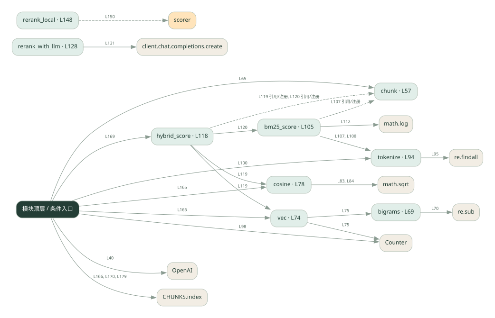
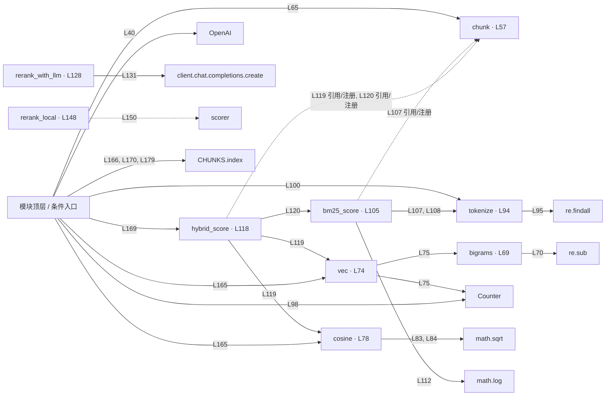

# 042.py · 切块、混合检索与重排

课程：3-5 · 全课程第 45 节。源码快照 SHA-256 前 12 位：`a5f27d686383`。

[原文件](../042.py) · [网页阅读](pages/042.py.html) · [放大调用图](graphs/042.py.svg)

## 这份文件要完成什么

把文档切块，用字符向量与词项分数召回，再对候选排序。

## 为什么需要它

整篇检索粒度粗；只用一种匹配信号可能漏掉相关片段。

## 当前文件的实际状态

- vec 使用字符二元组计数，不能理解深层语义。rerank_with_llm 会真实调用模型，rerank_local 是本地降级分支；仍有切块、打分等填空。
- 仍有下划线占位表达式，源文件行号：60, 90, 124, 178。相应路径在补完前不能正常执行。
- 存在外部服务或模型依赖；执行前需按源文件配置依赖和凭据，可能联网或产生 API 费用。 本次只做静态解析，没有运行练习，也没有替你填写或修改原代码。

## 调用图 / 阅读与数据流程

实线：源码中的直接调用；虚线：函数引用/注册、动态调用或按方法名推断的候选。L 是调用所在源码行号。箭头不表示执行顺序或每次必经；分支、循环、异步调度及框架内部调用需结合源码。灰色是外部/未解析目标，橙色是动态分发；省略 print、len 和常规容器操作以减少干扰。孤立函数可能尚未接入。

Mermaid 图源

## 从哪里开始看

先从 模块入口 出发，沿箭头找到本文件函数，再查看外部调用或动态分发。右侧调用清单保留所有静态调用点，能回到原文件逐行对照。

## 关键函数与依赖

| 函数 / 定义行 | 职责（源码注释供参考） | 函数体中的调用 |
|---|---|---|
| `chunk` [L57](../042.py#L57) | 以源码函数体为准；下列调用展示其依赖。 | `range, len, chunks.append` |
| `bigrams` [L69](../042.py#L69) | 以源码函数体为准；下列调用展示其依赖。 | `re.sub, range, len` |
| `vec` [L74](../042.py#L74) | 以源码函数体为准；下列调用展示其依赖。 | `Counter, bigrams` |
| `cosine` [L78](../042.py#L78) | 以源码函数体为准；下列调用展示其依赖。 | `set, sum, math.sqrt, a.values, b.values` |
| `tokenize` [L94](../042.py#L94) | 以源码函数体为准；下列调用展示其依赖。 | `re.findall` |
| `bm25_score` [L105](../042.py#L105) | 以源码函数体为准；下列调用展示其依赖。 | `tokenize, cterms.count, math.log` |
| `hybrid_score` [L118](../042.py#L118) | 以源码函数体为准；下列调用展示其依赖。 | `cosine, vec, bm25_score` |
| `rerank_with_llm` [L128](../042.py#L128) | 以源码函数体为准；下列调用展示其依赖。 | `client.chat.completions.create, float, resp.choices[动态键].message.content.strip, ranked.append, ranked.sort` |
| `rerank_local` [L148](../042.py#L148) | 本地精排：直接用混合分重排（不调 LLM 的降级版） | `scorer, scored.sort` |

## 这样做的优点

可比较切块、重叠和混合权重对候选的影响。

## 代价与局限

本地字符二元组不是预训练语义 embedding，稀疏分数也是简化实现；两种分数尺度未必可直接相加。

## 适合什么场景

理解 RAG 各环节和做小数据实验。

## 不适合直接照搬的场景

把演示效果等同真实语义检索或生产 BM25 性能。

## 改一个条件，检验是否理解

问一个与原文同义但措辞不同的问题，观察字符匹配的局限。

如果当前文件有未实现位置，先预测应该怎样变化，补齐后再验证；不要把“能启动”当作“实现正确”。

## 全部静态调用点

这是语法分析清单，包含图中省略的基础操作；不记录参数值。

| 调用方 | 目标表达式 | 行号 | 类型 |
|---|---|---|---|
| <模块入口> | `OpenAI` | 40 | 调用表达式 |
| chunk | `range` | 60 | 调用表达式 |
| chunk | `len` | 60 | 调用表达式 |
| chunk | `chunks.append` | 61 | 调用表达式 |
| <模块入口> | `chunk` | 65 | 调用表达式 |
| bigrams | `re.sub` | 70 | 调用表达式 |
| bigrams | `range` | 71 | 调用表达式 |
| bigrams | `len` | 71 | 调用表达式 |
| vec | `Counter` | 75 | 调用表达式 |
| vec | `bigrams` | 75 | 调用表达式 |
| cosine | `set` | 81 | 调用表达式 |
| cosine | `set` | 81 | 调用表达式 |
| cosine | `sum` | 82 | 调用表达式 |
| cosine | `math.sqrt` | 83 | 调用表达式 |
| cosine | `sum` | 83 | 调用表达式 |
| cosine | `a.values` | 83 | 调用表达式 |
| cosine | `math.sqrt` | 84 | 调用表达式 |
| cosine | `sum` | 84 | 调用表达式 |
| cosine | `b.values` | 84 | 调用表达式 |
| tokenize | `re.findall` | 95 | 调用表达式 |
| <模块入口> | `Counter` | 98 | 调用表达式 |
| <模块入口> | `set` | 100 | 调用表达式 |
| <模块入口> | `tokenize` | 100 | 调用表达式 |
| <模块入口> | `len` | 102 | 调用表达式 |
| bm25_score | `tokenize` | 107 | 调用表达式 |
| bm25_score | `tokenize` | 108 | 调用表达式 |
| bm25_score | `cterms.count` | 111 | 调用表达式 |
| bm25_score | `math.log` | 112 | 调用表达式 |
| hybrid_score | `cosine` | 119 | 调用表达式 |
| hybrid_score | `vec` | 119 | 调用表达式 |
| hybrid_score | `vec` | 119 | 调用表达式 |
| hybrid_score | `bm25_score` | 120 | 调用表达式 |
| rerank_with_llm | `client.chat.completions.create` | 131 | 调用表达式 |
| rerank_with_llm | `float` | 140 | 调用表达式 |
| rerank_with_llm | `resp.choices[动态键].message.content.strip` | 140 | 调用表达式 |
| rerank_with_llm | `ranked.append` | 143 | 调用表达式 |
| rerank_with_llm | `ranked.sort` | 144 | 调用表达式 |
| rerank_local | `scorer` | 150 | 调用表达式 |
| rerank_local | `scored.sort` | 151 | 调用表达式 |
| <模块入口> | `print` | 157 | 调用表达式 |
| <模块入口> | `print` | 158 | 调用表达式 |
| <模块入口> | `print` | 159 | 调用表达式 |
| <模块入口> | `print` | 160 | 调用表达式 |
| <模块入口> | `len` | 160 | 调用表达式 |
| <模块入口> | `enumerate` | 161 | 调用表达式 |
| <模块入口> | `print` | 162 | 调用表达式 |
| <模块入口> | `sorted` | 165 | 调用表达式 |
| <模块入口> | `cosine` | 165 | 调用表达式 |
| <模块入口> | `vec` | 165 | 调用表达式 |
| <模块入口> | `vec` | 165 | 调用表达式 |
| <模块入口> | `print` | 166 | 调用表达式 |
| <模块入口> | `CHUNKS.index` | 166 | 调用表达式 |
| <模块入口> | `sorted` | 169 | 调用表达式 |
| <模块入口> | `hybrid_score` | 169 | 调用表达式 |
| <模块入口> | `print` | 170 | 调用表达式 |
| <模块入口> | `CHUNKS.index` | 170 | 调用表达式 |
| <模块入口> | `print` | 179 | 调用表达式 |
| <模块入口> | `CHUNKS.index` | 179 | 调用表达式 |
| <模块入口> | `print` | 181 | 调用表达式 |
| <模块入口> | `print` | 182 | 调用表达式 |
| bm25_score | `chunk` | 107 | 函数引用/注册 |
| hybrid_score | `chunk` | 119 | 函数引用/注册 |
| hybrid_score | `chunk` | 120 | 函数引用/注册 |
