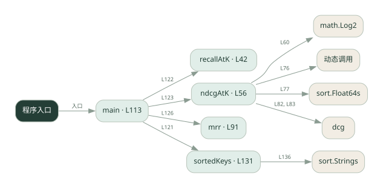
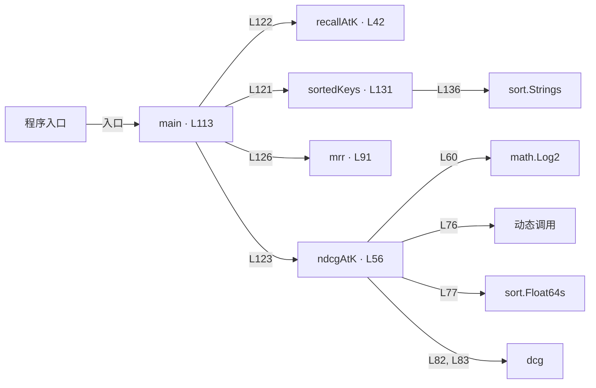

# 043.go · 检索质量指标

课程：3-8 · 全课程第 48 节。源码快照 SHA-256 前 12 位：`6a336e97fc94`。

[原文件](../043.go) · [网页阅读](pages/043.go.html) · [放大调用图](graphs/043.go.svg)

## 这份文件要完成什么

计算 Recall@k、NDCG@k 和 MRR，对比命中数量和排序位置。

## 为什么需要它

找到相关文档与把最相关结果排前面是不同能力。

## 当前文件的实际状态

- 主要展示本地计算、内存状态或模拟流程；是否写文件/启动子进程请看调用表。 本次只做静态解析，没有运行练习，也没有替你填写或修改原代码。

## 调用图 / 阅读与数据流程

实线：源码中的直接调用；虚线：函数引用/注册、动态调用或按方法名推断的候选。L 是调用所在源码行号。箭头不表示执行顺序或每次必经；分支、循环、异步调度及框架内部调用需结合源码。灰色是外部/未解析目标，橙色是动态分发；省略 print、len 和常规容器操作以减少干扰。孤立函数可能尚未接入。

Mermaid 图源

## 从哪里开始看

先从 main（程序入口） 出发，沿箭头找到本文件函数，再查看外部调用或动态分发。右侧调用清单保留所有静态调用点，能回到原文件逐行对照。

## 关键函数与依赖

| 函数 / 定义行 | 职责（源码注释供参考） | 函数体中的调用 |
|---|---|---|
| `recallAtK` [L42](../043.go#L42) | recallAtK：召回率@k = 前 k 个命中的相关文档数 / 相关文档总数 | `float64, len` |
| `ndcgAtK` [L56](../043.go#L56) | ndcgAtK：NDCG@k = DCG / IDCG（考虑排序位置，位置越靠前折扣越小、贡献越大） | `math.Log2, float64, append, 动态调用, sort.Float64s, len, dcg` |
| `mrr` [L91](../043.go#L91) | mrr：每个查询「第一个相关文档」出现在第几名，取倒数后求平均 | `append, float64, len` |
| `main` [L113](../043.go#L113) | 以源码函数体为准；下列调用展示其依赖。 | `fmt.Println, fmt.Printf, sortedKeys, recallAtK, ndcgAtK, mrr` |
| `sortedKeys` [L131](../043.go#L131) | sortedKeys：把 relevant 的键排序返回（对应 Python 的 sorted(rel)） | `make, len, append, sort.Strings` |

## 这样做的优点

能把“检索好不好”拆成可测指标。

## 代价与局限

需要可信相关性标注；空集合、重复结果和 k 的选择会影响比较。

## 适合什么场景

检索参数和排序方法的离线比较。

## 不适合直接照搬的场景

没有标注数据时把指标当作真实用户满意度。

## 改一个条件，检验是否理解

保持命中文档不变，只把相关文档往后移，观察三个指标怎样变化。

如果当前文件有未实现位置，先预测应该怎样变化，补齐后再验证；不要把“能启动”当作“实现正确”。

## 全部静态调用点

这是语法分析清单，包含图中省略的基础操作；不记录参数值。

| 调用方 | 目标表达式 | 行号 | 类型 |
|---|---|---|---|
| recallAtK | `float64` | 52 | 调用表达式 |
| recallAtK | `float64` | 52 | 调用表达式 |
| recallAtK | `len` | 52 | 调用表达式 |
| ndcgAtK | `math.Log2` | 60 | 调用表达式 |
| ndcgAtK | `float64` | 60 | 调用表达式 |
| ndcgAtK | `append` | 71 | 调用表达式 |
| ndcgAtK | `append` | 73 | 调用表达式 |
| ndcgAtK | `append` | 76 | 调用表达式 |
| ndcgAtK | `动态调用` | 76 | 调用表达式 |
| ndcgAtK | `sort.Float64s` | 77 | 调用表达式 |
| ndcgAtK | `len` | 78 | 调用表达式 |
| ndcgAtK | `dcg` | 82 | 调用表达式 |
| ndcgAtK | `dcg` | 83 | 调用表达式 |
| mrr | `append` | 97 | 调用表达式 |
| mrr | `float64` | 97 | 调用表达式 |
| mrr | `append` | 103 | 调用表达式 |
| mrr | `float64` | 110 | 调用表达式 |
| mrr | `len` | 110 | 调用表达式 |
| main | `fmt.Println` | 114 | 调用表达式 |
| main | `fmt.Println` | 115 | 调用表达式 |
| main | `fmt.Println` | 116 | 调用表达式 |
| main | `fmt.Printf` | 120 | 调用表达式 |
| main | `fmt.Printf` | 121 | 调用表达式 |
| main | `sortedKeys` | 121 | 调用表达式 |
| main | `fmt.Printf` | 122 | 调用表达式 |
| main | `recallAtK` | 122 | 调用表达式 |
| main | `fmt.Printf` | 123 | 调用表达式 |
| main | `ndcgAtK` | 123 | 调用表达式 |
| main | `fmt.Printf` | 126 | 调用表达式 |
| main | `mrr` | 126 | 调用表达式 |
| main | `fmt.Println` | 127 | 调用表达式 |
| sortedKeys | `make` | 132 | 调用表达式 |
| sortedKeys | `len` | 132 | 调用表达式 |
| sortedKeys | `append` | 134 | 调用表达式 |
| sortedKeys | `sort.Strings` | 136 | 调用表达式 |
