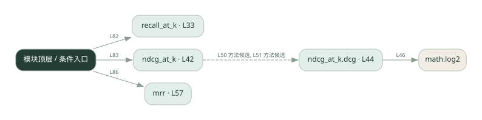
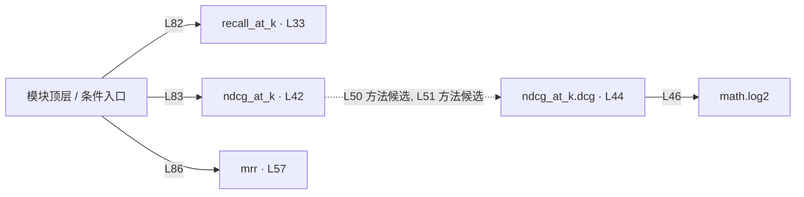

# 043.py · 检索质量指标

课程：3-8 · 全课程第 48 节。源码快照 SHA-256 前 12 位：`2b66e819f3f0`。

[原文件](../043.py) · [网页阅读](pages/043.py.html) · [放大调用图](graphs/043.py.svg)

## 这份文件要完成什么

计算 Recall@k、NDCG@k 和 MRR，对比命中数量和排序位置。

## 为什么需要它

找到相关文档与把最相关结果排前面是不同能力。

## 当前文件的实际状态

- 仍有下划线占位表达式，源文件行号：39, 54, 66。相应路径在补完前不能正常执行。
- 主要展示本地计算、内存状态或模拟流程；是否写文件/启动子进程请看调用表。 本次只做静态解析，没有运行练习，也没有替你填写或修改原代码。

## 调用图 / 阅读与数据流程

实线：源码中的直接调用；虚线：函数引用/注册、动态调用或按方法名推断的候选。L 是调用所在源码行号。箭头不表示执行顺序或每次必经；分支、循环、异步调度及框架内部调用需结合源码。灰色是外部/未解析目标，橙色是动态分发；省略 print、len 和常规容器操作以减少干扰。孤立函数可能尚未接入。

Mermaid 图源

## 从哪里开始看

先从 模块入口 出发，沿箭头找到本文件函数，再查看外部调用或动态分发。右侧调用清单保留所有静态调用点，能回到原文件逐行对照。

## 关键函数与依赖

| 函数 / 定义行 | 职责（源码注释供参考） | 函数体中的调用 |
|---|---|---|
| `recall_at_k` [L33](../043.py#L33) | 召回率@k：检索返回的前 k 个里，命中了多少相关文档（占全部相关文档的比例） | `len, set` |
| `ndcg_at_k` [L42](../043.py#L42) | NDCG@k：考虑排序位置——相关文档排得越靠前，得分越高 | `sorted, dcg` |
| `ndcg_at_k.dcg` [L44](../043.py#L44) | 以源码函数体为准；下列调用展示其依赖。 | `sum, math.log2, enumerate` |
| `mrr` [L57](../043.py#L57) | MRR：每个查询「第一个相关文档」出现在第几名，取倒数后求平均 | `enumerate, scores.append, sum, len` |

## 这样做的优点

能把“检索好不好”拆成可测指标。

## 代价与局限

需要可信相关性标注；空集合、重复结果和 k 的选择会影响比较。

## 适合什么场景

检索参数和排序方法的离线比较。

## 不适合直接照搬的场景

没有标注数据时把指标当作真实用户满意度。

## 改一个条件，检验是否理解

保持命中文档不变，只把相关文档往后移，观察三个指标怎样变化。

如果当前文件有未实现位置，先预测应该怎样变化，补齐后再验证；不要把“能启动”当作“实现正确”。

## 全部静态调用点

这是语法分析清单，包含图中省略的基础操作；不记录参数值。

| 调用方 | 目标表达式 | 行号 | 类型 |
|---|---|---|---|
| recall_at_k | `len` | 38 | 调用表达式 |
| recall_at_k | `set` | 38 | 调用表达式 |
| ndcg_at_k.dcg | `sum` | 46 | 调用表达式 |
| ndcg_at_k.dcg | `math.log2` | 46 | 调用表达式 |
| ndcg_at_k.dcg | `enumerate` | 46 | 调用表达式 |
| ndcg_at_k | `sorted` | 49 | 调用表达式 |
| ndcg_at_k | `dcg` | 50 | 调用表达式 |
| ndcg_at_k | `dcg` | 51 | 调用表达式 |
| mrr | `enumerate` | 64 | 调用表达式 |
| mrr | `scores.append` | 66 | 调用表达式 |
| mrr | `scores.append` | 69 | 调用表达式 |
| mrr | `sum` | 70 | 调用表达式 |
| mrr | `len` | 70 | 调用表达式 |
| <模块入口> | `print` | 74 | 调用表达式 |
| <模块入口> | `print` | 75 | 调用表达式 |
| <模块入口> | `print` | 76 | 调用表达式 |
| <模块入口> | `print` | 80 | 调用表达式 |
| <模块入口> | `print` | 81 | 调用表达式 |
| <模块入口> | `sorted` | 81 | 调用表达式 |
| <模块入口> | `print` | 82 | 调用表达式 |
| <模块入口> | `recall_at_k` | 82 | 调用表达式 |
| <模块入口> | `print` | 83 | 调用表达式 |
| <模块入口> | `ndcg_at_k` | 83 | 调用表达式 |
| <模块入口> | `print` | 86 | 调用表达式 |
| <模块入口> | `mrr` | 86 | 调用表达式 |
| <模块入口> | `print` | 87 | 调用表达式 |
