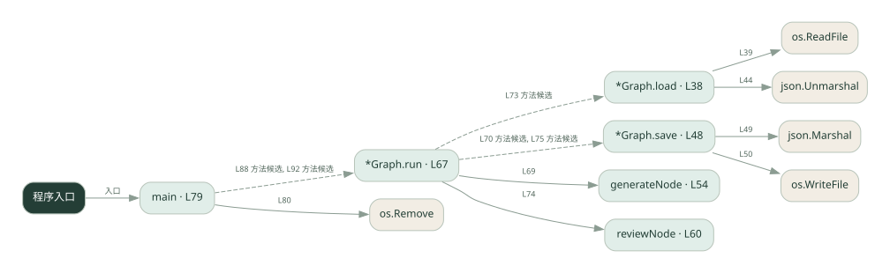
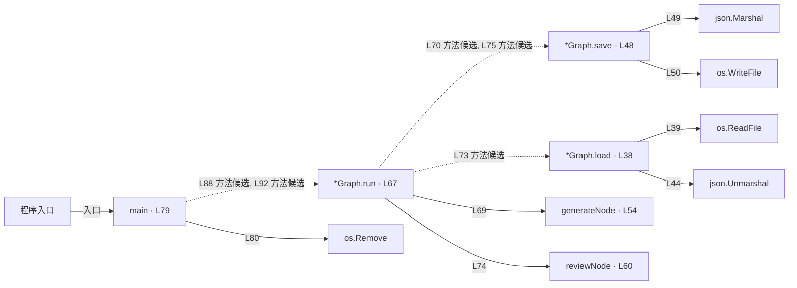

# 044.go · 持久化与暂停恢复

课程：3-9 · 全课程第 49 节。源码快照 SHA-256 前 12 位：`2f5e5ec39dd2`。

[原文件](../044.go) · [网页阅读](pages/044.go.html) · [放大调用图](graphs/044.go.svg)

## 这份文件要完成什么

生成草稿，保存状态，在人审处暂停，再带决定恢复执行。

## 为什么需要它

人工不会立即回复，进程也可能重启；状态需要跨等待保留。

## 当前文件的实际状态

- 自定义 Graph.load/save 用 JSON 文件保存状态，Graph.run 根据 resume 参数模拟暂停与继续。不是 LangGraph SDK，也不是 SQLite checkpoint。main 启动时删除旧 checkpoint，因此当前只演示同一进程内两次 run 的保存与恢复；跨进程恢复需调整入口。文件相对于启动工作目录。
- 主要展示本地计算、内存状态或模拟流程；是否写文件/启动子进程请看调用表。 本次只做静态解析，没有运行练习，也没有替你填写或修改原代码。

## 调用图 / 阅读与数据流程

实线：源码中的直接调用；虚线：函数引用/注册、动态调用或按方法名推断的候选。L 是调用所在源码行号。箭头不表示执行顺序或每次必经；分支、循环、异步调度及框架内部调用需结合源码。灰色是外部/未解析目标，橙色是动态分发；省略 print、len 和常规容器操作以减少干扰。孤立函数可能尚未接入。

Mermaid 图源

## 从哪里开始看

先从 main（程序入口） 出发，沿箭头找到本文件函数，再查看外部调用或动态分发。右侧调用清单保留所有静态调用点，能回到原文件逐行对照。

## 关键函数与依赖

| 函数 / 定义行 | 职责（源码注释供参考） | 函数体中的调用 |
|---|---|---|
| `*Graph.load` [L38](../044.go#L38) | 以源码函数体为准；下列调用展示其依赖。 | `os.ReadFile, json.Unmarshal` |
| `*Graph.save` [L48](../044.go#L48) | 以源码函数体为准；下列调用展示其依赖。 | `json.Marshal, os.WriteFile` |
| `generateNode` [L54](../044.go#L54) | generateNode：节点 1 —— 生成内容（简化版，不真调 LLM） | `未发现显式函数调用（可能直接计算、读写状态或尚未实现）` |
| `reviewNode` [L60](../044.go#L60) | reviewNode：节点 2 —— 人审。decision = interrupt(...) 的返回值 = 恢复时 resume 传进来的值 | `未发现显式函数调用（可能直接计算、读写状态或尚未实现）` |
| `*Graph.run` [L67](../044.go#L67) | run：跑图。resume=="" 表示第一次（在 review 前 interrupt 暂停，返回 false=没跑完）； | `generateNode, g.save, g.load, reviewNode` |
| `main` [L79](../044.go#L79) | 以源码函数体为准；下列调用展示其依赖。 | `os.Remove, fmt.Println, g.run, fmt.Printf` |

## 这样做的优点

长流程可以分多次运行，审核决定能进入后续状态。

## 代价与局限

恢复时要避免重复副作用；本地演示不自动解决多用户隔离与并发写入。

## 适合什么场景

需要等待审批的长流程原型。

## 不适合直接照搬的场景

未设计事务、身份与幂等却直接承载重要写操作。

## 改一个条件，检验是否理解

当前 main 会先删除旧 checkpoint。在副本中拆分首次运行与恢复入口，再检查重启后是否能够继续原草稿；原样重跑不能验证跨进程恢复。

如果当前文件有未实现位置，先预测应该怎样变化，补齐后再验证；不要把“能启动”当作“实现正确”。

## 全部静态调用点

这是语法分析清单，包含图中省略的基础操作；不记录参数值。

| 调用方 | 目标表达式 | 行号 | 类型 |
|---|---|---|---|
| *Graph.load | `os.ReadFile` | 39 | 调用表达式 |
| *Graph.load | `json.Unmarshal` | 44 | 调用表达式 |
| *Graph.save | `json.Marshal` | 49 | 调用表达式 |
| *Graph.save | `os.WriteFile` | 50 | 调用表达式 |
| *Graph.run | `generateNode` | 69 | 调用表达式 |
| *Graph.run | `g.save` | 70 | 调用表达式 |
| *Graph.run | `g.load` | 73 | 调用表达式 |
| *Graph.run | `reviewNode` | 74 | 调用表达式 |
| *Graph.run | `g.save` | 75 | 调用表达式 |
| main | `os.Remove` | 80 | 调用表达式 |
| main | `fmt.Println` | 83 | 调用表达式 |
| main | `fmt.Println` | 84 | 调用表达式 |
| main | `fmt.Println` | 85 | 调用表达式 |
| main | `fmt.Println` | 87 | 调用表达式 |
| main | `g.run` | 88 | 调用表达式 |
| main | `fmt.Printf` | 89 | 调用表达式 |
| main | `fmt.Println` | 91 | 调用表达式 |
| main | `g.run` | 92 | 调用表达式 |
| main | `fmt.Printf` | 93 | 调用表达式 |
| main | `fmt.Printf` | 94 | 调用表达式 |
| main | `fmt.Println` | 96 | 调用表达式 |
