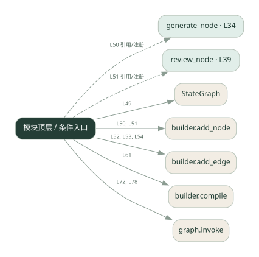
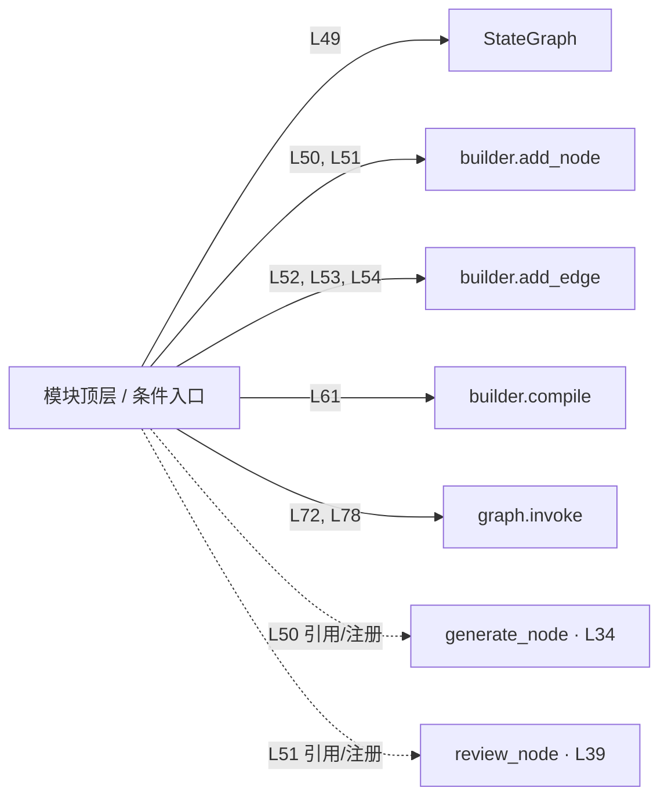

# 044.py · 持久化与暂停恢复

课程：3-9 · 全课程第 49 节。源码快照 SHA-256 前 12 位：`48f5947fd2ed`。

[原文件](../044.py) · [网页阅读](pages/044.py.html) · [放大调用图](graphs/044.py.svg)

## 这份文件要完成什么

生成草稿，保存状态，在人审处暂停，再带决定恢复执行。

## 为什么需要它

人工不会立即回复，进程也可能重启；状态需要跨等待保留。

## 当前文件的实际状态

- generate_node 返回固定草稿，并不调用大模型。使用 SQLite checkpoint 的框架示例，人审和保存器相关位置仍有填空；与 Go 的 checkpoints.json 不共用存储格式。
- 仍有下划线占位表达式，源文件行号：45, 60, 78。相应路径在补完前不能正常执行。
- 主要展示本地计算、内存状态或模拟流程；是否写文件/启动子进程请看调用表。 本次只做静态解析，没有运行练习，也没有替你填写或修改原代码。

## 调用图 / 阅读与数据流程

实线：源码中的直接调用；虚线：函数引用/注册、动态调用或按方法名推断的候选。L 是调用所在源码行号。箭头不表示执行顺序或每次必经；分支、循环、异步调度及框架内部调用需结合源码。灰色是外部/未解析目标，橙色是动态分发；省略 print、len 和常规容器操作以减少干扰。孤立函数可能尚未接入。

Mermaid 图源

## 从哪里开始看

先从 模块入口 出发，沿箭头找到本文件函数，再查看外部调用或动态分发。右侧调用清单保留所有静态调用点，能回到原文件逐行对照。

## 关键函数与依赖

| 函数 / 定义行 | 职责（源码注释供参考） | 函数体中的调用 |
|---|---|---|
| `generate_node` [L34](../044.py#L34) | 节点 1：生成内容（简化版，不真调 LLM） | `未发现显式函数调用（可能直接计算、读写状态或尚未实现）` |
| `review_node` [L39](../044.py#L39) | 节点 2：人审 —— 在这里暂停图，等人类拍板 | `未发现显式函数调用（可能直接计算、读写状态或尚未实现）` |

## 这样做的优点

长流程可以分多次运行，审核决定能进入后续状态。

## 代价与局限

恢复时要避免重复副作用；本地演示不自动解决多用户隔离与并发写入。

## 适合什么场景

需要等待审批的长流程原型。

## 不适合直接照搬的场景

未设计事务、身份与幂等却直接承载重要写操作。

## 改一个条件，检验是否理解

在暂停后重新启动进程，检查是否读回同一份草稿并接受拒绝。

如果当前文件有未实现位置，先预测应该怎样变化，补齐后再验证；不要把“能启动”当作“实现正确”。

## 全部静态调用点

这是语法分析清单，包含图中省略的基础操作；不记录参数值。

| 调用方 | 目标表达式 | 行号 | 类型 |
|---|---|---|---|
| <模块入口> | `StateGraph` | 49 | 调用表达式 |
| <模块入口> | `builder.add_node` | 50 | 调用表达式 |
| <模块入口> | `builder.add_node` | 51 | 调用表达式 |
| <模块入口> | `builder.add_edge` | 52 | 调用表达式 |
| <模块入口> | `builder.add_edge` | 53 | 调用表达式 |
| <模块入口> | `builder.add_edge` | 54 | 调用表达式 |
| <模块入口> | `builder.compile` | 61 | 调用表达式 |
| <模块入口> | `print` | 65 | 调用表达式 |
| <模块入口> | `print` | 66 | 调用表达式 |
| <模块入口> | `print` | 67 | 调用表达式 |
| <模块入口> | `print` | 71 | 调用表达式 |
| <模块入口> | `graph.invoke` | 72 | 调用表达式 |
| <模块入口> | `print` | 73 | 调用表达式 |
| <模块入口> | `graph.invoke` | 78 | 调用表达式 |
| <模块入口> | `print` | 79 | 调用表达式 |
| <模块入口> | `print` | 80 | 调用表达式 |
| <模块入口> | `generate_node` | 50 | 函数引用/注册 |
| <模块入口> | `review_node` | 51 | 函数引用/注册 |
