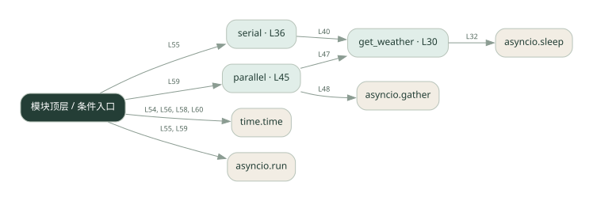
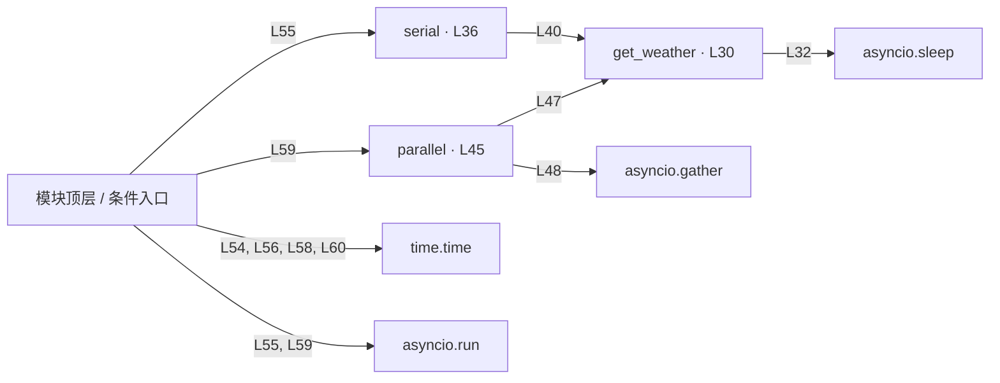

# async_tools.py · 异步工具并行

课程：1-18 · 全课程第 18 节。源码快照 SHA-256 前 12 位：`6b579d37a0b5`。

[原文件](../async_tools.py) · [网页阅读](pages/async_tools.py.html) · [放大调用图](graphs/async_tools.py.svg)

## 这份文件要完成什么

对比逐个等待与同时等待多个天气任务。

## 为什么需要它

相互独立的等待时间可以重叠，不必排队相加。

## 当前文件的实际状态

- 主要展示本地计算、内存状态或模拟流程；是否写文件/启动子进程请看调用表。 本次只做静态解析，没有运行练习，也没有替你填写或修改原代码。

## 调用图 / 阅读与数据流程

实线：源码中的直接调用；虚线：函数引用/注册、动态调用或按方法名推断的候选。L 是调用所在源码行号。箭头不表示执行顺序或每次必经；分支、循环、异步调度及框架内部调用需结合源码。灰色是外部/未解析目标，橙色是动态分发；省略 print、len 和常规容器操作以减少干扰。孤立函数可能尚未接入。

Mermaid 图源

## 从哪里开始看

先从 模块入口 出发，沿箭头找到本文件函数，再查看外部调用或动态分发。右侧调用清单保留所有静态调用点，能回到原文件逐行对照。

## 关键函数与依赖

| 函数 / 定义行 | 职责（源码注释供参考） | 函数体中的调用 |
|---|---|---|
| `get_weather` [L30](../async_tools.py#L30) | 模拟查天气：每个城市要 1 秒（真实场景这里是调 API/LLM） | `asyncio.sleep` |
| `serial` [L36](../async_tools.py#L36) | 串行：一个接一个 | `get_weather, results.append` |
| `parallel` [L45](../async_tools.py#L45) | 并行：asyncio.gather 一起发 | `get_weather, asyncio.gather` |

## 这样做的优点

等待型任务可降低总耗时。

## 代价与局限

共享资源、异常传播和并发上限更复杂；模拟 sleep 的收益不代表真实系统。

## 适合什么场景

相互独立的网络或磁盘查询。

## 不适合直接照搬的场景

有前后依赖的任务，或纯 CPU 重计算。

## 改一个条件，检验是否理解

把一个工具等待时间调长，对比串行与并行的总时长。

如果当前文件有未实现位置，先预测应该怎样变化，补齐后再验证；不要把“能启动”当作“实现正确”。

## 全部静态调用点

这是语法分析清单，包含图中省略的基础操作；不记录参数值。

| 调用方 | 目标表达式 | 行号 | 类型 |
|---|---|---|---|
| get_weather | `asyncio.sleep` | 32 | 调用表达式 |
| serial | `get_weather` | 40 | 调用表达式 |
| serial | `results.append` | 41 | 调用表达式 |
| parallel | `get_weather` | 47 | 调用表达式 |
| parallel | `asyncio.gather` | 48 | 调用表达式 |
| <模块入口> | `time.time` | 54 | 调用表达式 |
| <模块入口> | `asyncio.run` | 55 | 调用表达式 |
| <模块入口> | `serial` | 55 | 调用表达式 |
| <模块入口> | `time.time` | 56 | 调用表达式 |
| <模块入口> | `time.time` | 58 | 调用表达式 |
| <模块入口> | `asyncio.run` | 59 | 调用表达式 |
| <模块入口> | `parallel` | 59 | 调用表达式 |
| <模块入口> | `time.time` | 60 | 调用表达式 |
| <模块入口> | `print` | 62 | 调用表达式 |
| <模块入口> | `print` | 63 | 调用表达式 |
| <模块入口> | `print` | 64 | 调用表达式 |
| <模块入口> | `print` | 65 | 调用表达式 |
| <模块入口> | `print` | 66 | 调用表达式 |
| <模块入口> | `print` | 67 | 调用表达式 |
