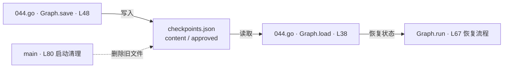

# checkpoints.json · 暂停恢复的状态快照

课程：3-9 · 全课程第 49 节。源码快照 SHA-256 前 12 位：`656da72ba83a`。

[原文件](../checkpoints.json) · [网页阅读](pages/checkpoints.json.html) · [放大调用图](graphs/checkpoints.json.svg)

## 这份文件要完成什么

保存 content 和 approved 字段，供 Go 的图流程保存/恢复草稿与审批状态。

## 为什么需要它

程序暂停后内存会丢失，文件让下一次运行能够读取之前的状态。

## 当前文件的实际状态

- 当前 JSON 字段：content, approved。044.py 使用 SQLite 保存器，不读取这个 JSON 格式。
- 044.go 的 main 在 L80 删除旧 checkpoint；原样重启会清掉之前的状态。当前只演示同一进程内两次 run，跨进程恢复需调整入口。
- JSON 本身不执行代码。读写它的是 044.go，实际位置相对于启动工作目录。

## 调用图 / 阅读与数据流程

这是数据读写流程，不是本 JSON 文件里的函数调用。

Mermaid 图源

## 从哪里开始看

先看谁写入，再看谁读取；检查恢复后的状态如何影响 reviewNode。

## 这样做的优点

JSON 容易查看，教学中容易观察保存前后的字段变化。

## 代价与局限

单文件写入不提供多会话隔离、并发事务或完整历史；本页不复制当前草稿值。

## 适合什么场景

044.go 的单机暂停恢复演示。

## 不适合直接照搬的场景

多个用户或进程同时读写同一个状态文件。

## 改一个条件，检验是否理解

在副本目录运行 044.go，比较暂停前后 content 与 approved 字段，避免覆盖当前练习状态。

如果当前文件有未实现位置，先预测应该怎样变化，补齐后再验证；不要把“能启动”当作“实现正确”。
