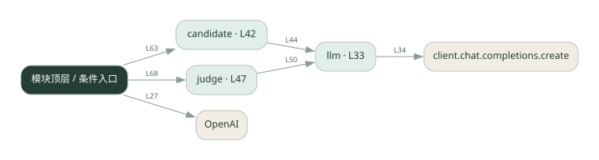
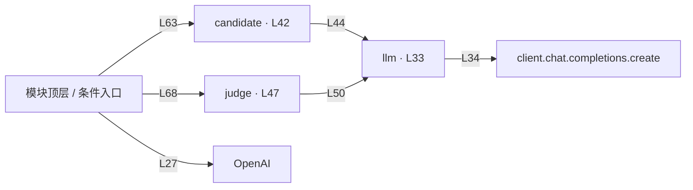

# competitive.py · 竞争与裁判

课程：2-4 · 全课程第 24 节。源码快照 SHA-256 前 12 位：`4eea8ad5913e`。

[原文件](../competitive.py) · [网页阅读](pages/competitive.py.html) · [放大调用图](graphs/competitive.py.svg)

## 这份文件要完成什么

多个候选独立作答，裁判比较并选择。

## 为什么需要它

同一模型的一次答案可能不是最合适的，多个候选提供选择空间。

## 当前文件的实际状态

- 存在外部服务或模型依赖；执行前需按源文件配置依赖和凭据，可能联网或产生 API 费用。 本次只做静态解析，没有运行练习，也没有替你填写或修改原代码。

## 调用图 / 阅读与数据流程

实线：源码中的直接调用；虚线：函数引用/注册、动态调用或按方法名推断的候选。L 是调用所在源码行号。箭头不表示执行顺序或每次必经；分支、循环、异步调度及框架内部调用需结合源码。灰色是外部/未解析目标，橙色是动态分发；省略 print、len 和常规容器操作以减少干扰。孤立函数可能尚未接入。

Mermaid 图源

## 从哪里开始看

先从 模块入口 出发，沿箭头找到本文件函数，再查看外部调用或动态分发。右侧调用清单保留所有静态调用点，能回到原文件逐行对照。

## 关键函数与依赖

| 函数 / 定义行 | 职责（源码注释供参考） | 函数体中的调用 |
|---|---|---|
| `llm` [L33](../competitive.py#L33) | 以源码函数体为准；下列调用展示其依赖。 | `client.chat.completions.create, resp.choices[动态键].message.content.strip` |
| `candidate` [L42](../competitive.py#L42) | 候选 agent：用不同风格生成方案 | `llm` |
| `judge` [L47](../competitive.py#L47) | judge：评估所有方案，选最优 | `动态对象.join, enumerate, llm` |

## 这样做的优点

候选可并列检查，容易做不同风格实验。

## 代价与局限

增加生成与裁判成本；裁判也可能偏好文风而非正确性。

## 适合什么场景

文案候选、受明确标准约束的方案选择。

## 不适合直接照搬的场景

没有评价标准、或预算只容许一次调用的任务。

## 改一个条件，检验是否理解

交换候选展示顺序，观察裁判选择是否稳定。

如果当前文件有未实现位置，先预测应该怎样变化，补齐后再验证；不要把“能启动”当作“实现正确”。

## 全部静态调用点

这是语法分析清单，包含图中省略的基础操作；不记录参数值。

| 调用方 | 目标表达式 | 行号 | 类型 |
|---|---|---|---|
| <模块入口> | `OpenAI` | 27 | 调用表达式 |
| llm | `client.chat.completions.create` | 34 | 调用表达式 |
| llm | `resp.choices[动态键].message.content.strip` | 39 | 调用表达式 |
| candidate | `llm` | 44 | 调用表达式 |
| judge | `动态对象.join` | 49 | 调用表达式 |
| judge | `enumerate` | 49 | 调用表达式 |
| judge | `llm` | 50 | 调用表达式 |
| <模块入口> | `print` | 58 | 调用表达式 |
| <模块入口> | `print` | 59 | 调用表达式 |
| <模块入口> | `print` | 60 | 调用表达式 |
| <模块入口> | `candidate` | 63 | 调用表达式 |
| <模块入口> | `enumerate` | 65 | 调用表达式 |
| <模块入口> | `print` | 66 | 调用表达式 |
| <模块入口> | `judge` | 68 | 调用表达式 |
| <模块入口> | `print` | 69 | 调用表达式 |
