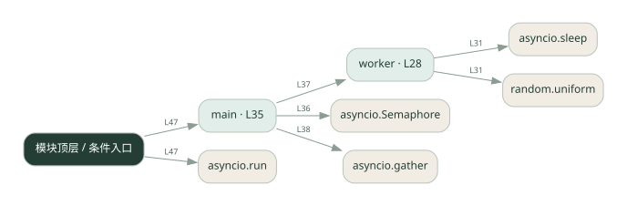
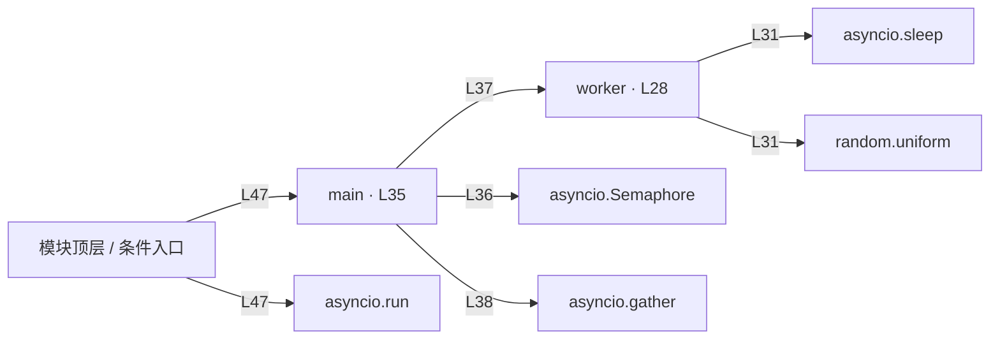

# concurrency.py · 并发数量控制

课程：2-8 · 全课程第 28 节。源码快照 SHA-256 前 12 位：`650c04780882`。

[原文件](../concurrency.py) · [网页阅读](pages/concurrency.py.html) · [放大调用图](graphs/concurrency.py.svg)

## 这份文件要完成什么

用信号量限制同时执行的 worker 数量。

## 为什么需要它

一次启动过多请求会占满连接或触发服务限制。

## 当前文件的实际状态

- 主要展示本地计算、内存状态或模拟流程；是否写文件/启动子进程请看调用表。 本次只做静态解析，没有运行练习，也没有替你填写或修改原代码。

## 调用图 / 阅读与数据流程

实线：源码中的直接调用；虚线：函数引用/注册、动态调用或按方法名推断的候选。L 是调用所在源码行号。箭头不表示执行顺序或每次必经；分支、循环、异步调度及框架内部调用需结合源码。灰色是外部/未解析目标，橙色是动态分发；省略 print、len 和常规容器操作以减少干扰。孤立函数可能尚未接入。

Mermaid 图源

## 从哪里开始看

先从 main 及模块入口 出发，沿箭头找到本文件函数，再查看外部调用或动态分发。右侧调用清单保留所有静态调用点，能回到原文件逐行对照。

## 关键函数与依赖

| 函数 / 定义行 | 职责（源码注释供参考） | 函数体中的调用 |
|---|---|---|
| `worker` [L28](../concurrency.py#L28) | 模拟一个 worker：受信号量限制，最多 sem 个同时执行 | `asyncio.sleep, random.uniform` |
| `main` [L35](../concurrency.py#L35) | 以源码函数体为准；下列调用展示其依赖。 | `asyncio.Semaphore, worker, range, asyncio.gather, print` |

## 这样做的优点

并发度可调，避免无限制拥挤。

## 代价与局限

限制同时运行数量不等于限制每秒请求数；慢任务会长期占用名额。

## 适合什么场景

大量独立的等待型子任务。

## 不适合直接照搬的场景

供应商要求严格 QPS 限制却没有额外速率控制的情况。

## 改一个条件，检验是否理解

把上限改为 1 和 3，记录同时运行数量与总耗时。

如果当前文件有未实现位置，先预测应该怎样变化，补齐后再验证；不要把“能启动”当作“实现正确”。

## 全部静态调用点

这是语法分析清单，包含图中省略的基础操作；不记录参数值。

| 调用方 | 目标表达式 | 行号 | 类型 |
|---|---|---|---|
| worker | `asyncio.sleep` | 31 | 调用表达式 |
| worker | `random.uniform` | 31 | 调用表达式 |
| main | `asyncio.Semaphore` | 36 | 调用表达式 |
| main | `worker` | 37 | 调用表达式 |
| main | `range` | 37 | 调用表达式 |
| main | `asyncio.gather` | 38 | 调用表达式 |
| main | `print` | 40 | 调用表达式 |
| <模块入口> | `print` | 44 | 调用表达式 |
| <模块入口> | `print` | 45 | 调用表达式 |
| <模块入口> | `print` | 46 | 调用表达式 |
| <模块入口> | `asyncio.run` | 47 | 调用表达式 |
| <模块入口> | `main` | 47 | 调用表达式 |
| <模块入口> | `print` | 48 | 调用表达式 |
