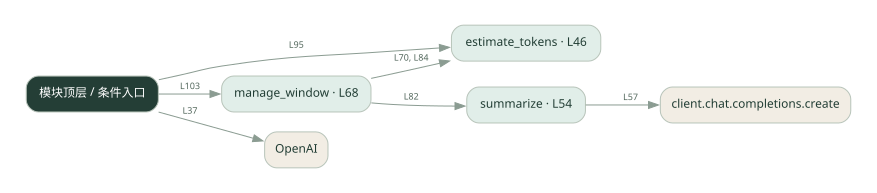
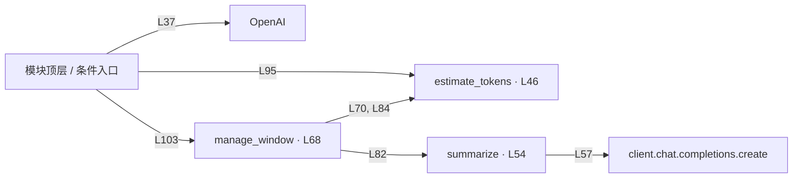

# ctx_window.py · 上下文窗口管理

课程：1-11 · 全课程第 11 节。源码快照 SHA-256 前 12 位：`17bd4a114f88`。

[原文件](../ctx_window.py) · [网页阅读](pages/ctx_window.py.html) · [放大调用图](graphs/ctx_window.py.svg)

## 这份文件要完成什么

估算历史长度，超出阈值时压缩历史并保留近期消息。

## 为什么需要它

模型输入长度有限，历史越来越长还会增加延迟和费用。

## 当前文件的实际状态

- 存在外部服务或模型依赖；执行前需按源文件配置依赖和凭据，可能联网或产生 API 费用。 本次只做静态解析，没有运行练习，也没有替你填写或修改原代码。

## 调用图 / 阅读与数据流程

实线：源码中的直接调用；虚线：函数引用/注册、动态调用或按方法名推断的候选。L 是调用所在源码行号。箭头不表示执行顺序或每次必经；分支、循环、异步调度及框架内部调用需结合源码。灰色是外部/未解析目标，橙色是动态分发；省略 print、len 和常规容器操作以减少干扰。孤立函数可能尚未接入。

Mermaid 图源

## 从哪里开始看

先从 模块入口 出发，沿箭头找到本文件函数，再查看外部调用或动态分发。右侧调用清单保留所有静态调用点，能回到原文件逐行对照。

## 关键函数与依赖

| 函数 / 定义行 | 职责（源码注释供参考） | 函数体中的调用 |
|---|---|---|
| `estimate_tokens` [L46](../ctx_window.py#L46) | 粗估 token：中文 1 字≈1 token，这里直接用字符数近似（生产用 tiktoken 更准） | `len` |
| `summarize` [L54](../ctx_window.py#L54) | 用 LLM 把早期对话压成一段摘要 | `动态对象.join, client.chat.completions.create` |
| `manage_window` [L68](../ctx_window.py#L68) | 超窗时：把最旧的对话摘要掉，保留 system + 摘要 + 最近几条 | `estimate_tokens, summarize` |

## 这样做的优点

持续对话不必无限保留所有原文。

## 代价与局限

字符估算不是精确 token 数；摘要会丢失细节。

## 适合什么场景

长对话、保留大意比保留逐字原文更重要的场景。

## 不适合直接照搬的场景

需要逐条原文追溯的记录系统。

## 改一个条件，检验是否理解

在早期消息埋入一个数字，触发压缩后检查数字是否仍被保留。

如果当前文件有未实现位置，先预测应该怎样变化，补齐后再验证；不要把“能启动”当作“实现正确”。

## 全部静态调用点

这是语法分析清单，包含图中省略的基础操作；不记录参数值。

| 调用方 | 目标表达式 | 行号 | 类型 |
|---|---|---|---|
| <模块入口> | `OpenAI` | 37 | 调用表达式 |
| estimate_tokens | `len` | 50 | 调用表达式 |
| summarize | `动态对象.join` | 56 | 调用表达式 |
| summarize | `client.chat.completions.create` | 57 | 调用表达式 |
| manage_window | `estimate_tokens` | 70 | 调用表达式 |
| manage_window | `summarize` | 82 | 调用表达式 |
| manage_window | `estimate_tokens` | 84 | 调用表达式 |
| <模块入口> | `range` | 91 | 调用表达式 |
| <模块入口> | `messages.append` | 92 | 调用表达式 |
| <模块入口> | `messages.append` | 93 | 调用表达式 |
| <模块入口> | `estimate_tokens` | 95 | 调用表达式 |
| <模块入口> | `print` | 96 | 调用表达式 |
| <模块入口> | `print` | 97 | 调用表达式 |
| <模块入口> | `print` | 98 | 调用表达式 |
| <模块入口> | `print` | 99 | 调用表达式 |
| <模块入口> | `len` | 99 | 调用表达式 |
| <模块入口> | `print` | 100 | 调用表达式 |
| <模块入口> | `print` | 101 | 调用表达式 |
| <模块入口> | `manage_window` | 103 | 调用表达式 |
| <模块入口> | `print` | 104 | 调用表达式 |
| <模块入口> | `len` | 104 | 调用表达式 |
| <模块入口> | `print` | 105 | 调用表达式 |
| <模块入口> | `print` | 106 | 调用表达式 |
| <模块入口> | `print` | 109 | 调用表达式 |
| <模块入口> | `len` | 109 | 调用表达式 |
