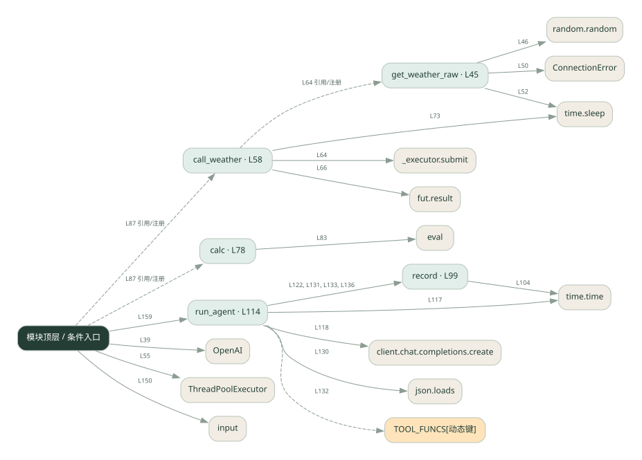
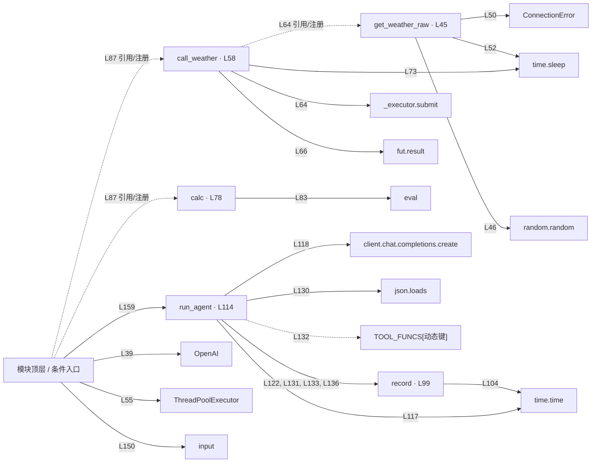

# full_agent.py · 完整单 Agent

课程：1-10 · 全课程第 10 节。源码快照 SHA-256 前 12 位：`b14806a00b9d`。

[原文件](../full_agent.py) · [网页阅读](pages/full_agent.py.html) · [放大调用图](graphs/full_agent.py.svg)

## 这份文件要完成什么

把工具分发、错误处理和记录接入同一个模型循环。

## 为什么需要它

单个机制学会后，需要看到它们如何共同服务一次用户请求。

## 当前文件的实际状态

- 模型请求与本地工具是不同边界：这些文件中的天气工具使用示例逻辑，不能将示例天气当成实时查询结果。
- 源码存在 eval 调用。请先看表达式限制条件；调用图只能说明它被使用，不能证明输入已被安全限制。
- 存在外部服务或模型依赖；执行前需按源文件配置依赖和凭据，可能联网或产生 API 费用。 本次只做静态解析，没有运行练习，也没有替你填写或修改原代码。

## 调用图 / 阅读与数据流程

实线：源码中的直接调用；虚线：函数引用/注册、动态调用或按方法名推断的候选。L 是调用所在源码行号。箭头不表示执行顺序或每次必经；分支、循环、异步调度及框架内部调用需结合源码。灰色是外部/未解析目标，橙色是动态分发；省略 print、len 和常规容器操作以减少干扰。孤立函数可能尚未接入。

Mermaid 图源

## 从哪里开始看

先从 模块入口 出发，沿箭头找到本文件函数，再查看外部调用或动态分发。右侧调用清单保留所有静态调用点，能回到原文件逐行对照。

## 关键函数与依赖

| 函数 / 定义行 | 职责（源码注释供参考） | 函数体中的调用 |
|---|---|---|
| `get_weather_raw` [L45](../full_agent.py#L45) | 以源码函数体为准；下列调用展示其依赖。 | `random.random, ConnectionError, time.sleep` |
| `call_weather` [L58](../full_agent.py#L58) | 以源码函数体为准；下列调用展示其依赖。 | `range, _executor.submit, fut.result, print, time.sleep` |
| `calc` [L78](../full_agent.py#L78) | 以源码函数体为准；下列调用展示其依赖。 | `set, any, str, eval` |
| `record` [L99](../full_agent.py#L99) | 以源码函数体为准；下列调用展示其依赖。 | `len, round, time.time, trace.append, print` |
| `run_agent` [L114](../full_agent.py#L114) | 以源码函数体为准；下列调用展示其依赖。 | `messages.append, range, time.time, client.chat.completions.create, record, json.loads, TOOL_FUNCS[动态键], str` |

## 这样做的优点

一个入口能串起模型决策、执行工具和返回答案。

## 代价与局限

循环控制更复杂，工具出错和模型反复调用都需要上限与诊断。

## 适合什么场景

小型有工具的问答助手原型。

## 不适合直接照搬的场景

直接承担高风险写操作的生产系统。

## 改一个条件，检验是否理解

给一个需要天气和计算的问题，追踪两次工具结果怎样回到模型。

如果当前文件有未实现位置，先预测应该怎样变化，补齐后再验证；不要把“能启动”当作“实现正确”。

## 全部静态调用点

这是语法分析清单，包含图中省略的基础操作；不记录参数值。

| 调用方 | 目标表达式 | 行号 | 类型 |
|---|---|---|---|
| <模块入口> | `OpenAI` | 39 | 调用表达式 |
| get_weather_raw | `random.random` | 46 | 调用表达式 |
| get_weather_raw | `ConnectionError` | 50 | 调用表达式 |
| get_weather_raw | `time.sleep` | 52 | 调用表达式 |
| <模块入口> | `ThreadPoolExecutor` | 55 | 调用表达式 |
| call_weather | `range` | 63 | 调用表达式 |
| call_weather | `_executor.submit` | 64 | 调用表达式 |
| call_weather | `fut.result` | 66 | 调用表达式 |
| call_weather | `print` | 70 | 调用表达式 |
| call_weather | `print` | 72 | 调用表达式 |
| call_weather | `time.sleep` | 73 | 调用表达式 |
| calc | `set` | 80 | 调用表达式 |
| calc | `any` | 81 | 调用表达式 |
| calc | `str` | 83 | 调用表达式 |
| calc | `eval` | 83 | 调用表达式 |
| record | `len` | 100 | 调用表达式 |
| record | `round` | 104 | 调用表达式 |
| record | `time.time` | 104 | 调用表达式 |
| record | `trace.append` | 105 | 调用表达式 |
| record | `print` | 111 | 调用表达式 |
| run_agent | `messages.append` | 115 | 调用表达式 |
| run_agent | `range` | 116 | 调用表达式 |
| run_agent | `time.time` | 117 | 调用表达式 |
| run_agent | `client.chat.completions.create` | 118 | 调用表达式 |
| run_agent | `record` | 122 | 调用表达式 |
| run_agent | `messages.append` | 127 | 调用表达式 |
| run_agent | `json.loads` | 130 | 调用表达式 |
| run_agent | `record` | 131 | 调用表达式 |
| run_agent | `TOOL_FUNCS[动态键]` | 132 | 调用表达式 |
| run_agent | `record` | 133 | 调用表达式 |
| run_agent | `str` | 133 | 调用表达式 |
| run_agent | `messages.append` | 134 | 调用表达式 |
| run_agent | `str` | 134 | 调用表达式 |
| run_agent | `record` | 136 | 调用表达式 |
| run_agent | `messages.append` | 137 | 调用表达式 |
| <模块入口> | `print` | 144 | 调用表达式 |
| <模块入口> | `print` | 145 | 调用表达式 |
| <模块入口> | `print` | 146 | 调用表达式 |
| <模块入口> | `print` | 147 | 调用表达式 |
| <模块入口> | `input().strip` | 150 | 调用表达式 |
| <模块入口> | `input` | 150 | 调用表达式 |
| <模块入口> | `print` | 152 | 调用表达式 |
| <模块入口> | `user.lower` | 156 | 调用表达式 |
| <模块入口> | `print` | 157 | 调用表达式 |
| <模块入口> | `run_agent` | 159 | 调用表达式 |
| <模块入口> | `print` | 160 | 调用表达式 |
| call_weather | `get_weather_raw` | 64 | 函数引用/注册 |
| <模块入口> | `call_weather` | 87 | 函数引用/注册 |
| <模块入口> | `calc` | 87 | 函数引用/注册 |
