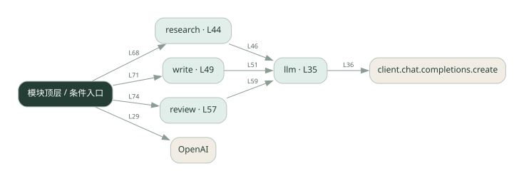
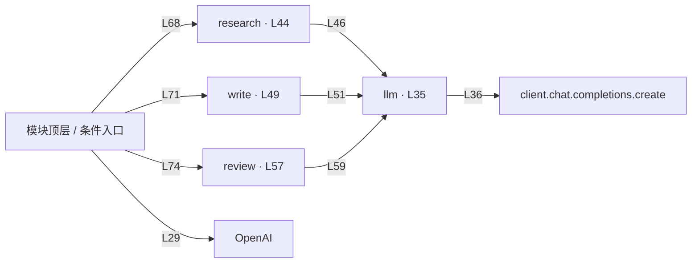

# pipeline.py · 多阶段流水线

课程：2-2 · 全课程第 22 节。源码快照 SHA-256 前 12 位：`554d7a8194c7`。

[原文件](../pipeline.py) · [网页阅读](pages/pipeline.py.html) · [放大调用图](graphs/pipeline.py.svg)

## 这份文件要完成什么

研究结果交给写作，写作结果再交给审阅。

## 为什么需要它

后一步需要前一步产物，顺序传递比同时开工更合适。

## 当前文件的实际状态

- 存在外部服务或模型依赖；执行前需按源文件配置依赖和凭据，可能联网或产生 API 费用。 本次只做静态解析，没有运行练习，也没有替你填写或修改原代码。

## 调用图 / 阅读与数据流程

实线：源码中的直接调用；虚线：函数引用/注册、动态调用或按方法名推断的候选。L 是调用所在源码行号。箭头不表示执行顺序或每次必经；分支、循环、异步调度及框架内部调用需结合源码。灰色是外部/未解析目标，橙色是动态分发；省略 print、len 和常规容器操作以减少干扰。孤立函数可能尚未接入。

Mermaid 图源

## 从哪里开始看

先从 模块入口 出发，沿箭头找到本文件函数，再查看外部调用或动态分发。右侧调用清单保留所有静态调用点，能回到原文件逐行对照。

## 关键函数与依赖

| 函数 / 定义行 | 职责（源码注释供参考） | 函数体中的调用 |
|---|---|---|
| `llm` [L35](../pipeline.py#L35) | 以源码函数体为准；下列调用展示其依赖。 | `client.chat.completions.create, resp.choices[动态键].message.content.strip` |
| `research` [L44](../pipeline.py#L44) | 阶段1：研究，收集素材 | `llm` |
| `write` [L49](../pipeline.py#L49) | 阶段2：写作，基于素材写文章 | `llm` |
| `review` [L57](../pipeline.py#L57) | 阶段3：审核，挑毛病并给改进版 | `llm` |

## 这样做的优点

每阶段输入输出明确，容易单独调试。

## 代价与局限

早期错误会被后面继承；总延迟累加。

## 适合什么场景

资料整理、成稿、审核等顺序工作。

## 不适合直接照搬的场景

各任务互相独立且追求并发速度的场景。

## 改一个条件，检验是否理解

故意让研究结果缺少依据，检查审阅能否指出。

如果当前文件有未实现位置，先预测应该怎样变化，补齐后再验证；不要把“能启动”当作“实现正确”。

## 全部静态调用点

这是语法分析清单，包含图中省略的基础操作；不记录参数值。

| 调用方 | 目标表达式 | 行号 | 类型 |
|---|---|---|---|
| <模块入口> | `OpenAI` | 29 | 调用表达式 |
| llm | `client.chat.completions.create` | 36 | 调用表达式 |
| llm | `resp.choices[动态键].message.content.strip` | 41 | 调用表达式 |
| research | `llm` | 46 | 调用表达式 |
| write | `llm` | 51 | 调用表达式 |
| review | `llm` | 59 | 调用表达式 |
| <模块入口> | `print` | 64 | 调用表达式 |
| <模块入口> | `print` | 65 | 调用表达式 |
| <模块入口> | `print` | 66 | 调用表达式 |
| <模块入口> | `research` | 68 | 调用表达式 |
| <模块入口> | `print` | 69 | 调用表达式 |
| <模块入口> | `write` | 71 | 调用表达式 |
| <模块入口> | `print` | 72 | 调用表达式 |
| <模块入口> | `review` | 74 | 调用表达式 |
| <模块入口> | `print` | 75 | 调用表达式 |
